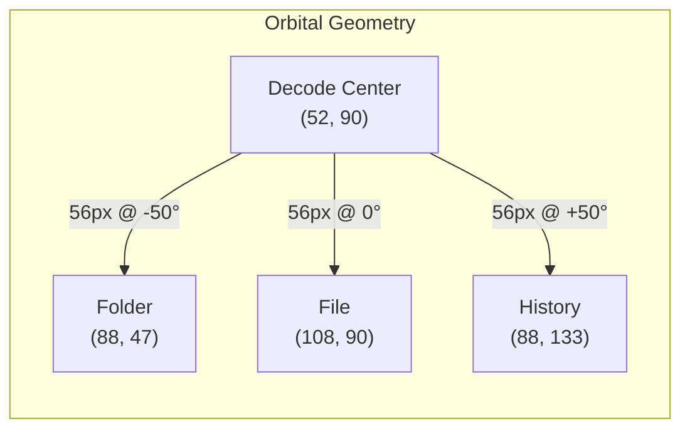
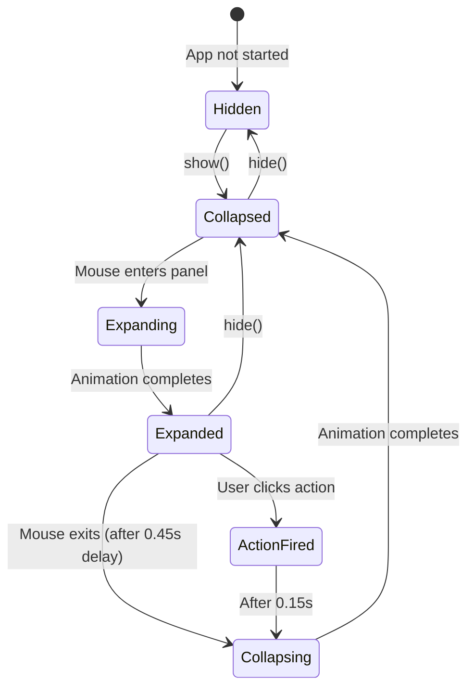
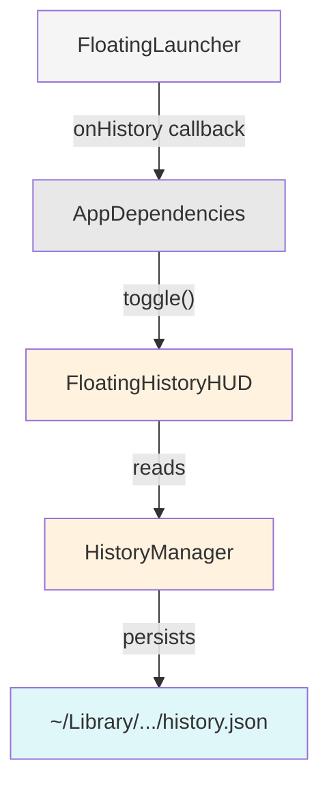
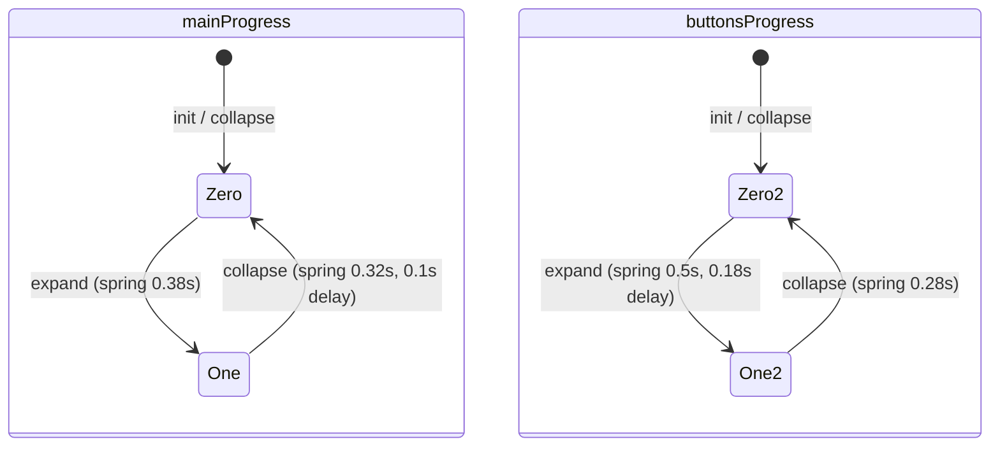
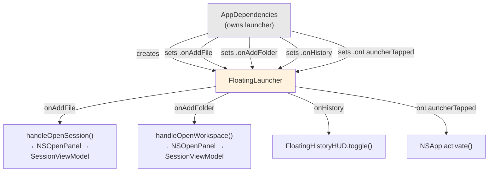
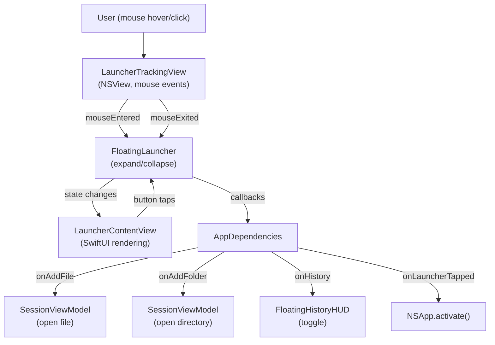
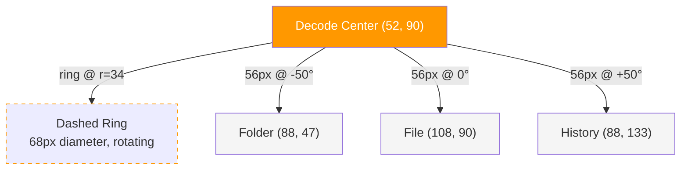
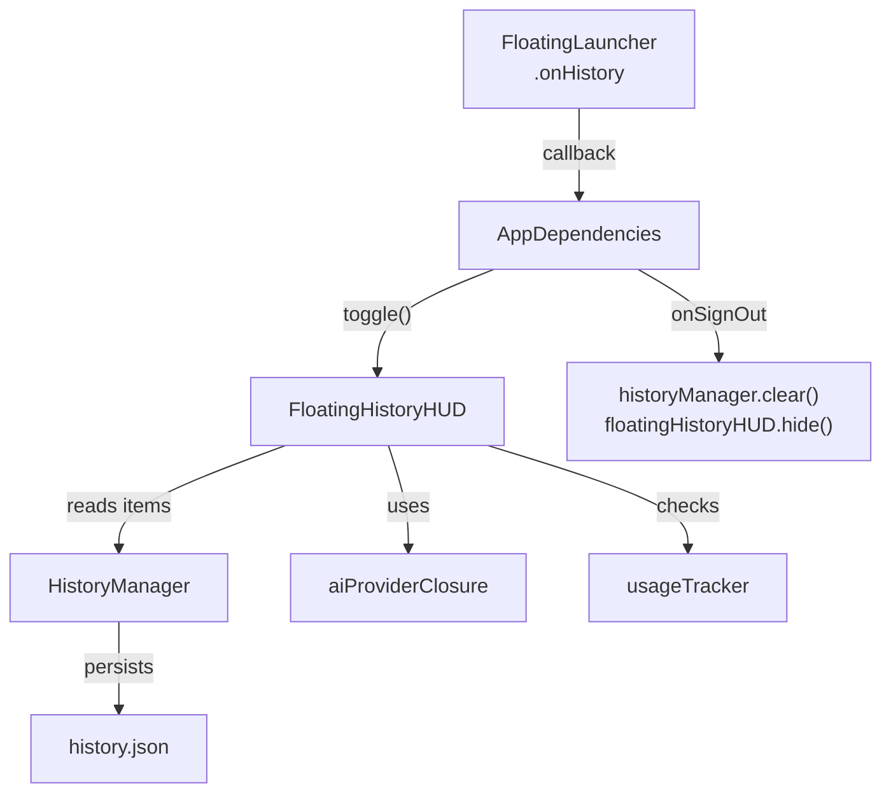
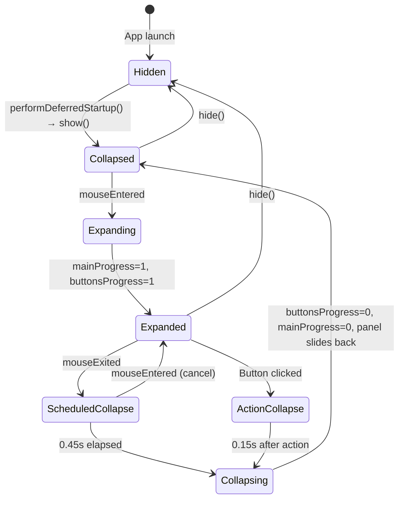

# Decode Launcher — Architecture & Implementation

> **Audience**: CTO / technical co-founder  
> **Inspected**: 2026-08-13, from current `main` branch  
> **Source of truth**: The repository implementation. If this document and the code diverge, the code wins.

---

## 1. Executive Summary

The Decode Launcher is a **persistent floating panel** anchored to the left edge of the macOS screen. It provides one-click access to Decode's primary actions without requiring the main application window to be visible or focused.

**What it is**: A small, always-visible orbital UI consisting of a central Decode button surrounded by three action buttons (Folder, File, History) arranged on a circular arc.

**Why it exists**: Decode is a background intelligence tool — users work in their IDE/editor while Decode runs alongside. The launcher gives instant access to Decode's capabilities from any application context, without switching spaces or hunting for the Decode window.

**What it does**:

| Element | Action |
|---------|--------|
| **Decode button** (center) | Activates the main Decode window |
| **Folder** (upper-right orbit) | Opens NSOpenPanel for directory workspace import |
| **File** (right orbit) | Opens NSOpenPanel for file workspace import |
| **History** (lower-right orbit) | Toggles the History HUD (recent explanations) |

The launcher is pure **presentation/orchestration** — it owns zero business logic. Every action is a callback to `AppDependencies`, which routes to the appropriate subsystem.

---

## 2. Product / UX Purpose

### Interaction Model

The launcher lives on the left screen edge, always visible as a translucent sliver. On mouse hover:

1. The panel slides out from the screen edge
2. The Decode button morphs from a small, dim half-circle to a fully opaque, glowing circle
3. A dashed orbital ring fades in around the Decode button, rotating continuously
4. Three action buttons (Folder, File, History) emerge from the Decode center outward along circular orbital paths

When the mouse exits, the entire sequence reverses after a 0.45s delay.

### Visual Hierarchy

The launcher communicates hierarchy through size and position:

- **Decode button**: 52px diameter (expanded), glass material, orange glow, orange `</>` icon — clearly the dominant element
- **Action buttons**: 35px diameter, same glass material but smaller, positioned around the Decode button — clearly secondary
- **Orbital ring**: Dashed stroke, subtle rotating animation — communicates "system" / "orbit" without competing for attention

The orbital layout communicates that Folder/File/History are **capabilities of Decode**, not independent actions. They visually orbit the platform's center.

### Collapse Behavior

When a secondary action is clicked (Folder, File, or History), the launcher:
1. Fires the action callback immediately
2. Waits 150ms (lets the action register visually)
3. Collapses the launcher back to its peek state

The Decode button click does **not** collapse the launcher — it activates the main window, which is a different interaction pattern.

---

## 3. Complete Visual Architecture

### Elements (from back to front in z-order)

| Layer | Element | Size | Color/Material |
|-------|---------|------|----------------|
| 1 | Dashed orbital ring | 68px diameter (radius 34) | `accentOrange` at 55% opacity × `mainProgress` |
| 2 | Decode button | 42→52px diameter | `.ultraThinMaterial`, white border, orange glow + shadow |
| 3 | Decode icon | 12→16pt | SF Symbol `chevron.left.forwardslash.chevron.right`, orange |
| 4 | Folder button | 35px diameter | `.ultraThinMaterial`, SF Symbol `folder.badge.plus` |
| 5 | File button | 35px diameter | `.ultraThinMaterial`, SF Symbol `doc.badge.plus` |
| 6 | History button | 35px diameter | `.ultraThinMaterial`, SF Symbol `clock.arrow.circlepath` |

### Accent Color

```swift
Color(red: 0.91, green: 0.47, blue: 0.18)  // Decode orange
```

Used for: icon tint, orbital ring stroke, glow shadow.

### Constants from Code

| Constant | Value | Purpose |
|----------|-------|---------|
| `panelWidth` | 170 | NSPanel width in points |
| `panelHeight` | 180 | NSPanel height in points |
| `peekAmount` | 22 | Pixels visible when collapsed |
| `collapseDelay` | 0.45s | Delay before collapsing after mouse exit |
| `mainSize` | 42→52 | Decode button diameter (collapsed→expanded) |
| `orbitRadius` | 56 | Distance from Decode center to action button centers |
| `ringRadius` | 34 | Dashed ring radius |
| `buttonSize` | 35×35 | Action button frame |
| `mainX` | 148→52 | Decode center X (collapsed→expanded) |
| `mainY` | 90 | Decode center Y (fixed, vertical center of panel) |
| Ring line width | 1.5 | Dashed ring stroke width |
| Ring dash pattern | `[5, 4]` | 5pt dash, 4pt gap |
| Ring rotation duration | 20s | Full 360° rotation period |

### Decode Button Visual Properties (Animated)

| Property | Collapsed | Expanded | Formula |
|----------|-----------|----------|---------|
| Diameter | 42px | 52px | `42 + 10 × mainProgress` |
| Opacity | 0.22 | 1.0 | `0.22 + 0.78 × mainProgress` |
| Icon size | 12pt | 16pt | `12 + 4 × mainProgress` |
| Icon opacity | 0.4 | 1.0 | `0.4 + 0.6 × mainProgress` |
| Glow radius | 0 | 11px | `11 × mainProgress` |
| Shadow radius | 3px | 8px | `3 + 5 × mainProgress` |
| Border opacity | 0.15 | 0.30 | `0.15 + 0.15 × mainProgress` |

### Action Button Visual Properties (Animated)

| Property | Collapsed | Expanded | Formula |
|----------|-----------|----------|---------|
| Scale | 0.35 | 1.0 | `0.35 + 0.65 × buttonsProgress` |
| Opacity | 0.0 | 1.0 | `buttonsProgress` |
| Position | At Decode center | At orbital position | See §4 |

---

## 4. Geometry Architecture

### Coordinate System

The launcher uses SwiftUI's coordinate system within a `ZStack` of fixed size (170×180). Origin is top-left, Y increases downward. All elements are positioned using `.position(x:, y:)` relative to this frame.

### Central Geometry Model

All positions derive from a single center point — the Decode button's position:

```
decodeCenter = (mainX, mainY)
```

Where:
- `mainX = 148 - 96 × mainProgress` (slides from right edge to left-center)
- `mainY = 90` (fixed vertical center of 180-tall panel)

### Orbital Button Positions

Each action button is placed at a specific angle on a circle of radius `orbitRadius = 56` centered on the Decode button:

```
buttonX = mainX + cos(angle°) × orbitRadius × buttonsProgress
buttonY = mainY + sin(angle°) × orbitRadius × buttonsProgress
```

The `buttonsProgress` multiplier (0→1) makes buttons emerge from the center outward along their angular paths during expansion.

### Current Angular Positions

| Button | Angle | cos(angle) | sin(angle) | Offset at full expansion |
|--------|-------|------------|------------|--------------------------|
| Folder | -50° | 0.643 | -0.766 | (+36.0, -42.9) |
| File | 0° | 1.000 | 0.000 | (+56.0, 0.0) |
| History | +50° | 0.643 | +0.766 | (+36.0, +42.9) |

**Why these angles work**: All three buttons are equidistant from the Decode center (56px). The 100° arc (-50° to +50°) spans the right side, creating a visual fan. The equal spacing between angles (50° between each pair) produces even visual distribution.

### Expanded Positions (absolute in panel coords)

With `mainX = 52`, `mainY = 90`:

| Button | X | Y |
|--------|---|---|
| Decode | 52 | 90 |
| Folder | 88 | 47 |
| File | 108 | 90 |
| History | 88 | 133 |

All fit within the 170×180 panel with margin.

### Why Trigonometric Positioning

Using `angle + radius` instead of hard-coded `(x, y)` offsets means:
- All buttons are provably equidistant from center (same `orbitRadius`)
- Adding a fourth button requires only adding one angle value
- The orbital relationship is enforced by the math, not by manual tuning
- The expansion animation naturally follows radial paths (multiply by `buttonsProgress`)



---

## 5. Orbital Ring Architecture

### Rendering

The ring is a SwiftUI `Circle` with a dashed stroke, drawn **behind** the Decode button (first element in the `ZStack`):

```swift
Circle()
    .stroke(style: StrokeStyle(lineWidth: 1.5, lineCap: .round, dash: [5, 4]))
    .foregroundStyle(accentOrange.opacity(ringOpacity))
    .frame(width: 68, height: 68)  // ringRadius × 2
    .rotationEffect(ringRotation)
    .position(x: mainX, y: mainY)
```

### Dimensional Relationships

```
Decode button edge:     radius 26px (52/2 expanded)
Ring:                   radius 34px
Gap (button→ring):      8px
Action button centers:  radius 56px from center
Gap (ring→button edge): 56 - 34 - 17.5 = 4.5px
```

The ring sits in the visual space between the Decode button and the action buttons, reinforcing the orbital relationship.

### Opacity

```swift
ringOpacity = 0.55 × mainProgress
```

The ring is invisible when collapsed (`mainProgress = 0`) and reaches 55% of the accent orange opacity when fully expanded. This keeps it subtle — visible but not competing with the buttons.

### Rotation Animation

| Property | Value |
|----------|-------|
| State variable | `@State private var ringRotation: Angle` |
| Starting angle | 0° |
| Target angle | 360° |
| Duration | 20 seconds per revolution |
| Animation curve | `.linear` (constant angular velocity) |
| Repeat | `.repeatForever(autoreverses: false)` |
| Trigger | `.onAppear` |

```swift
.onAppear {
    withAnimation(.linear(duration: 20).repeatForever(autoreverses: false)) {
        ringRotation = .degrees(360)
    }
}
```

### What Rotates and What Does Not

| Element | Rotates? |
|---------|----------|
| Dashed ring | Yes — continuous 360° rotation |
| Decode button | No — stationary |
| Decode icon | No — stationary |
| Folder button | No — stationary at orbital position |
| File button | No — stationary at orbital position |
| History button | No — stationary at orbital position |

The ring rotation is purely decorative — it communicates "active system" without affecting usability. Action buttons remain fixed at their orbital positions for reliable click targeting.

---

## 6. Expansion / Collapse Workflow

### State Machine



### Expansion Sequence (3 phases)

**Phase 1** — Panel slides out (NSAnimationContext, 0.35s, ease-out):
```
Panel position: screenLeft - 148 → screenLeft
```

**Phase 2** — Main circle morph (SwiftUI spring, immediate):
```
mainProgress: 0 → 1  (response: 0.38, damping: 0.82)
```
Effects: button grows 42→52, opacity 0.22→1.0, glow appears, ring fades in.

**Phase 3** — Action buttons emerge (SwiftUI spring, 0.18s delayed):
```
buttonsProgress: 0 → 1  (response: 0.5, damping: 0.65)
```
Effects: buttons scale up, fade in, move outward along orbital paths.

The `isAnimating` flag prevents re-entrant expand/collapse during animation.

### Collapse Sequence (3 phases)

**Phase 1** — Buttons retract (SwiftUI spring, immediate):
```
buttonsProgress: 1 → 0  (response: 0.28, damping: 0.85)
```

**Phase 2** — Main circle shrinks (SwiftUI spring, 0.1s delayed):
```
mainProgress: 1 → 0  (response: 0.32, damping: 0.85)
```

**Phase 3** — Panel slides back (NSAnimationContext, 0.3s, ease-in):
```
Panel position: screenLeft → screenLeft - 148
```

### Collapse Scheduling

When the mouse exits the panel, collapse is **not** immediate. A `DispatchWorkItem` is scheduled after `collapseDelay` (0.45s). If the mouse re-enters before the delay fires, the work item is cancelled (`cancelCollapse()`). This prevents flickering when the mouse briefly leaves the panel boundary.

### Action-Triggered Collapse

When Folder, File, or History is clicked:
1. The action callback fires immediately
2. After a 150ms `asyncAfter` delay, `collapse()` is called directly
3. This bypasses the hover delay — the launcher retracts promptly after an action

The Decode button click does **not** trigger collapse (it activates the main window instead).

---

## 7. Complete Interaction Model

### Decode Button

```
User clicks Decode button
    → onLauncherTapped callback fires
    → AppDependencies.performDeferredStartup() closure:
        NSApp.activate(ignoringOtherApps: true)
        Find first non-NSPanel window
        mainWindow.makeKeyAndOrderFront(nil)
    → Main Decode window comes to front
    → Launcher remains expanded (no collapse triggered)
```

**Purpose**: Bring the Decode app to the foreground. This is the "go to Decode" action.

### Folder

```
User clicks Folder button
    → onAddFolder callback fires
    → AppDependencies.handleOpenWorkspace():
        NSApp.activate(ignoringOtherApps: true)
        NSOpenPanel (folder selection, single select)
        → User selects folder
        → sessionViewModel.loadDirectory(url:)
        → Create/open directory workspace
        → Present session sheet if workspace active
    → After 0.15s, launcher collapses
```

**Purpose**: Import a project directory as a workspace for Session Mode analysis.

### File

```
User clicks File button
    → onAddFile callback fires
    → AppDependencies.handleOpenSession():
        NSApp.activate(ignoringOtherApps: true)
        NSOpenPanel (file selection, multi-select)
        → User selects file(s)
        → sessionViewModel.loadFile(url:) for each
        → Create/open file workspace(s)
        → Present session sheet if workspace active
    → After 0.15s, launcher collapses
```

**Purpose**: Import individual code files as workspaces for Session Mode analysis.

### History

```
User clicks History button
    → onHistory callback fires
    → AppDependencies closure:
        self.floatingHistoryHUD?.toggle()
    → FloatingHistoryHUD.toggle():
        isVisible ? hide() : show()
    → If showing:
        Panel created lazily (520×600, non-activating, floating)
        Positioned at screen center
        AnalyticsEventService.send("history_opened")
    → After 0.15s, launcher collapses
```

**Purpose**: Toggle the History HUD showing the 10 most recent explanation requests with their follow-up conversations.

---

## 8. History Integration

### Integration Boundary

The launcher's relationship to History is minimal — it is a **toggle switch**:



### What the Launcher Knows About History

Nothing. The launcher holds an `onHistory: (() -> Void)?` callback. It does not:
- Import `FloatingHistoryHUD`
- Import `HistoryManager`
- Know whether the History HUD is visible
- Know how many history items exist
- Know anything about history persistence

### Dependency Chain

```
FloatingLauncher.onHistory         (set by AppDependencies)
    → AppDependencies.floatingHistoryHUD?.toggle()
        → FloatingHistoryHUD.show() / .hide()
            → FloatingHistoryHUD reads HistoryManager.items
            → FloatingHistoryHUD uses aiProviderClosure for follow-ups
            → FloatingHistoryHUD uses usageTracker for quota checking
```

### History Recording (Separate Path)

History recording does **not** flow through the launcher. It flows through the Explanation HUD:

```
ExplanationHUDViewModel.onExplanationRecorded    (set by AppDependencies.wireHistoryRecording())
    → HistoryManager.recordExplanation()
    → activeHistoryRequestId = id

ExplanationHUDViewModel.onFollowUpRecorded       (set by AppDependencies.wireHistoryRecording())
    → HistoryManager.recordFollowUp(requestId:)
```

### Privacy Boundary

On sign-out (`authService.onSignOut`):
```swift
historyManager.clear()           // Wipe all history
activeHistoryRequestId = nil     // Reset correlation
floatingHistoryHUD?.hide()       // Dismiss if visible
```

The launcher itself is not hidden on sign-out — it remains visible as a persistent UI element.

### Implementation Files

| File | Role in History Integration |
|------|----------------------------|
| `FloatingLauncher.swift` | Holds `onHistory` callback (no knowledge of History internals) |
| `AppDependencies.swift` | Wires `onHistory` → `floatingHistoryHUD.toggle()` |
| `FloatingHistoryHUD.swift` | History panel (520×600, lazy, non-activating) |
| `HistoryManager.swift` | In-memory + JSON persistence (10 items max) |
| `HistoryRequest.swift` | Domain model (`HistoryRequest`, `HistoryFollowUp`) |

---

## 9. Application Architecture

### Layer Placement

```
Presentation layer
    └── FloatingLauncher.swift
        ├── FloatingLauncher          (AppKit panel controller)
        ├── LauncherState             (Observable state)
        ├── LauncherPanel             (NSPanel subclass)
        ├── LauncherTrackingView      (NSView for mouse tracking)
        └── LauncherContentView       (SwiftUI view)

App layer
    └── AppDependencies.swift
        ├── Creates FloatingLauncher
        ├── Wires all callbacks
        ├── Owns floatingLauncher property
        └── Manages lifecycle (show during deferred startup)
```

### Ownership

`AppDependencies` owns the launcher:
```swift
private(set) var floatingLauncher: FloatingLauncher?
```

Created during `performDeferredStartup()`, shown immediately, never hidden (except implicitly when the app terminates).

### Dependency Injection

The launcher receives **zero** injected dependencies. It is constructed with `FloatingLauncher()` (no parameters). All behavior is configured via four optional callback closures:

```swift
var onAddFile: (() -> Void)?
var onAddFolder: (() -> Void)?
var onHistory: (() -> Void)?
var onLauncherTapped: (() -> Void)?
```

This makes the launcher completely decoupled from every Decode subsystem. It doesn't import, reference, or depend on any manager, service, or coordinator.

### Lifecycle

```
AppDependencies.init()                    → Nothing (lightweight construction)
AppDependencies.performDeferredStartup()  → Creates FloatingLauncher, wires callbacks, calls show()
App termination                           → Panel destroyed with process
```

The launcher is created **once** and lives for the entire application session. There is no mechanism to recreate it.

---

## 10. SwiftUI / AppKit Boundary

The launcher is a **hybrid** — AppKit for window management, SwiftUI for rendering.

### AppKit Components

| Component | Class | Why AppKit |
|-----------|-------|------------|
| Window/panel | `LauncherPanel` (NSPanel) | Non-activating floating panel behavior, screen-edge positioning, `orderFrontRegardless()`, collection behavior, window level — none of these are available in pure SwiftUI |
| Mouse tracking | `LauncherTrackingView` (NSView) | `NSTrackingArea` with `.activeAlways` for hover detection even when Decode is not the active app — SwiftUI's `onHover` only works when the app is active |
| Panel slide animation | `NSAnimationContext` | Animates the NSPanel's frame position (window-level animation, not view-level) |

### SwiftUI Components

| Component | Struct | Why SwiftUI |
|-----------|--------|-------------|
| Visual content | `LauncherContentView` | Declarative layout, spring animations, material effects, SF Symbols, rotation effects — all natural SwiftUI |
| Animation state | `LauncherState` (`@Observable`) | SwiftUI observation drives re-rendering when `mainProgress` or `buttonsProgress` change |
| Ring rotation | `@State var ringRotation` | SwiftUI animation system handles the continuous rotation |

### Bridge

```swift
let hostingView = NSHostingView(rootView: contentView)
```

`NSHostingView` bridges SwiftUI into the AppKit panel. It fills the entire panel via Auto Layout constraints.

### Why Both Frameworks

**AppKit is required** because:
1. **Non-activating panels** (`NSPanel` with `.nonactivatingPanel`) don't steal focus from the user's IDE
2. **`.activeAlways` tracking** detects hover even when another app is focused
3. **Screen-edge positioning** uses `NSScreen.visibleFrame` and explicit frame calculations
4. **`orderFrontRegardless()`** shows the panel without activation — no SwiftUI equivalent

**SwiftUI is preferred** for the visual content because:
1. Spring animations with damping/response parameters
2. `.ultraThinMaterial` vibrancy effects
3. SF Symbol icons with dynamic sizing
4. Declarative layout with `ZStack` and `.position()`
5. `@Observable` state-driven rendering

---

## 11. Window / Panel Architecture

### Panel Configuration

```swift
LauncherPanel(
    contentRect: NSRect(x: 0, y: 0, width: 170, height: 180),
    styleMask: [.nonactivatingPanel, .fullSizeContentView, .borderless],
    backing: .buffered,
    defer: false
)
```

| Property | Value | Reason |
|----------|-------|--------|
| `level` | `.floating` | Always above normal windows |
| `becomesKeyOnlyIfNeeded` | `true` | Don't steal keyboard focus |
| `hidesOnDeactivate` | `false` | Stay visible when Decode is not frontmost |
| `isMovableByWindowBackground` | `false` | Fixed position, not user-draggable |
| `backgroundColor` | `.clear` | Transparent — only SwiftUI content is visible |
| `isOpaque` | `false` | Required for transparent background |
| `hasShadow` | `false` | No system window shadow (SwiftUI handles per-element shadows) |
| `appearance` | `.aqua` | Consistent light appearance |
| `collectionBehavior` | `[.canJoinAllSpaces, .fullScreenAuxiliary]` | Visible on all desktops/spaces, available alongside fullscreen apps |

### LauncherPanel Subclass

```swift
private final class LauncherPanel: NSPanel {
    override var canBecomeKey: Bool { true }
    override var canBecomeMain: Bool { false }
}
```

`canBecomeKey = true` allows the panel to receive button clicks. `canBecomeMain = false` prevents it from becoming the main window (which would affect menu bar behavior).

### Screen Positioning

**Collapsed**: Panel's left edge is 148px off-screen to the left. Only the rightmost 22px are visible (the Decode button sliver).

```swift
x = screenLeft - (170 - 22) = screenLeft - 148
```

**Expanded**: Panel's left edge is at the screen's left visible edge. All 170px are on-screen.

```swift
x = screenLeft
```

**Vertical**: Centered on the screen's visible frame midpoint.

```swift
y = screen.visibleFrame.midY - 90
```

### Lazy Creation

The panel is created on first `show()` call, not at `FloatingLauncher` init time. This avoids window creation during `AppDependencies.init()` (which runs before the app is fully active).

---

## 12. State Model

### LauncherState (`@Observable @MainActor`)

| Property | Type | Range | Purpose | Changed by |
|----------|------|-------|---------|------------|
| `mainProgress` | `CGFloat` | 0→1 | Drives Decode button morph (size, opacity, glow, position, ring opacity) | `expand()` / `collapse()` via `withAnimation` |
| `buttonsProgress` | `CGFloat` | 0→1 | Drives action button emergence (scale, opacity, orbital position) | `expand()` / `collapse()` via `withAnimation` |

Derived: `isExpanded: Bool { mainProgress > 0.01 }` — used as guard in `expand()` and `collapse()`.

### FloatingLauncher Instance State

| Property | Type | Purpose |
|----------|------|---------|
| `panel` | `LauncherPanel?` | The NSPanel (lazily created) |
| `isVisible` | `Bool` | Whether the launcher is currently shown |
| `state` | `LauncherState` | Shared state observed by SwiftUI |
| `collapseWorkItem` | `DispatchWorkItem?` | Pending delayed collapse (cancelable) |
| `anchorCenterY` | `CGFloat` | Vertical center for panel positioning |
| `isAnimating` | `Bool` | Re-entrancy guard for expand/collapse |

### LauncherContentView Local State

| Property | Type | Purpose |
|----------|------|---------|
| `ringRotation` | `@State Angle` | Current rotation angle of the dashed ring |

### State Diagram



The two progress values are independent — `mainProgress` starts immediately on expand, while `buttonsProgress` starts 180ms later. On collapse, `buttonsProgress` starts immediately and `mainProgress` starts 100ms later. This staggering creates the phased animation feel.

---

## 13. Event / Control Flow

### Hover → Expand

```
LauncherTrackingView.mouseEntered(with:)
    → onMouseEntered closure
    → FloatingLauncher.cancelCollapse()         // Cancel any pending delayed collapse
    → FloatingLauncher.expand()
        guard: !isExpanded, isVisible, !isAnimating
        → isAnimating = true
        → NSAnimationContext: panel.animator().setFrame(expandedFrame())   [0.35s]
        → withAnimation(.spring): state.mainProgress = 1.0               [immediate]
        → asyncAfter(0.18s):
            → withAnimation(.spring): state.buttonsProgress = 1.0
            → isAnimating = false
```

### Mouse Exit → Collapse

```
LauncherTrackingView.mouseExited(with:)
    → onMouseExited closure
    → FloatingLauncher.scheduleCollapse()
        → Cancel any existing collapseWorkItem
        → Create new DispatchWorkItem { self.collapse() }
        → asyncAfter(0.45s): execute work item
            → FloatingLauncher.collapse()
                guard: isExpanded, isVisible, !isAnimating
                → isAnimating = true
                → withAnimation(.spring): state.buttonsProgress = 0       [immediate]
                → asyncAfter(0.1s):
                    → withAnimation(.spring): state.mainProgress = 0
                    → NSAnimationContext: panel.animator().setFrame(collapsedFrame())  [0.3s]
                    → completionHandler: isAnimating = false
```

### Action Click → Callback + Collapse

```
User clicks "History" button in LauncherContentView
    → SwiftUI Button action fires
    → onHistory closure (from makePanel)
        → self.onHistory?()                    // AppDependencies: floatingHistoryHUD.toggle()
        → asyncAfter(0.15s): self.collapse()   // Launcher retracts
```

---

## 14. Dependency Flow



The launcher **receives** callbacks but **owns** nothing external. It is a leaf node in the dependency graph — nothing depends on the launcher.

---

## 15. File / Component Map

| File | Component(s) | Responsibility |
|------|-------------|----------------|
| `Decode/Presentation/Overlay/FloatingLauncher.swift` | `LauncherState`, `FloatingLauncher`, `LauncherPanel`, `LauncherTrackingView`, `LauncherContentView` | All launcher presentation, geometry, animation, panel management |
| `Decode/App/AppDependencies.swift` | (partial) | Creates launcher, wires callbacks, manages lifecycle |
| `Decode/Presentation/Overlay/FloatingHistoryHUD.swift` | `FloatingHistoryHUD` | History panel toggled by launcher's History action |
| `Decode/Application/HistoryManager.swift` | `HistoryManager`, `HistoryPersistence` | History state management (read by History HUD, not by launcher) |
| `Decode/Domain/Models/HistoryRequest.swift` | `HistoryRequest`, `HistoryFollowUp` | History domain models (not referenced by launcher) |

**Total launcher-specific code**: ~482 lines in one file (`FloatingLauncher.swift`).

---

## 16. Architectural Boundaries

### Launcher Owns

- Visual presentation (SwiftUI content view)
- Panel window management (creation, show, hide, positioning)
- Orbital geometry (angles, radius, trigonometric positioning)
- Expand/collapse animation (phased springs, panel slide)
- Mouse tracking (hover enter/exit via NSTrackingArea)
- Collapse scheduling (delayed work items)
- Dashed ring rotation animation

### Launcher Does NOT Own

| Concern | Owner |
|---------|-------|
| Explanation generation | SelectionModeCoordinator, SessionQuestionCoordinator |
| History persistence | HistoryManager |
| History display | FloatingHistoryHUD |
| Workspace management | WorkspaceManager, SessionViewModel |
| AI provider routing | AIConfiguration, AIProviderRegistry |
| Authentication | AuthService |
| Analytics recording | AnalyticsEventService (called by FloatingHistoryHUD, not launcher) |
| Billing / credits | Not yet implemented |
| File opening UI | NSOpenPanel (via AppDependencies) |

The launcher is **purely presentation** — a button panel that converts clicks into callbacks. It has no imports beyond `AppKit` and `SwiftUI`.

---

## 17. Design Decisions

### Why Orbital Geometry?

The three actions are **capabilities of Decode** — they orbit the platform's center rather than sitting in a disconnected list. This visual metaphor communicates that Folder, File, and History are aspects of one system, not three separate tools.

The alternative (vertical column) made the buttons look like an unrelated toolbar. The orbital layout makes the relationship explicit at a glance.

### Why Central Geometry Model?

All positions derive from `(mainX, mainY)` — the Decode center. This has concrete benefits:

1. **Consistency**: All buttons are provably equidistant from center (same `orbitRadius`)
2. **Extensibility**: Adding a button = adding one angle constant
3. **Animation**: The expansion animation naturally follows radial paths because positions are `center + offset × progress`
4. **Correctness**: The orbital relationship is enforced by the math. You cannot accidentally break it by editing one button's position.

### Why Trigonometric Positioning?

Hardcoded `(x, y)` offsets would:
- Not guarantee equidistance from center
- Break the orbital visual if one position is tweaked
- Require manual recalculation if the orbit radius changes
- Not naturally produce radial expansion paths

`cos/sin × radius` gives all of these for free.

### Why a Rotating Dashed Ring?

The ring serves two purposes:
1. **Visual**: Communicates "orbital system" — the dashes orbiting the center reinforce that the action buttons belong to the Decode center
2. **Polish**: The subtle rotation (20s per revolution) signals "active" / "alive" without being distracting

### Why Only the Ring Rotates?

Rotating the action buttons would make them unclikable — moving targets are hostile to mouse interaction. Rotating the Decode button would create visual instability in the primary element. The ring is the only element that can rotate without degrading usability.

### Why Non-Activating Panel?

Decode is a tool that runs alongside IDEs. If the launcher stole focus when hovered, the user would lose their cursor position in Xcode/VS Code. `NSPanel` with `.nonactivatingPanel` and `becomesKeyOnlyIfNeeded` keeps focus in the user's editor while still allowing button clicks.

---

## 18. Performance

### Animation Cost

- **Ring rotation**: Single `rotationEffect` driven by a SwiftUI implicit animation. The animation is computed by Core Animation on the GPU — negligible CPU cost.
- **Expand/collapse**: Two SwiftUI spring animations (3-4 animatable properties each) plus one `NSAnimationContext` frame animation. All are standard framework animations — no custom render loops.
- **Idle (collapsed)**: The ring rotation continues but the ring is invisible (opacity 0) so the GPU may optimize it away. The SwiftUI view body is not re-evaluated when state doesn't change.

### Memory

The panel and its view hierarchy are created once and kept alive for the app session. Total memory is the NSPanel + NSHostingView + SwiftUI view graph — estimated at well under 1MB.

### Event Handling

`NSTrackingArea` with `.activeAlways` generates enter/exit events on the main thread. These are lightweight (set a flag, schedule a work item). No polling, no timers.

### Benchmarks

No formal benchmarks exist. The launcher is a small, idle UI element with standard framework animations. Performance is not a concern at the current scale.

### Potential Future Concern

If additional animated elements are added to the launcher (e.g., particle effects, complex gradients), the continuous rotation could interact with them to produce unnecessary re-renders. Currently, the ring is the only animated element in the idle state, so this is not an issue.

---

## 19. Accessibility

### Current State

**Limitations — the launcher currently has no explicit accessibility support:**

- No `accessibilityLabel` set on the Decode button, Folder, File, or History buttons
- No `accessibilityRole` overrides
- No keyboard navigation (no `accessibilityFocused`, no tab order)
- No VoiceOver announcements for expand/collapse state changes

### What Partially Works

- SwiftUI `Button` views automatically get `.button` accessibility role
- SF Symbol names may provide default accessibility descriptions
- Button click actions work via standard AppKit event handling

### Hit Targets

All buttons use standard SwiftUI `Button` with `.buttonStyle(.plain)`. Hit targets match their frame sizes:
- Decode button: 42-52px diameter (varies with animation)
- Action buttons: 35×35px

The action buttons at 35px meet Apple's minimum recommended touch target (44pt) marginally for click targets but are small by modern standards. This has not been flagged as an issue in manual testing.

### Recommendation

If accessibility is a priority for the next phase, the launcher needs:
1. `accessibilityLabel` on all four buttons
2. `accessibilityHint` describing what each action does
3. Keyboard activation support (e.g., a global shortcut to expand the launcher)
4. VoiceOver announcement when the launcher expands/collapses

---

## 20. Testing / Verification

### Launcher-Specific Tests

**None exist.** There are no unit tests or UI tests for `FloatingLauncher`, `LauncherState`, `LauncherContentView`, or related components in the `DecodeTests/` directory.

### History Integration Tests

28 tests across 3 suites in `DecodeTests/Application/HistoryManagerTests.swift`:

| Suite | Tests | Status |
|-------|-------|--------|
| `HistoryRequestModelTests` | Model construction, Codable round-trip, optional fields | All pass |
| `HistoryPersistenceTests` | Save/load, overwrite, corrupt file handling, missing file | All pass |
| `HistoryManagerTests` | Record, follow-up, eviction, restore, clear, ordering | All pass |

### Build Status

**BUILD SUCCEEDED** — verified on 2026-08-13 with the current implementation.

### Pre-Existing Test Failures (Unrelated to Launcher)

4 pre-existing failures in other test suites:
1. `streamChatFormatsMessages` (AINetworkClientTests) — `emptyResponse` error
2. `showStreamHandlesError` (ExplanationHUDViewModelTests) — display state mismatch
3. `emptyTagSkipped` (ExplanationTagParserTests) — segment parsing difference
4. `explainSelectionStreamsToHUD` (SelectionModeCoordinatorTests) — mock timing issue

None are related to the launcher.

### Manual Verification

The launcher has been manually verified for:
- Expand/collapse animation smoothness
- All four button click actions
- History HUD toggle
- Ring rotation continuity
- Visual orbital layout (buttons on circular arc, not vertical line)
- Screen-edge positioning
- Collapse-after-action behavior

---

## 21. Current Implementation Status

| Aspect | Status |
|--------|--------|
| Orbital geometry | Complete — trigonometric positioning with central geometry model |
| Dashed ring | Complete — rotating, correctly sized, properly layered |
| Three action buttons | Complete — Folder, File, History with correct callbacks |
| Expand/collapse | Complete — phased animation with re-entrancy guard |
| Mouse tracking | Complete — NSTrackingArea with `.activeAlways` |
| Panel management | Complete — non-activating, floating, all-spaces |
| History integration | Complete — toggle callback wired through AppDependencies |
| Privacy (logout) | Complete — History cleared on sign-out via `authService.onSignOut` |
| Analytics | Partial — `history_opened` and `history_followup` events exist in FloatingHistoryHUD, but no launcher-specific analytics (no "launcher_expanded" event) |
| Accessibility | Not implemented — no labels, no keyboard nav |
| Tests | Not implemented — no launcher-specific tests |

### Known Visual Limitations

- Angular positions (-50°, 0°, +50°) and orbit radius (56px) are tuned for the current 3-button configuration. These values would need adjustment if the button count changes.
- The dashed ring's dash pattern `[5, 4]` at radius 34 produces approximately 24 dashes around the circle. At the launcher's small scale, this is visible but the individual dashes are subtle.
- The Decode button's collapsed sliver (22px peek) is intentionally small — discoverable to users who know it's there, but may not be immediately noticed by new users.

### Known Technical Limitations

- `anchorCenterY` is set once during `show()` from `NSScreen.main.visibleFrame.midY`. It does not update if the screen configuration changes while the launcher is visible (e.g., connecting/disconnecting a display).
- The `isAnimating` guard prevents expand/collapse during animation, but if a user clicks an action button during the expand animation's final 0.18s phase (when `isAnimating` is already set to `false`), the action fires before `buttonsProgress` has fully reached 1.0. This is harmless but means the action can fire while buttons are still animating in.

---

## 22. Future Extensibility

### Adding a Fourth Action Button

To add a new action (e.g., "Settings"):

1. **Add callback** to `FloatingLauncher`:
   ```swift
   var onSettings: (() -> Void)?
   ```

2. **Add angle constant** to `LauncherContentView`:
   ```swift
   private let settingsAngle: Double = 75  // example: below History
   ```

3. **Add button** to the `body` ZStack:
   ```swift
   actionButton(icon: "gearshape", label: "Settings", action: onSettings)
       .scaleEffect(buttonScale)
       .opacity(buttonOpacity)
       .position(x: orbitX(angleDeg: settingsAngle), y: orbitY(angleDeg: settingsAngle))
   ```

4. **Wire callback** in `AppDependencies`:
   ```swift
   launcher.onSettings = { [weak self] in /* ... */ }
   ```

5. **Adjust angles** — redistribute the four buttons across a wider arc (e.g., -60°, -20°, +20°, +60°) and potentially increase `panelHeight` to accommodate the vertical spread.

**What does NOT need to change**: `orbitRadius`, `ringRadius`, orbital positioning math, animation system, panel management, tracking view.

### Adding a Badge/Indicator

The current `actionButton()` function accepts `icon`, `label`, and `action`. To add a badge (e.g., unread count on History), you would modify the function signature or create a wrapper — the change is contained within `LauncherContentView`.

### Architectural Constraint

The launcher should remain a **callback-only** surface. Future actions should follow the same pattern: `onX: (() -> Void)?` callback set by `AppDependencies`, with zero business logic in the launcher itself.

---

## 23. Failure Modes / Edge Cases

### Handled

| Scenario | Handling |
|----------|----------|
| Panel not yet created | `show()` lazily creates via `makePanel()` |
| Rapid mouse enter/exit | `scheduleCollapse()` cancels previous work item; `cancelCollapse()` on re-enter |
| Expand during expand | `isAnimating` guard prevents re-entrancy |
| Collapse during collapse | `isAnimating` guard prevents re-entrancy |
| Expand during collapse | Guarded by `isAnimating` (blocked until collapse completes) |
| No screen available | `screenLeftX()` returns 0; `setDefaultAnchor()` returns early |
| Callback not set | All callbacks are optional (`?()`) — nil is a no-op |
| `hide()` while animating | Forces state to 0, clears work items, orders panel out |

### Potential Limitations

| Scenario | Current Behavior | Risk |
|----------|-----------------|------|
| Screen configuration change while visible | `anchorCenterY` not updated | Launcher may appear off-center on new display config. Low risk — rare during active use. |
| Very small screen / scaled display | Panel is 170×180 fixed | Could be disproportionately large on small displays. Not observed in practice. |
| Multiple monitors | Uses `NSScreen.main ?? .screens.first` | Launcher always appears on the main screen's left edge. Cannot be moved to a secondary display. |
| Action clicked during expand animation | Action fires normally | Harmless — the action completes even though visual animation is still in progress. |
| History HUD already visible when History clicked | `toggle()` hides it | Correct behavior — acts as a toggle. |
| App not fully started | `performDeferredStartup()` guards against pre-activation state | Launcher is only created after deferred startup completes. |

---

## 24. Security / Data Boundaries

The launcher is a **zero-data** component:

| Question | Answer |
|----------|--------|
| Does it handle user data? | No |
| Does it handle authentication? | No |
| Does it access persistent history? | No (the callback goes through AppDependencies → FloatingHistoryHUD → HistoryManager) |
| Does it call AI providers? | No |
| Does it transmit network requests? | No |
| Does it read files? | No |
| Does it store state to disk? | No |
| Does it read environment variables? | No |
| Does it access Keychain? | No |

The launcher is strictly a presentation surface. It converts mouse events into callback invocations. All sensitive operations (file access, AI calls, history persistence, authentication) happen downstream in other components.

---

## 25. Observability / Analytics

### Launcher-Specific Analytics

**None.** The launcher itself does not emit any analytics events. There is no "launcher_expanded", "launcher_collapsed", or "launcher_action_clicked" event.

### Downstream Analytics

The History action's downstream target (`FloatingHistoryHUD`) emits:
- `history_opened` — when the History HUD is shown
- `history_followup` — when a follow-up is submitted from the History HUD

These are emitted by `FloatingHistoryHUD`, not by the launcher.

### Observation

If launcher interaction analytics are desired in the future, the natural injection points would be:
- `expand()` — "launcher_expanded"
- Action callbacks in `makePanel()` — "launcher_action" with action type metadata

---

## 26. Architecture Diagrams

### A. High-Level Launcher Architecture



### B. Launcher Geometry



### C. History Integration



### D. Launcher Lifecycle



---

## 27. CTO Review Notes

### Architectural Strengths

1. **Clean separation**: The launcher is a pure presentation surface with zero business logic. Four callbacks are its entire external interface. This is the right abstraction level.
2. **Maintainable geometry**: Trigonometric orbital positioning means the layout is defined by `orbitRadius` + angles, not fragile coordinate tuning. Adding a button is a one-line geometry change.
3. **Framework boundary is correct**: AppKit handles what only AppKit can do (non-activating panels, always-active tracking), SwiftUI handles what it does best (declarative rendering, spring animations).
4. **Single-file implementation**: All 482 lines live in one file with clear MARK sections. No over-abstraction into separate files for a component this small.
5. **Phased animation**: The staggered expand/collapse (main → buttons on expand, buttons → main on collapse) creates visual polish without architectural complexity.

### Potential Risks

1. **No accessibility**: The launcher has no accessibility labels, no keyboard navigation, and no VoiceOver support. This is acceptable for alpha but will need attention before broader release.
2. **No launcher tests**: The launcher has zero test coverage. The risk is low (it's a small, stable UI component) but any future geometry changes would benefit from automated verification.
3. **Fixed screen anchoring**: `anchorCenterY` is computed once and never updated. This is fragile for multi-monitor setups where the primary display changes.
4. **`isAnimating` flag timing**: The flag is cleared before `buttonsProgress` animation fully completes (at the `asyncAfter(0.18s)` point). This means there's a brief window where expand/collapse could theoretically re-enter. In practice, the spring animation hasn't settled in 0.18s, so the visual would slightly overlap, but it would not crash.

### Technical Debt

- **Minor**: The `isAnimating` flag could be replaced with a more robust state machine (e.g., an enum with `.idle`, `.expanding`, `.expanded`, `.collapsing` states). The current approach works but relies on careful sequencing of `asyncAfter` calls.
- **Minor**: `screenLeftX()` falls back to 0 if no screen is found. This would place the launcher at x=0, which may or may not be visible depending on the display configuration.

### Maintainability

The implementation is appropriately simple for what it does. The single-file design, callback-based external interface, and derived geometry model make it easy to modify. No framework dependencies beyond AppKit and SwiftUI.

### Scalability

The current design scales to 4-5 action buttons before the orbital arc becomes too crowded. Beyond that, a different layout (e.g., radial menu, popover list) would be needed. For the current product scope (3 actions), the orbital layout is the right choice.

### What Should NOT Be Changed Casually

1. **Non-activating panel behavior** — changing this would cause the launcher to steal focus from the user's IDE
2. **Callback-only external interface** — adding business logic to the launcher would couple it to subsystems it shouldn't know about
3. **Central geometry model** — replacing trigonometric positioning with hardcoded coordinates would make the layout fragile
4. **Ring rotation independence** — the ring must rotate independently of the buttons to preserve click targeting

### What Would Justify a Future Redesign

- **More than 5 actions**: The right-side arc cannot accommodate more than ~5 buttons without becoming crowded. A radial menu or expandable list would be needed.
- **User-repositionable launcher**: Currently fixed to the left screen edge. If users request positioning on other edges, the geometry model would need to support arbitrary orientation.
- **Keyboard-driven launcher**: If a keyboard shortcut should expand the launcher and allow arrow-key navigation between actions, the tracking/expansion model would need to support non-mouse interaction.
- **Badge/notification system**: If action buttons need real-time badges (e.g., unread history count), the callback-only pattern may need to become a binding pattern to avoid polling.

---

## 28. Important Architectural Rules

1. **The launcher is a presentation/orchestration surface.** It converts user interactions into callbacks. It must not contain feature-specific business logic.

2. **Feature-specific business logic belongs outside the launcher.** File opening, workspace creation, history management, AI calls, and authentication are owned by their respective subsystems. The launcher merely invokes them.

3. **Geometry must remain derived from the central model.** All button positions derive from `(mainX, mainY)` via `orbitRadius` and angle constants. Do not introduce independent hardcoded `(x, y)` coordinates for individual buttons.

4. **The dashed ring must remain independent from button positioning.** The ring rotates; buttons do not. These are separate concerns and must remain visually and architecturally independent.

5. **The launcher must not become a second source of truth.** It should not cache history items, store authentication state, track billing credits, or duplicate any state owned by another subsystem. Callbacks are the boundary.

6. **Future changes should preserve subsystem boundaries.** If a new action is added, it should follow the existing `onX: (() -> Void)?` callback pattern. The launcher should not need to import new modules.

7. **Any architectural change should be evidence-driven.** The current design handles 3 actions with clean geometry and minimal code. Do not redesign for hypothetical requirements (e.g., 10 actions, drag-to-reorder, persistent customization) until there is real product need.

---

## 29. Source of Truth

This document describes the implementation as inspected on the current repository state (2026-08-13, `main` branch).

**The repository implementation is the ultimate source of truth.**

If this document and the code diverge:

```
Current code  >  This document
```

This document should be updated whenever a meaningful launcher architecture change is made. Minor visual tuning (angle adjustments, color tweaks, animation timing) does not require a document update.
