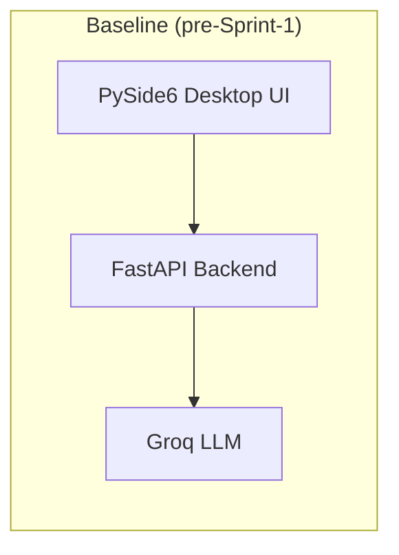
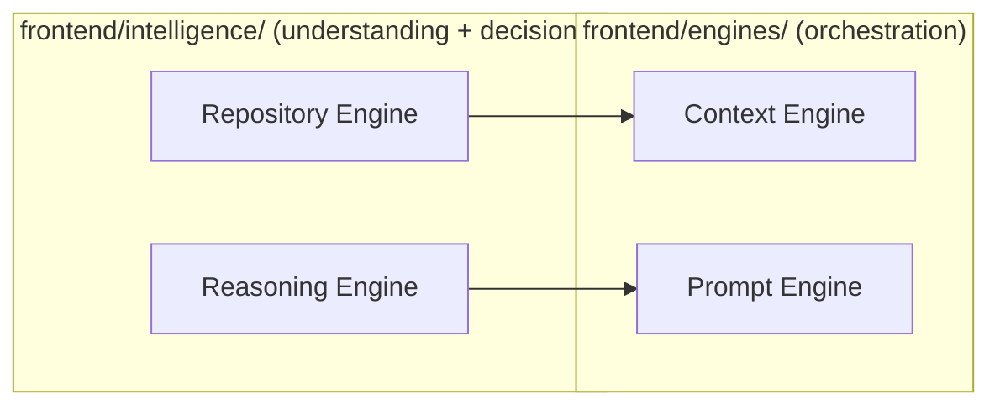
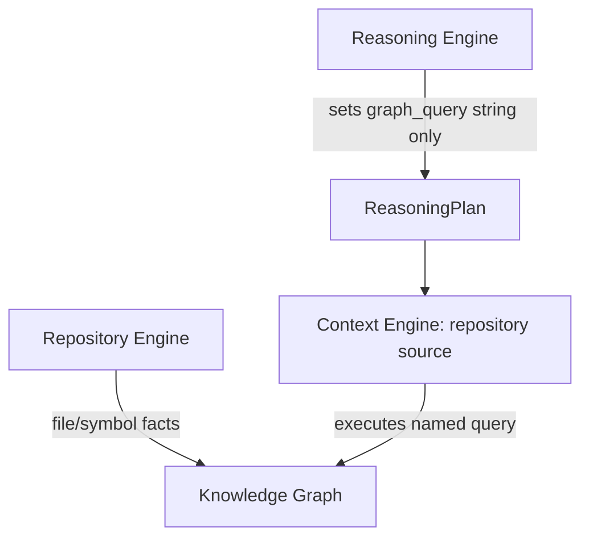
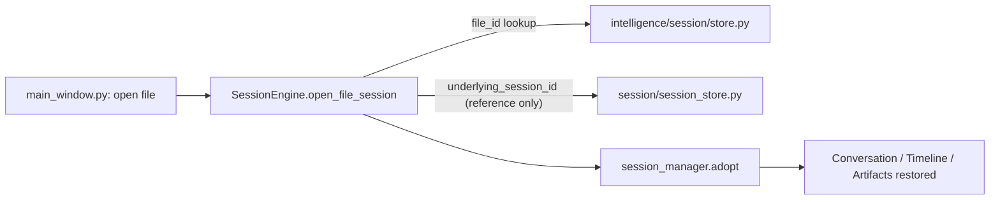
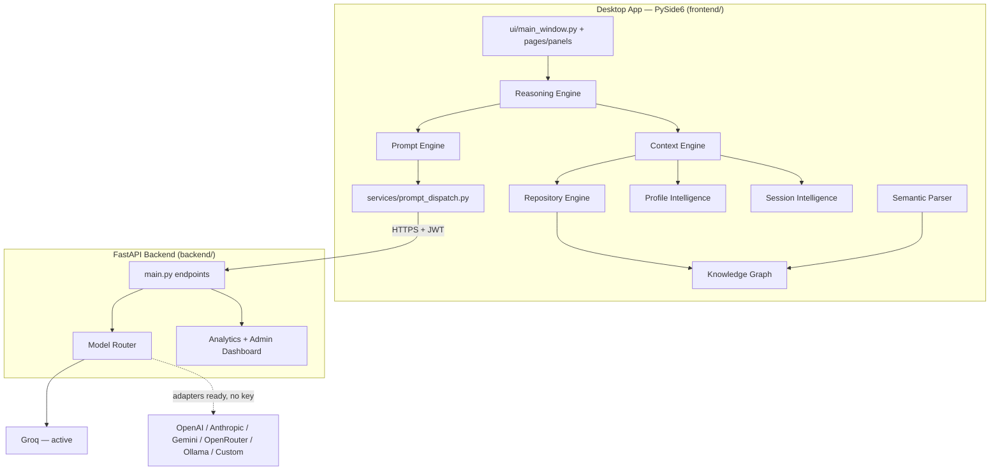

# Decode Development Journal

**Engineering journal — Sprint 1 through Sprint 15**
Branch: `feature/context-engine-v2` · Version: `1.0.0-beta` (channel: beta) · 58 commits total

This journal is compiled directly from the project's own commit history and from
sprint-by-sprint engineering memory recorded at the time each sprint shipped. Every
claim below was cross-checked against the current codebase before this document was
written (folder layout, file existence, commit hashes). Nothing here is aspirational —
features marked **Planned** or **Partial** are called out explicitly; everything else
is real, running code as of `09d7756` (the current HEAD).

---

## Baseline — before the engine architecture existed

Before Sprint 1, Decode was already a working, shipped product: a PySide6 desktop
app (`frontend/`) talking to a FastAPI backend (`backend/`), with JWT auth,
Alt+Q selection capture, Alt+W screenshot OCR, a diff viewer, an admin analytics
dashboard, and a local gamified learning tracker. Two commits mark this baseline:

- `9d09bd6` — "Decode v1.0.0-beta"
- `6c5cdcd` — "Add analytics package"

Everything from Sprint 1 onward is additive intelligence architecture built **on
top of** this working product — the sprint discipline enforced throughout ("never
rewrite working modules," "no breaking changes to existing public APIs") meant the
pre-existing app never stopped working at any point across all 15 sprints.

---

## Sprint 1 — "Foundation Refactor"

**Objective.** Introduce a home for future intelligence work without touching
anything that already worked — pure architectural scaffolding.

**Major Features Added.** None user-facing. This sprint added *capability
contracts*, not capability.

**Architecture Changes.** Introduced `frontend/engines/` with six single-responsibility
engine placeholders: Context, Session, Repository, Prompt, Profile, Artifact. Two
had real adapters wrapping existing code (`ContextSelectorContextEngine` wrapping
`session/context_selector.py`; `SessionManagerSessionEngine` wrapping the existing
`SessionManager`); the other four (Repository, Prompt, Profile, Artifact) were
interface-only ABCs with `NotImplementedError` bodies, since nothing to wrap existed
yet for most of them.

**Files Created.** `frontend/engines/__init__.py` and six subpackages
(`context_engine/`, `session_engine/`, `repository_engine/`, `prompt_engine/`,
`profile_engine/`, `artifact_engine/`), each with `interfaces.py` (+`adapter.py`
for Context/Session).

**Files Modified.** None — `main.py` and `main_window.py` were untouched; nothing
was wired in.

**Files Removed.** None.

**Important Engineering Decisions.** The sprint brief claimed Decode already had
working "Repository Intelligence," "Knowledge Graph," "Reasoning Engine,"
"Evolution Engine," "Workspace Studio," and "Folder Mode." A full case-insensitive
grep across `frontend/` and `backend/` found **none of these existed** — only an
unrelated "Workspace Profiles" per-project settings feature. This correction was
recorded up front rather than silently building on a false premise, and became a
recurring verification habit for every sprint after.

**Performance Improvements.** N/A (no runtime code path touched).

**Bugs Fixed.** None (nothing was live yet).

**Regression Notes.** Zero risk — additive only, zero wiring into the running app.
`tests/test_api_integration.py`: 16/17 passing (`test_register` pre-existing
duplicate-email test-data issue, unrelated, tracked from this point forward every
sprint).

**Git Commits.** `a3a480d` — "Add Sprint 1 engine skeleton (Context, Session,
Repository, Prompt, Profile, Artifact)"

**Lessons Learned.** Verify a brief's factual claims about the existing codebase
before writing a line of code — a wrong premise compounds across every future
sprint that trusts it.

**What became possible after this sprint.** A defined package boundary
(`engines/`) for all future orchestration work to land in, without guessing at
structure sprint-by-sprint.

---

## Sprint 2 — "Context Engine v2" + Integration

**Objective.** Replace Sprint 1's placeholder Context Engine with a real
implementation, then make it the *only* source of context for every AI action in
the running app.

**Major Features Added.** A real `ContextPackage` assembled from five real
sources: Selection, Session, Repository (empty until Sprint 4), Profile (empty
until Sprint 9), Workspace (git branch/root). `build()` / `estimate_size()` /
`export()` / `rank()` / `compress()` / `trim()` / `merge()` / `retrieve()`.

**Architecture Changes.** `ContextEngine` became one concrete class (not an
ABC+adapter pair, per this sprint's explicit "no placeholder interfaces" mandate)
— the first and only engine to break from Sprint 1's pattern. `ui/main_window.py`'s
`optimize_selection()` and `_run_worker()` were rewired to call
`flows.from_selection_flow()` / `flows.from_session_flow()` instead of touching
`session/context_selector.py` / `optimization/selection_context.py` directly —
those modules stayed alive underneath, just no longer called straight from the UI.

**Files Created.** `engines/context_engine/{context_package.py, engine.py,
ranking.py, compression.py, flows.py}`, `engines/context_engine/sources/{selection,
session, repository, profile, workspace}.py`.

**Files Modified.** `ui/main_window.py` (`optimize_selection()`, `_run_worker()`).

**Files Removed.** Sprint 1's placeholder `interfaces.py`/`adapter.py` for Context
Engine (superseded, not orphaned — verified zero remaining references).

**Important Engineering Decisions.** Compression policy floor: session-history
summarization never drops below 2 preserved turns; `trim()` is the harder,
last-resort escalation. Selection/Profile/Workspace context is never trimmed —
a hard invariant, not a tunable. `WorkspaceContextData.branch` reads `.git/HEAD`
directly rather than shelling out to `git`, avoiding a hard PATH dependency in the
packaged app.

**Performance Improvements.** Found and fixed a ~0.55–0.65ms per-call regression
from wiring in the full 5-source build: `profile.build()` and `workspace.build()`
were each independently reloading `AppConfig`, and `workspace.build()` re-walked
`.git` on every call. Fixed by loading `AppConfig` once and `@lru_cache`-ing the
git-root/branch lookups. Net cost after fix: ~0.17–0.22ms per call.

**Bugs Fixed.** `SelectionContextData` was missing `mode` (would have crashed
Optimize on first real use). `from_session_flow()` was calling
`ContextEngine.retrieve()`, which uses a different scoring path than production's
real `build_for_action()` — fixed to match exactly. Deleted `from_screenshot_flow()`
after confirming Screenshot Mode never built its own context to begin with (no
real call site existed).

**Regression Notes.** Validated every context-string-producing change was
byte-identical to the old function's output before/after — not just "runs."
16/17 backend tests passing throughout.

**Git Commits.** `0581d2f`, `48bdb87`, `3f9c283`, `e49402e` (v2 build) · `6821a37`,
`fb7937f`, `6df0a6e`, `d2a1856` (integration + perf fix).

**Lessons Learned.** "Runs without error" is not the same bar as "produces
byte-identical output" — the `build_for_action` vs `build` branching bug was only
caught by the stricter check.

**What became possible after this sprint.** Selection Mode and Session Mode both
route through one auditable context-assembly path instead of two divergent ones.

---

## Sprint 3 — "Prompt Engine"

**Objective.** Build the real Prompt Engine and make it the sole decider of what
an AI request looks like on the wire.

**Major Features Added.** `Intent` (11 values) + `detect_intent()` reproducing
`AIWorker._dispatch()`'s exact branching. `PromptRequest` (intent, system_prompt,
user_prompt, context, metadata, estimated_size, priority,
future_model_preferences). `services/prompt_dispatch.py` — the one mechanical
`PromptRequest → api_client` translation.

**Architecture Changes.** `AIWorker`/`OptimizeWorker` collapsed to take a single
`PromptRequest` and call `prompt_dispatch.execute()`, replacing per-action
branching that previously lived in the UI layer.

**Files Created.** `engines/prompt_engine/{intent.py, capability_routing.py,
prompt_request.py, assembly.py}` (intent.py/capability_routing.py later deleted in
Sprint 6), `services/prompt_dispatch.py`.

**Files Modified.** `ui/main_window.py` (builds `PromptRequest` via
`prompt_engine.build_request()`), `services/worker.py`.

**Files Removed.** None this sprint (the Sprint-1 Prompt Engine ABC was replaced
in place).

**Important Engineering Decisions.** `api_payload` (the literal wire format
`api_client.py` sends) must never change — a hard backend-contract boundary.
`system_prompt` is kept as a *symbolic label* (`"debug"`, `"mode:dsa"`) rather than
the literal backend template text, avoiding duplicating backend-owned state across
the process boundary.

**Performance Improvements.** `PromptEngine.build_request()` measured
0.003–0.01ms per call — two orders of magnitude under the sprint's own <1ms target.

**Bugs Fixed.** None new; validated all 11 intents produce byte-identical
`api_payload` to the pre-existing hand-written functions.

**Regression Notes.** Discovered monkeypatching `QThread.start()` for synchronous
testing hangs indefinitely — fixed by stubbing the whole worker *class* instead
(a pattern reused in every later sprint's Qt smoke tests).

**Git Commits.** `5950e36`, `808cfd3`, `3258f7b`.

**Lessons Learned.** Never monkeypatch `QThread.start()`; stub the worker class.

**What became possible after this sprint.** One engine now owns "what does this
AI request look like," decoupled from the specific button/action that triggered it.

---

## Sprint 4 — "Repository Intelligence Engine"

**Objective.** Build the first real *intelligence* (not just orchestration):
deterministic, whole-repository understanding — no LLM, no embeddings, no vector
DB.

**Major Features Added.** Repository discovery (VCS/build/dependency-dir
exclusion, real virtualenv detection via `pyvenv.cfg`), per-file categorization
(entry_point/config/core/utility/test/generated/other), a dependency graph,
ranking (entry/config/core=high, utility=medium, test=low, generated=lowest), an
inverted search index (snake_case/camelCase-tokenized), and a deterministic
repository summary.

**Architecture Changes.** `RepositoryEngine` (index/get_metadata/lookup), cached
by normalized root path. `ContextEngine.build()` gained `include_repository: bool
= False` — **opt-in, not wired into the existing hot path** by design.

**Files Created.** `engines/repository_engine/{discovery.py, parsing.py,
dependency_graph.py, ranking.py, search_index.py, summary.py, engine.py}`.

**Files Modified.** `engines/context_engine/sources/repository.py`
(`RepositoryContextData` gained 4 fields).

**Files Removed.** None.

**Important Engineering Decisions.** Cold-indexing was deliberately kept *opt-in*
rather than firing on every Explain click — a naive always-on design would have
introduced a real, user-visible freeze on large repos.

**Performance Improvements.** Corrected (post-`tracemalloc`-overhead-fix) numbers:
7ms cold / 0.006ms warm for a 19-file repo, up to 2.24s cold / 0.019ms warm for
10,000 files. An initial (wrong) benchmark run showed 177s for 10,000 files —
traced to measurement tooling overhead, not the real engine, and corrected before
being reported.

**Bugs Fixed.** `from X import Y` submodule resolution bug (resolved to
`__init__.py` instead of the actually-imported submodule). `is_generated_file()`
never checked the directory path itself, misclassifying files under a
`generated/` directory as "core."

**Regression Notes.** Every already-wired caller (Selection/Session Mode)
doesn't pass `include_repository`, so existing latency/behavior was provably
unchanged — re-ran every Sprint 2/3 smoke test to confirm.

**Git Commits.** `f53a6f7`, `95bf465`, `4e92846`, `e435f19`.

**Lessons Learned.** A first benchmark number that looks alarmingly bad is worth
a second look at the measurement tool itself before trusting it as a real
regression.

**What became possible after this sprint.** Decode can build a real,
ranked, searchable model of an entire repository — the raw material every later
intelligence engine (Knowledge Graph, Semantic Parser, Reasoning) builds on top of.

---

## Sprint 5 — "Reasoning Engine"

**Objective.** Restructure the codebase to separate *orchestration* from
*understanding/decision-making*, and build the first genuinely deterministic
decision-making layer.

**Major Features Added.** `ReasoningEngine.plan()` — 14 intent categories
(5 unambiguous button/mode signals, plus keyword-matched free-text categories,
falling back to follow_up/ask), each with a `(intent, detection_method)` pair
driving a HIGH/MEDIUM/LOW confidence score. `ReasoningPlan` is a frozen
(genuinely immutable) dataclass.

**Architecture Changes.** Introduced the permanent `frontend/engines/` vs.
`frontend/intelligence/` split: engines **orchestrate**, intelligence
**understands and decides**. `intelligence/repository/` was `git mv`'d out of
`engines/repository_engine/` (history preserved). Reasoning Engine has zero
dependency on `engines/*` — it sits upstream of Prompt Engine in the pipeline,
never the reverse.

**Files Created.** `intelligence/__init__.py`, `intelligence/knowledge/__init__.py`
(placeholder), `intelligence/reasoning/{models.py, intent.py, engine.py}`.

**Files Modified.** All 9 files importing the old `engines.repository_engine`
path, updated to `intelligence.repository`. `engines/prompt_engine/engine.py`
(`assemble()`/`build_request()` gained optional `plan: Optional[ReasoningPlan]`).

**Files Removed.** `engines/repository_engine/` (moved, not deleted — a rename).

**Important Engineering Decisions.** "Session continuation" was deliberately
**not** made a 14th intent — it's an orthogonal boolean, since forcing it to
compete with the primary intent for one slot would suppress real action-type
information.

**Performance Improvements.** `ReasoningEngine.plan()`: 0.0035–0.0087ms mean,
roughly 100x under the <1ms target. Verified zero file-system or network imports
anywhere in the package by grepping every import statement, not just observing
behavior.

**Bugs Fixed.** `"complexity"`/`"big o"` were in both the performance and DSA
keyword sets with performance checked first, so algorithmic questions
misclassified as PERFORMANCE_QUESTION. Fixed by keeping algorithmic phrasing
DSA-exclusive.

**Regression Notes.** Default (`plan=None`) is byte-identical to Sprint 3 —
verified by re-running Sprint 3's tests unmodified. Not yet wired into
`main_window.py` this sprint.

**Git Commits.** `9f057a9`, `66e05f5`, `249ed85`.

**Lessons Learned.** Overlapping keyword sets across categories need explicit
conflict-checking during design, not just per-set sanity checks.

**What became possible after this sprint.** A real, testable, zero-I/O decision
layer exists — ready to be made mandatory in Sprint 6.

---

## Sprint 6 — "Intelligence Pipeline Integration"

**Objective.** Make Reasoning Engine the mandatory execution step for *every* AI
action, and delete the Prompt-Engine-local logic it now supersedes — the first
sprint whose explicit mandate included deletion.

**Major Features Added.** None new — this sprint is pure consolidation.

**Architecture Changes.** `PromptRequest.intent` is now always `plan.
detected_intent`; `system_prompt` for explain/session-explain is unconditionally
`plan.explanation_style`. `_run_worker()`/`optimize_selection()` now call
`reasoning_engine.plan()` **before** building any context, then pass
`include_repository=plan.capabilities.needs_repository_lookup` into
`context_flows.*`.

**Files Created.** None.

**Files Modified.** `engines/prompt_engine/assembly.py` (rewritten — endpoint
shape is now a direct function of `(action, has_session_context)`),
`ui/main_window.py`.

**Files Removed.** `engines/prompt_engine/intent.py` and
`capability_routing.py` — fully superseded by `intelligence.reasoning`; verified
zero remaining references before deletion.

**Important Engineering Decisions.** The legacy no-session path deliberately
still never builds a `ContextPackage` at all — Reasoning Engine runs for it
(satisfying "every action"), but building a full package just for rare
legacy-architecture questions would add real overhead to the hot Alt+Q/Alt+W
path. Recorded as a disclosed gap, not silently omitted.

**Performance Improvements.** Delta from making Reasoning Engine mandatory:
Alt+Q +0.012ms, Session +0.010ms, Screenshot +0.004ms — negligible against
0.16–0.2ms total pipeline cost and hundred-to-thousand-ms LLM round-trips.

**Bugs Fixed.** None new — a pure refactor/consolidation sprint.

**Regression Notes.** Full `py_compile` sweep + grep confirming zero remaining
references to deleted symbols. 16/17 backend tests passing.

**Git Commits.** `01679a8`, `5d28ea8`.

**Lessons Learned.** A "delete dead code" milestone can legitimately find
nothing further to remove — reported honestly rather than manufacturing busywork.

**What became possible after this sprint.** Every AI action in the app now runs
through exactly one decision-making engine — no action can bypass Reasoning
Engine's intent classification.

---

## Sprint 7 — "Knowledge Graph Engine"

**Objective.** Build the first semantic-relationship layer: a deterministic
graph of *provable* relationships between repository entities.

**Major Features Added.** `KnowledgeGraph` (in-memory, adjacency-indexed) with
`lookup`/`outgoing`/`incoming`/`neighbors`/`path` (BFS)/`subgraph`/`statistics`.
5 named queries: `immediate_neighborhood`, `architecture_neighborhood`,
`dependency_chain`, `call_chain`, `authentication_chain`.

**Architecture Changes.** `intelligence/repository/dependency_graph.py` moved to
`intelligence/knowledge/import_resolution.py` — **Knowledge Graph is now the only
owner of relationship/dependency logic**; Repository Engine owns indexing only.
`ReasoningPlan.retrieval_plan` gained `graph_query: Optional[str]`, mapping each
intent to a named query — but **Reasoning Engine never imports
`intelligence.knowledge`** directly, keeping "Reasoning decides, Knowledge Graph
executes" true without a circular import.

**Files Created.** `intelligence/knowledge/{models.py, graph.py, builder.py,
engine.py, queries.py, import_resolution.py}`.

**Files Modified.** `engines/context_engine/sources/repository.py` (7 new
fields), `engines/context_engine/engine.py` (`context_budget` param, first
connection to `trim()`).

**Files Removed.** `RepositoryIndex.dependency_graph` field (superseded by
Knowledge Graph ownership) — verified unread elsewhere before removal.

**Important Engineering Decisions.** Only 8 of 12 specified edge types and 10 of
14 node types were built — the remainder require call-site/inheritance
resolution the parser didn't yet support. Documented as an honest scope limit,
not fabricated via heuristics ("do not invent edges, only create edges that can
be proven").

**Performance Improvements.** All traversal/named-query operations sub-1ms at
every scale tested, up to 50,055 nodes / 50,056 edges (x-large, 10,000 files).
Post-benchmark fix: `subgraph()`'s edge filter was O(total graph edges)
regardless of result size — fixed to scan only visited nodes' own outgoing
lists, dropping from 1.21ms/1.24ms to 0.004ms/0.0038ms at x-large scale.

**Bugs Fixed.** The `subgraph()` O(total-edges) scan above. Also caught (and
correctly did NOT report as a regression) two benchmarking artifacts: a script
holding all four test repos' graphs alive simultaneously inflated GC pressure on
the last iteration; isolating a single repo in a fresh process confirmed the true
~2.2s cold time.

**Regression Notes.** All new work additive (new package, new optional fields,
new params defaulting to `None`/`False`). 16/17 backend tests passing throughout.

**Git Commits.** `2e6a68f`, `10b36e1`, `56eb184`, `e73b9e5`.

**Lessons Learned.** A benchmark's own methodology (object lifetime, GC timing)
can produce a number that looks like a real regression — isolate before
reporting.

**What became possible after this sprint.** Decode can answer "what depends on
this / what does this depend on / where is auth handled" with a real, traversable
graph instead of a flat file list.

---

## Sprint 8 — "Semantic Parser Engine"

**Objective.** Upgrade from file-level to symbol-level understanding — the
first sprint where CALLS/INHERITS/IMPLEMENTS/OVERRIDES become real, proven
graph edges.

**Major Features Added.** Full symbol model (Symbol/TypeRef/Parameter/Scope/
Call/Reference/ClassInfo/InterfaceInfo/MethodInfo/FunctionInfo/VariableInfo/
PropertyInfo/ModuleInfo). A deep, two-pass Python AST extractor (Pass 1: build
symbol tables; Pass 2: resolve calls/references only against *proven* symbols —
unresolvable calls stay recorded with `resolved_target_id=None`, never guessed).
A shallower generic regex-based extractor for JS/TS/Java/C#/C++ (base-class +
in-body method names only — calls/refs are explicitly not attempted for those
languages, since regex-sliced text can't support it honestly).

**Architecture Changes.** Knowledge Graph gained PROPERTY/TYPE node types and
OVERRIDES/RETURNS/HAS_PARAMETER/HAS_MEMBER/USES_TYPE/REFERENCES_SYMBOL edges,
plus incremental `merge()`/`remove_file_facts()` for re-enrichment without
duplicating file-level nodes. `KnowledgeGraphEngine.enrich_file()` — lazy,
one file at a time.

**Files Created.** `intelligence/semantic/{models.py, python_extractor.py,
generic_extractor.py, engine.py}`.

**Files Modified.** `intelligence/knowledge/{graph.py, builder.py, queries.py}`,
`engines/context_engine/sources/repository.py` (7 more fields), `intelligence/
reasoning/retrieval_planning.py` (new call_chain / hot_call_path /
semantic_neighborhood mappings).

**Files Removed.** None — `session.code_parser`'s shallow top-level walk was kept
untouched and is explicitly documented as an intentional second, independent AST
pass, not a duplicate to be merged.

**Important Engineering Decisions.** OVERRIDES is direct-base-only (no MRO
walk); ambiguous or external base classes produce no INHERITS/IMPLEMENTS edge at
all rather than a guessed one.

**Performance Improvements.** Warm parse 0.08–0.21ms; warm enrich 0.08–0.33ms;
full pipeline (plan+build+budget) warm 2.3ms, cold ~148ms (one-time lazy index +
first parse, only on the first repository-flavored question per project).

**Bugs Fixed.** TypeScript `implements`-without-`extends` classes silently lost
their interface list (the implements check was gated behind the extends-pattern
match) — fixed by checking independently. A benchmark artifact (~54MB peak
reported for both tiny and stress files) was traced to `build()`'s whole-repo
indexing sitting inside the measurement window, not the sprint's own code —
corrected before reporting.

**Regression Notes.** Two intentionally-stale test fixtures updated after
confirming the changes they reflected were deliberate, not regressions.

**Git Commits.** `8570dfa`, `af91eaa`, `d13848c`, `778baa0`.

**Lessons Learned.** Third sprint in a row to catch a benchmark methodology
artifact before reporting it as a real regression — worth treating as a standing
discipline, not a one-off.

**What became possible after this sprint.** Reasoning Engine can route
performance/bug/learning questions to a real call graph or symbol neighborhood
instead of a generic file list.

---

## Sprint 9 — "Profile Intelligence Engine"

**Objective.** Introduce long-term, local-only, privacy-first user learning
that adapts explanation depth and context sizing — no LLM, no cloud sync.

**Major Features Added.** `UserProfile` + 6 sub-profiles (Preference/Technology/
Repository/Learning/Coding/Interaction). `hash_identifier()` one-way-hashes any
path before it can reach a stored event — repository/file paths are never
persisted raw. Every derived fact stays at an honest "unknown"/empty default
until `MIN_OBSERVATIONS_FOR_CONFIDENCE` (5) real observations support it.

**Architecture Changes.** `intelligence/profile/{models, observation, learning,
store, engine}.py`. `ProfileEngine` is the only component allowed to touch
`ProfileStore` — enforced structurally via frozen dataclasses. Background daemon
thread flushes every 5 observations, guarded by a dedicated `_save_lock` separate
from the in-memory lock.

**Files Created.** `intelligence/profile/*` (5 files), `intelligence/reasoning/
profile_adjustment.py`.

**Files Modified.** `intelligence/reasoning/engine.py` (`plan()` gained optional
`profile`/`repository_id`), `engines/context_engine/sources/profile.py`
(rewritten to call `ProfileEngine.get_profile()` instead of reading
`~/.decode/learning.json` directly), `ui/main_window.py` (wired `profile_engine.
record()` at real choke points: `_on_analytics()`, `_record_optimization()`,
session start).

**Files Removed.** The stale direct `learning.json` read in
`engines/context_engine/sources/profile.py`.

**Important Engineering Decisions.** Facts with genuinely no signal in Decode
today (`reading_behavior`, a real `replace_vs_copy` distinction, "preferred
examples") were left at honest defaults rather than fabricated. `~/.decode/
profile_intelligence.json` is a new, distinct file — verified no collision with
the pre-existing gamification system's `~/.decode/learning.json`, which was kept
running unmodified as a complementary, not duplicate, system.

**Performance Improvements.** `build_event()` 0.0036ms mean; `merge_event()`
0.0167ms mean; `observe()` hot path 0.022ms mean (5th-of-5 call, which spawns the
background flush thread, averages 0.19ms — the OS thread-spawn cost, not disk
I/O, which happens off-thread). 500 diverse observations: 88.9 KB in memory,
1.85 KB persisted JSON.

**Bugs Fixed.** Caught *before* ever running the code: the optimize-acceptance-
rate merge initially reused `optimizations_accepted + optimizations_rejected` as
the denominator for the running *latency* average — but latency is recorded on
every interaction, not just optimize decisions, which would have silently
skewed it. Fixed by giving `CodingProfile` its own `latency_sample_count`.

**Regression Notes.** Full 11-combination pipeline smoke test confirmed
`api_payload` byte-identical with the Profile Engine singleton isolated to a
throwaway store during testing. 16/17 backend tests passing.

**Git Commits.** `dae8628`, `fcc1c82`, `c0510e7`.

**Lessons Learned.** A privacy audit needs to scan the actual persisted bytes for
raw path fragments, not just review the code that writes them — this sprint did
exactly that and found zero leaks.

**What became possible after this sprint.** Reasoning Engine can now bias
explanation style toward a user's actual weak/strong topics and known/unknown
repositories, using evidence instead of guesses.

---

## Sprint 10 — "Model Intelligence Engine"

**Objective.** Build a deterministic, rule-based router that decides which LLM
provider/model executes each request — "no AI chooses the AI." First sprint to
touch the backend, not just frontend intelligence.

**Major Features Added.** `ProviderRegistry` with **7 real provider adapters**
(Groq, OpenAI, Anthropic, Gemini, OpenRouter, Ollama, Custom HTTP) — six of them
built on a shared, zero-new-dependency `urllib` HTTP helper. Two-phase routing:
a hard capability filter (context window, vision/json/streaming, max output
tokens) followed by a deterministic score (reliability + soft preferences, cost
as tiebreaker), fully reproducible via `(-score, provider_id, model_id)` sort.
A bounded fallback chain walk (`MAX_ATTEMPTS=3`, never a same-provider retry
loop).

**Architecture Changes.** `backend/main.py`'s 9 endpoint handlers no longer call
a provider directly — each builds a `RoutingContext` and calls `model_router.
route_and_execute()`. `ReasoningPlan.routing_hints` (soft preferences from
Profile Engine evidence) flows into `api_payload["routing_hints"]`.

**Files Created.** `backend/model_router/{models.py, registry.py, routing.py,
fallback.py, router.py}`, `backend/model_router/adapters/*` (7 adapters + shared
HTTP helper), `intelligence/reasoning/profile_adjustment.py::compute_routing_hints()`.

**Files Modified.** `backend/main.py` (all 9 handlers), `backend/models.py`
(5 request models gained optional `routing_hints`).

**Files Removed.** `backend/groq_client.py` — logic relocated into
`GroqAdapter`, not lost.

**Important Engineering Decisions.** `prefers_offline` is deliberately never
set by Profile Engine — no real signal for it exists in Decode today, same
"never guess" discipline as Sprint 9.

**Performance Improvements.** Full `route()` decision: 0.005–0.006ms mean
across four scenarios, comfortably under the 1ms target.

**Bugs Fixed.** A serious regression caught *before shipping*: deleting
`groq_client.py` would have silently broken `.env` loading for the **entire
backend** (`GROQ_API_KEY`/`ADMIN_TOKEN`/`JWT_SECRET`), since its module-level
`load_dotenv()` was the only place that ever loaded `.env`. Caught by starting
the server without a shell-level key override and watching `admin_routes.py`
crash. Fixed with an explicit `load_dotenv()` at the top of `main.py`'s import
chain, plus an idempotent second call in `model_router/__init__.py`.

**Regression Notes.** Verified end-to-end against the **real** Groq API (not a
dummy key): a genuine `/explain` POST produced a correct explanation through the
full `main.py → RoutingContext → ModelRouter → RoutingEngine → FallbackEngine →
GroqAdapter → real Groq API` path. 16/17 backend tests passing.

**Git Commits.** `8c8b792`, `7bdeb69`, `d7944aa`, `cf6936d`.

**Lessons Learned.** Before deleting a file, grep for *every* side effect it has
at import time (like a module-level `load_dotenv()`), not just its primary
declared purpose.

**What became possible after this sprint.** Decode is architecturally ready for
multi-provider LLM support (OpenAI/Anthropic/Gemini/OpenRouter/Ollama/Custom) —
today only Groq has a configured API key, but the other six adapters are real,
tested code that activates the moment a key is added, with **zero code changes
required**.

---

## Sprint 11 — "Session Intelligence & Workspace Memory Engine"

**Objective.** Make Decode remember *work*, not just prompts/responses:
reopening a file resumes its exact conversation instead of starting fresh.

**Major Features Added.** `SessionEngine.open_file_session()` — the whole
auto-resume feature. Rename/move detection via content fingerprinting
(language + line count + sorted top-level symbol names + hash of first 500
chars) when a `file_id` lookup misses. `SessionSearchIndex` (in-memory inverted
index by title/tag/file/repository/technology/intent/artifact-type). Workspace
Memory (MRU file ordering, cross-file marking). Artifact Engine
(`create_artifact`/`update_artifact`, 8 artifact types). Timeline (`TimelineEvent`s
derived from the same real chat/optimization history — a second *view*, never a
second copy).

**Architecture Changes.** New `intelligence/session/` package. `SessionRecord.
underlying_session_id` is a **reference**, never a duplicate, into the
pre-existing `session/session_store.py` conversation storage — verified
field-by-field zero content overlap between the two stores.

**Files Created.** `intelligence/session/{models.py, identity.py, store.py,
workspace.py, artifacts.py, timeline.py, search.py, engine.py}`.

**Files Modified.** `session/session_manager.py` (new `adopt()` method),
`ui/main_window.py` (`load_file()` calls `session_engine.open_file_session()`;
Phase-2 LLM re-summarization skipped on real resume — a genuine LLM call saved).

**Files Removed.** `engines/session_engine/{__init__, adapter, interfaces}.py`
— Sprint 1's placeholder, superseded; verified zero remaining references first.

**Important Engineering Decisions.** Session ids use `file_`/`virtual_` prefixes,
not `file:`/`virtual:` — a colon is a reserved Windows path character and broke
`os.replace()` with `WinError 87` when first tried.

**Performance Improvements.** The brief's <10ms resume target was initially
missed by ~4x (39–42ms). Root cause, found via `cProfile` after ruling out
threading/lock contention and antivirus-path-specific theories: `_upsert_record()`
was unconditionally rewriting the session record and workspace file on *every*
resume, and reading a just-rewritten small file back costs ~14ms on this machine
(consistent with Windows Defender re-scanning a just-modified file). Fixed with
an in-memory write-through cache in `SessionStore`. Result: **39ms → 0.45ms mean
(~88x)**.

**Bugs Fixed.** The Windows-colon filename bug above. A `threading.Lock`
re-entrancy deadlock in `_save_record_sync()` (a non-reentrant lock acquired
twice from the same thread, silently hanging the background write thread
forever — no exception, no timeout). `tmp.replace(path)` intermittently raising
`WinError 32` under concurrent read/write load — fixed with a bounded 5-attempt/
10ms retry.

**Regression Notes.** Isolated new package until Milestone E's single wiring
point; 16/17 backend tests passing throughout.

**Git Commits.** `7a0f545`, `03bf458`, `e2656c4`, `5086597`, `c03b8d2`.

**Lessons Learned.** Any engine that persists small files to disk should ask
"does this need to rewrite on every call, or can an in-memory cache absorb
repeat reads" — unconditional re-saves of unchanged metadata is an easy trap to
reintroduce elsewhere.

**What became possible after this sprint.** Opening a file you worked on
yesterday shows the exact same conversation, timeline, and artifacts — Decode
stopped being stateless between sessions.

---

## Sprint 12 — "Final Engineering Sprint"

**Objective.** The last sprint before public beta: audit all 9 engines
end-to-end, delete dead code, connect anything left half-wired, fix real
correctness/latency issues — no new engines, no redesign.

**Major Features Added.** None — pure hardening.

**Architecture Changes.** None structural — dispatch-chain fixes and
observability wiring only.

**Files Created.** None.

**Files Modified.** `engines/context_engine/sources/repository.py` (added the
two missing `graph_query` branches), `engines/context_engine/engine.py`
(`estimate_size()` now counts `top_relationships`), `ui/main_window.py`
(`_record_optimization()` / `_on_replacement_done()` now record timeline events;
`_run_worker()`/`optimize_selection()` gained exception handling around the
Reasoning → Context → Prompt pipeline), `backend/main.py` (`_execute()` returns
full `ExecutionRecord` detail; all 9 `record()` call sites pass real
provider/model/retry_count/fallback_used), `backend/analytics/service.py`
(cache hit/miss counters + `cache_stats()`), `backend/admin_routes.py`
(`GET /admin/api/cache/stats`).

**Files Removed.** `engines/artifact_engine/` and `engines/profile_engine/`
(Sprint 1 placeholder ABCs, zero real consumers — grepped twice across two
independent audit passes) plus stale `__pycache__` for Sprint 6's already-deleted
files.

**Important Engineering Decisions.** Deliberately did **not** pipe local,
per-user engine statistics (Knowledge Graph/Profile/Repository/Workspace) to the
shared admin backend — that data lives only in each user's own `~/.decode/` tree,
and building a central pipe for it would violate Sprint 9's and Sprint 11's
explicit local-only/no-cloud-sync mandates. Only backend-safe metrics requiring
zero new data pipeline were added.

**Performance Improvements.** Newly-wired `hot_call_path`/`semantic_neighborhood`
branches measured statistically identical (0.057–0.058ms) to the pre-existing
branches they sit alongside — confirms the fix added coverage, not cost.

**Bugs Fixed.** Two named-Knowledge-Graph-query branches
(`hot_call_path`, `semantic_neighborhood`) were never wired into the context
source dispatch — Reasoning Engine had decided PERFORMANCE_QUESTION/
LEARNING_QUESTION needed them since Sprint 8, but they silently got zero
graph-derived context. `estimate_size()` never counted `top_relationships`
toward its token budget while `compression.py` treated it as compressible — a
real "invisible to budget, but trimmable" gap. The most consequential bug this
sprint: `backend/main.py` computed a full `ExecutionRecord` on every request but
**never passed provider/model/retry_count/fallback_used through to analytics** —
every stored event silently used hardcoded defaults (`provider="Groq"`) instead
of the Model Router's real decision, a correctness bug that would have failed
silently the moment any non-Groq provider went live. A redundant local
`QMessageBox` import inside one branch of `optimize_selection()` made the name
local to the *entire function* under Python scoping rules, causing
`UnboundLocalError` in the new exception handler's `except` block.

**Regression Notes.** Every change was either a pure deletion of confirmed-dead
code, an additive dispatch-chain fix, or defensive try/except that only changes
the failure path. 16/17 backend tests passing after every milestone.

**Git Commits.** `a4f9420`, `337b7db`, `0d1261f`, `9b307b7`.

**Lessons Learned.** A `from X import Y` inside one branch of a function is a
latent trap for code added to a *different* branch later, if the module already
provides `Y` at file scope. "Reasoning Engine decides X" and "something actually
executes X" are two separate claims — audit both, not just the first.

**What became possible after this sprint.** The admin dashboard's provider/model
analytics finally reflect what the Model Router actually decided, not a
hardcoded assumption — and the codebase carries zero Sprint-1-era dead stub code.

---

## Sprint 13 — "Product Polish"

**Objective.** Turn the single fixed-layout window into a sidebar-navigated,
multi-page app — UI/UX only, zero intelligence engines touched.

**Major Features Added.** A formal design system (`ui/design/`: tokens, global
QSS theme, motion helpers, Card/SectionLabel/IconButton/NavItem/EmptyState
primitives). Redesigned floating toolbar (compact icons, Space=instant Explain,
Enter=load-without-running). An 8-item left sidebar (Home/Workspace/Sessions/
Artifacts/History/Search/Settings/Admin). `HomePage`, `WorkspacePage`,
`SearchPage` (first UI use of Sprint 11's `session_engine.search()`),
`ArtifactViewer`. Command palette gained "Ask a Question"/"Ask Repository"/
"Create Documentation." Settings tabs renamed to the design brief's vocabulary.
Admin dashboard gained a Cache Hit Rate KPI (surfacing Sprint 12's endpoint).

**Architecture Changes.** `MainWindow._build_ui()`'s entire pre-existing editor
UI now lives inside a `QStackedWidget` page instead of directly on `self` — a
pure container change; zero widget-construction logic touched.

**Files Created.** `ui/design/{tokens.py, theme.py, motion.py, widgets.py}`,
`ui/{home_page.py, workspace_page.py, search_page.py, artifact_viewer.py,
sidebar.py}`.

**Files Modified.** `ui/action_toolbar.py`, `ui/main_window.py`, `ui/
command_palette.py`, `ui/settings_dialog.py`, `backend/admin_static` dashboard
assets.

**Files Removed.** None this sprint — Sessions/Artifacts/History were left as
honest stub pages (real content deferred to Sprint 14+).

**Important Engineering Decisions.** A full Admin Dashboard v2 visual rebuild
was deliberately **not** attempted — verified in a live browser session with real
data that the existing 1587-line dashboard was already a sophisticated custom
build (not the generic "Bootstrap" look the brief warned against), so a risky
full rewrite under this sprint's time budget was judged unjustified. Only the one
genuinely missing piece (Cache Hit Rate KPI) was added.

**Performance Improvements.** N/A (UI-only sprint).

**Bugs Fixed.** A bare `return` instead of `return card` in `workspace_page.py`
crashing `addWidget(None)`. Missing `addStretch()` in `search_page.py` letting
the last result card stretch to fill the scroll area. A widget-lifecycle bug
(three places) where clearing a dynamic widget list via `takeAt()`+`deleteLater()`
alone left the widget visible until deferred deletion ran — fixed with
`setParent(None)`. **Most severe**: a pre-existing, sprint-predating bug where
`session_panel.py` called `btn.setWordWrap(True)` on a `QPushButton` (a
`QLabel`-only method) — this crashed the app the instant real LLM analysis
produced suggested questions on any new file, a core, frequently-hit path.

**Regression Notes.** Verified via real (non-offscreen) `window.grab()`
screenshots — offscreen Qt renders text as boxes on this machine. Admin
dashboard changes verified with a real Chrome session and a real admin token.
16/17 backend tests passing.

**Git Commits.** `77f8b27`, `2397f92`, `865f4f4`, `9fa3374`, `9fe01cc`,
`51a53f0`, `31652b2`.

**Lessons Learned.** A severe, crash-causing bug can hide in a rarely-exercised
code path (suggested questions only render for a *new*, non-resumed session)
for multiple sprints until an unrelated UI change happens to touch that panel.

**What became possible after this sprint.** Decode looks and navigates like a
modern multi-page product instead of one fixed window — the foundation Sprint 14
and 15 build the real Session Experience on top of.

---

## Sprint 14 — "Session Experience"

**Objective.** Strict UI-only sprint: expose the Session Intelligence Engine
that already existed since Sprint 11 — Session Panel exclusively.

**Major Features Added.** Session Panel rebuilt as one unified vertical flow:
Repository Context Header → Conversation (full markdown-rendered chat thread,
not just the latest response) → Timeline (collapsible, now reading Session
Engine's *real* persisted events) → Artifacts → Suggested Questions (chip-styled)
→ collapsible "Details" (pre-existing File Info/Structure/Mode/Analytics,
de-emphasized, not deleted).

**Architecture Changes.** None to any engine — consumption only.
`_refresh_timeline()` now reads `session_engine.timeline_for()` directly.

**Files Created.** None (one file rebuilt in place).

**Files Modified.** `ui/session_panel.py` (full rebuild), `ui/main_window.py`
(`_refresh_timeline()` rewritten, `_active_session_record` clearing fixed in two
places).

**Files Removed.** `ui/timeline_panel.py` — the pre-existing Timeline UI never
actually read Session Engine's persisted timeline at all (it re-derived a
client-side approximation from `chat_history` on every call); confirmed zero
remaining importers via grep before deleting.

**Important Engineering Decisions.** A stale docstring in
`intelligence/session/timeline.py` referencing the now-deleted
`ui/timeline_panel.py` was deliberately left untouched — even a comment-only
edit to an intelligence-engine file would have violated this sprint's "do not
touch engines" constraint.

**Performance Improvements.** N/A (UI-only).

**Bugs Fixed.** `self.timeline_panel.clear()` at two call sites would have
crashed instantly once the splitter/attribute was removed. Confirmed via
isolated test: `record_timeline_event()` queues its write on a background
thread — reading it back with `timeline_for()` in the same call stack that just
wrote it is a genuine race (0 events immediately, 1 event 150ms later). Fixed on
the UI side with `QTimer.singleShot(150, ...)`, since the engine itself couldn't
be touched. `_active_session_record` was never cleared when switching to a
selection capture, risking misattributed analytics/timeline writes.

**Regression Notes.** Verified with a real screenshot + assertions against a
genuine temp repository. 16/17 backend tests, all Sprint 12/13 frontend smoke
tests still passing.

**Git Commits.** `65066b6`.

**Lessons Learned.** The same async-write race discovered here
(`record_timeline_event()`) likely also affects `conversation_metadata_for()` —
flagged for whoever reads that data back synchronously first, rather than
silently fixed pre-emptively in an off-limits file.

**What became possible after this sprint.** Session Engine's real, persisted
conversation/timeline/artifact data is finally visible in the UI, not just
stored — closing a gap open since Sprint 11.

---

## Sprint 15 — "Session Continuity"

**Objective.** Strict UI-only sprint: true Automatic Session Resume, a
Claude-style Session History sidebar, and real (not merely styled) Suggested
Questions chips.

**Major Features Added.** `response_box` now restores the last real answer on
resume. `SessionHistoryPage` — sessions grouped by repository, searchable,
active-session-highlighted, with instant click-to-switch. A genuine wrapping
chip flow layout (`_FlowLayout`) for Suggested Questions.

**Architecture Changes.** None to any engine. One call added to a pre-existing
**legacy, non-engine** module's public method (`session_manager.save()`).

**Files Created.** `ui/session_history_page.py`.

**Files Modified.** `ui/main_window.py` (`_open_file_path()`: response_box
restore + `session_manager.save()` call; sidebar `"sessions"` wiring),
`ui/session_panel.py` (`_FlowLayout` class added; questions grid switched to it).

**Files Removed.** None — Sprint 13's `_show_stub_page("sessions", ...)` call
site was replaced, but the shared `_show_stub_page()` method itself is still
used by the still-unbuilt "artifacts"/"history" stubs.

**Important Engineering Decisions.** Two id systems must never be confused:
`SessionRecord.identity.session_id` (Session Engine's own hash-derived id) vs.
`SessionRecord.underlying_session_id` (a pointer into the pre-existing
`session/session_store.py` system). UI code that calls `session_store.load()`
must use `underlying_session_id`. `session/session_manager.py` and
`session_store.py` were confirmed to be legacy **non-engine** frontend modules
(parallel to `ui/*.py`), so calling their existing public methods from
`main_window.py` does not violate any sprint's "don't touch engines" rule.

**Performance Improvements.** N/A (UI-only; the resume/history operations
already met their targets since Sprint 11's cache fix).

**Bugs Fixed.** `response_box` kept showing a *different* previously-opened
file's stale answer after a real resume — fixed by restoring the last assistant
message whenever real `chat_history` exists. **The deepest bug found this
sprint**: clicking a Session History row to reopen a session silently failed for
any session that had been opened but never questioned. Root cause, confirmed by
a direct isolated repro (`session_store.load(id)` returning `None` for an `id`
read moments earlier from a real `SessionRecord`): `session_manager.py`'s
legacy-store persistence only ever fires from `record_interaction()`/
`record_optimization()` — never from `create_from_file()`/`adopt()` — so a
file opened but never questioned had **no on-disk legacy session at all**, even
though Session Engine's own record already pointed at it. Fixed by calling the
pre-existing public `session_manager.save()` once at file-open time.

**Regression Notes.** All three milestones tested against real data (temp
repos with real `.git` dirs, real Session Engine records, real legacy-store
round-trips). Full regression pass: Sprint 12/13/14 frontend smoke tests all
green — two apparent failures traced to non-issues (a Windows console `cp1252`
encoding error in a test's own emoji `print()`; a fixed-filename test
accumulating real data across repeated runs against the persistent `~/.decode`
store), neither a real regression.

**Git Commits.** `ab72eb3`, `44376af`, `09d7756`.

**Lessons Learned.** A "click to reopen" feature can pass every rendering and
data-shape test and still be silently broken end-to-end if the two id systems it
straddles were never exercised together for a zero-turn session — worth writing
click-through tests, not just render tests, for any UI that bridges Session
Engine and the legacy session store.

**What became possible after this sprint.** "Open a file, come back later,
click it in Session History, land exactly where you left off" now works
end-to-end for every session, including ones where the user never asked a
single question — not just the ones that happened to have a saved answer.

---

## Full System Architecture (as of Sprint 15)

---

## Current Project Status

Decode's intelligence architecture is **complete and coherent** through Sprint 15:
nine engines/intelligence systems (Context, Repository, Semantic Parser,
Knowledge Graph, Reasoning, Prompt, Model Router, Profile, Session), each with
exactly one owner per responsibility, verified in Sprint 12's dedicated audit and
re-confirmed by every sprint since. The desktop product (Sprint 13–15) now
exposes that intelligence through a modern, sidebar-navigated UI with real
session continuity. The backend is authenticated, versioned, and routes every
completion through a real (if currently single-provider-active) Model Router.

**Fully implemented:** Context/Repository/Semantic/Knowledge-Graph/Reasoning/
Prompt/Profile/Session engines; Model Router (7 adapters, 1 live key); JWT auth;
admin analytics dashboard; Session Panel, Session History, Suggested Questions
chips; design system; floating toolbar; command palette; diff viewer.

**Partial:** OpenAI/Anthropic/Gemini/OpenRouter/Ollama/Custom-HTTP providers
(real adapters, code-complete, inactive — no API key configured in this
environment); "History" sidebar item (🕐, distinct from the now-real "Sessions"
page) — still an honest stub; per-user local engine statistics (Knowledge
Graph/Profile/Repository/Workspace) have no admin-dashboard visibility by
deliberate privacy design, not oversight.

**Planned / not started:** production packaging (`Decode.spec` doesn't exist;
`build.py`/`release.py` are explicitly placeholder); version-to-version data
migration (schema-versioning scaffolding exists, migration tables are empty);
Artifacts/History sidebar pages as full list views (currently stubs); cross-file
call resolution through imports; EXPORTS graph edges; a persistent (vs.
per-flush) Profile Engine background worker thread.

## Remaining Work

1. **Packaging** — the single largest blocker to a real public beta. No
   `.spec` file exists; `Installer/` has prebuilt binaries but no installer
   source; no tested install/uninstall/upgrade cycle on a clean machine.
2. **History sidebar page** — scope not yet decided (undo history? activity
   log?) — needs a product decision before implementation.
3. **Artifacts sidebar page** — currently a stub; Session Engine's artifact
   storage is fully functional and already consumed by the Session Panel, just
   not by a dedicated full-page list view.
4. Data migration functions — needed the first time any persisted schema
   (`intelligence/session/store.py`, `intelligence/profile/store.py`) actually
   changes shape.
5. Cross-file call resolution (`from x import f; f()` currently records the
   call unresolved) and EXPORTS edge capture in the Knowledge Graph.
6. A one-time analytics backfill (`UPDATE events SET provider='groq' WHERE
   provider='Groq'`) — optional cleanup, not required for correctness.

## Recommended Future Roadmap

1. **Packaging sprint** (highest priority) — a real PyInstaller `.spec`,
   `build.py`/`release.py` filled in, tested on a clean Windows machine. This
   is architecture-independent work and should not be bundled with further
   engine changes.
2. **Artifacts + History pages** — extend the Sprint 15 pattern
   (`SessionHistoryPage`) to a real Artifacts list view; scope "History"
   explicitly before building it.
3. **Multi-provider activation** — once a second provider's API key is
   configured, verify the Model Router's existing fallback chain and soft
   preferences in a real multi-provider environment (today only ever tested
   against a single live provider).
4. **Reliability-score feedback loop** — `ExecutionRecord`s have been produced
   since Sprint 10; feeding real per-provider success-rate telemetry back into
   `reliability_score` (currently static/curated) was flagged as future work
   from the start.
5. No further engine-layer work is recommended ahead of packaging — Sprint 12's
   audit and every sprint since found the architecture itself production-ready,
   not the current bottleneck.
