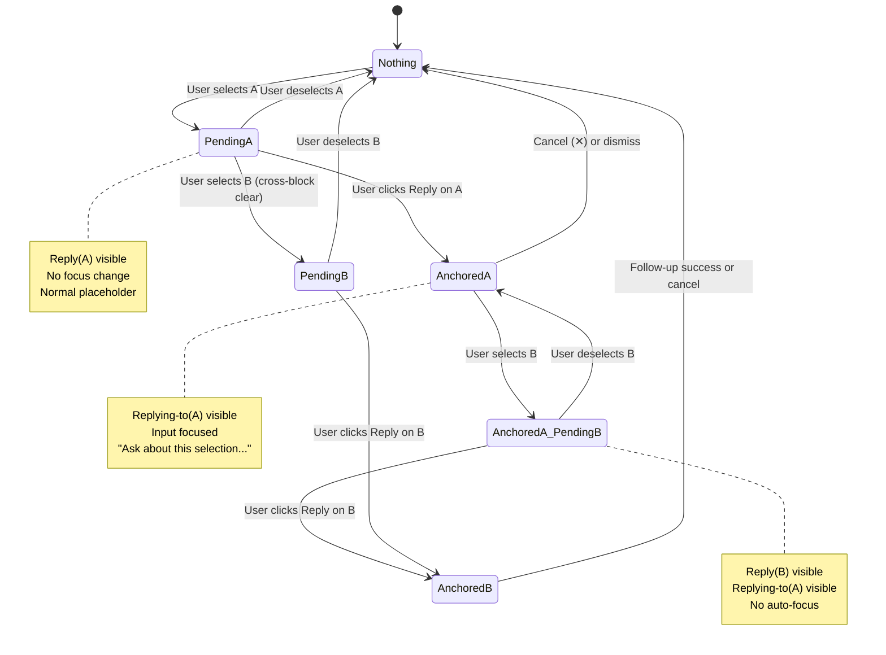
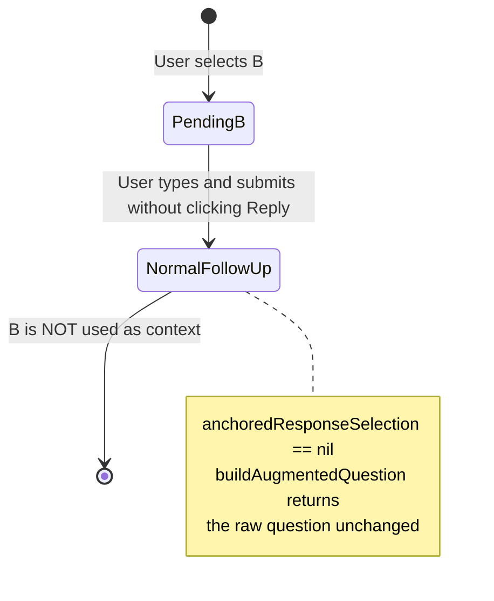
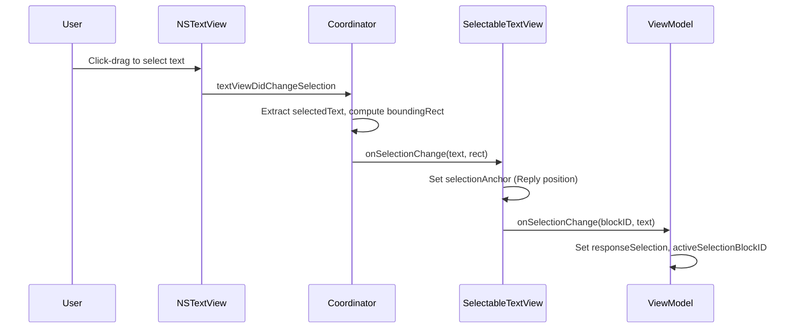
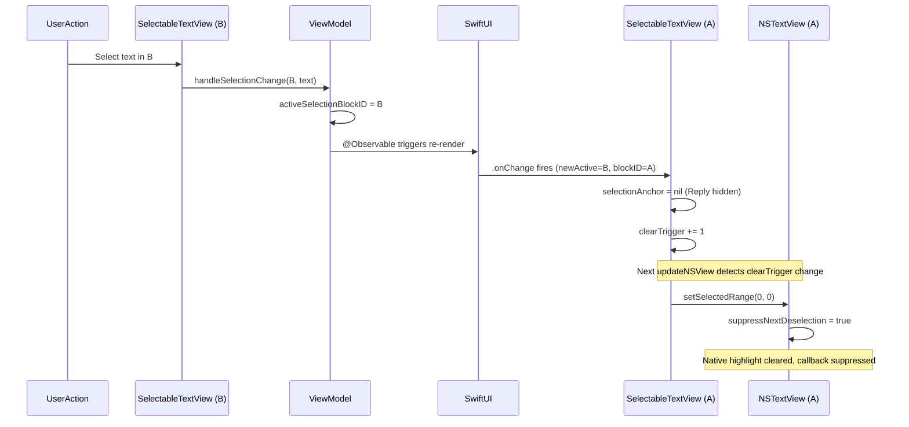
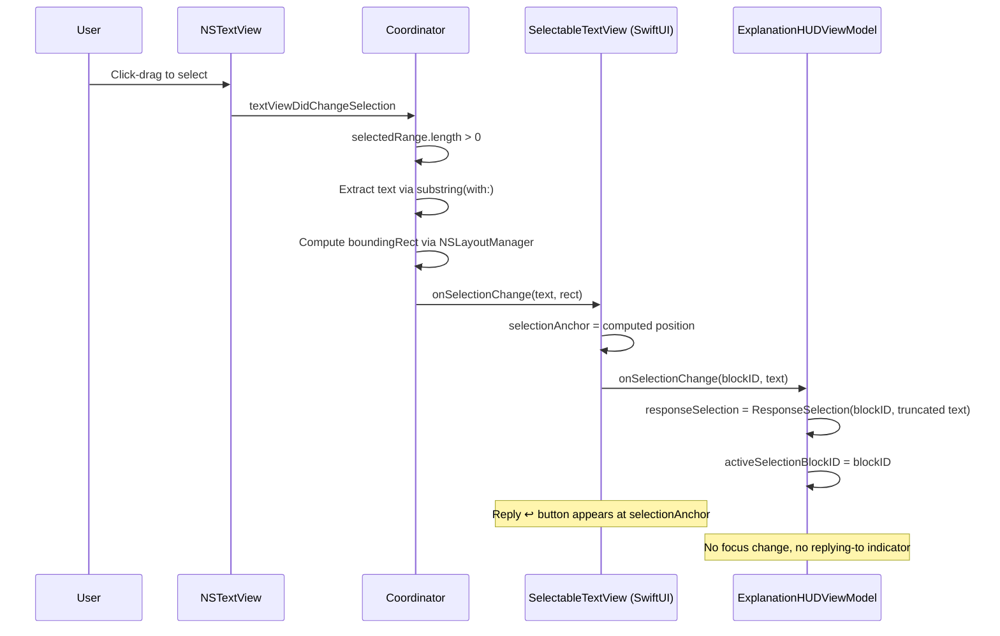
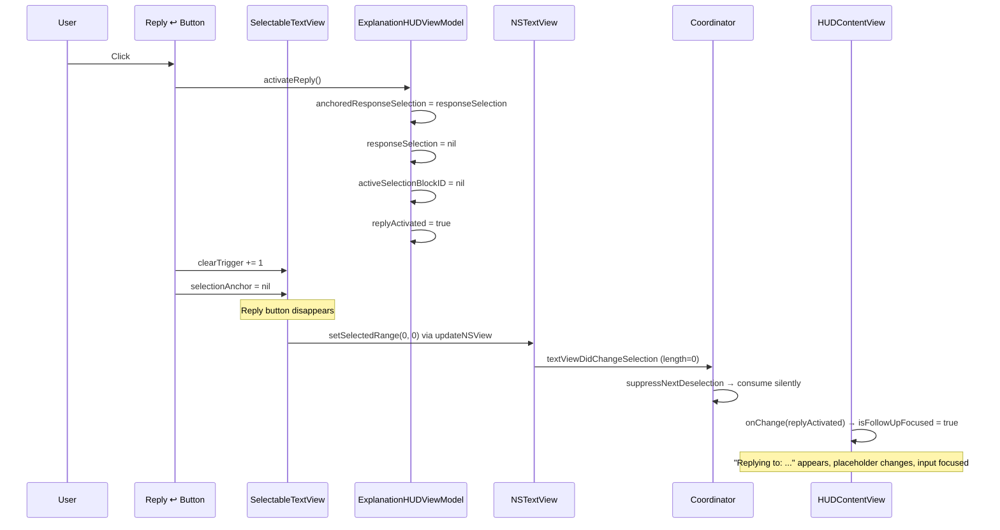
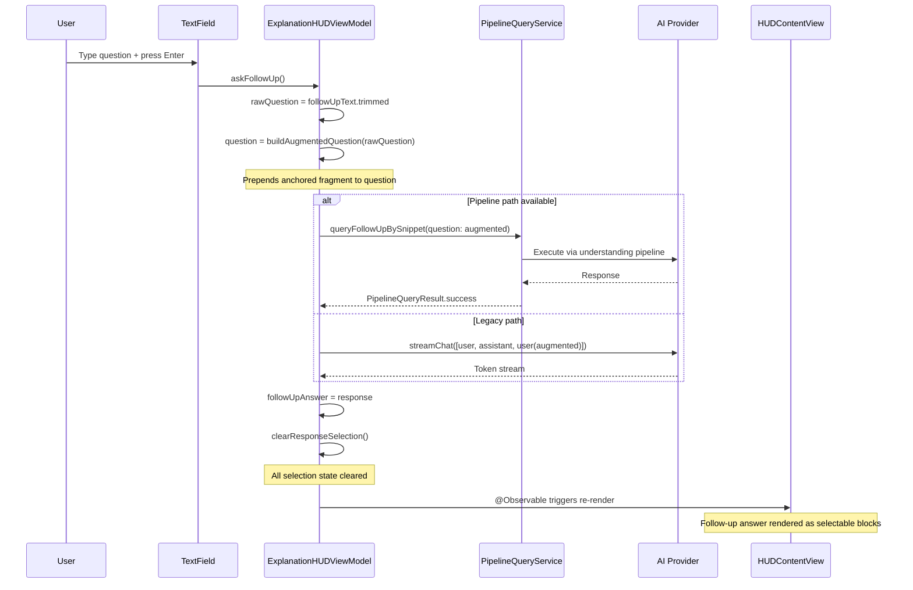
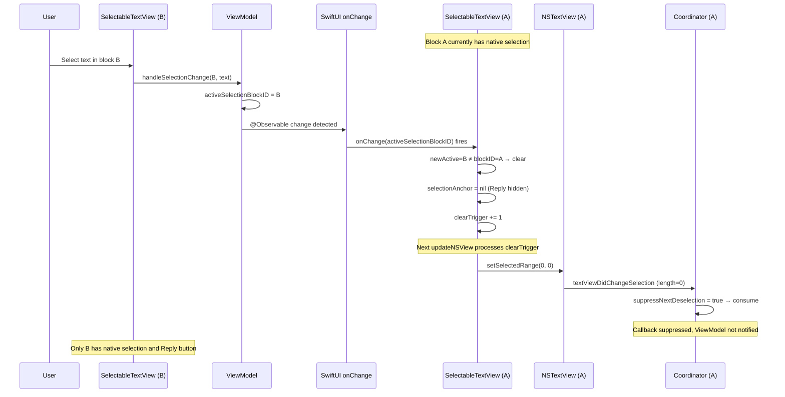
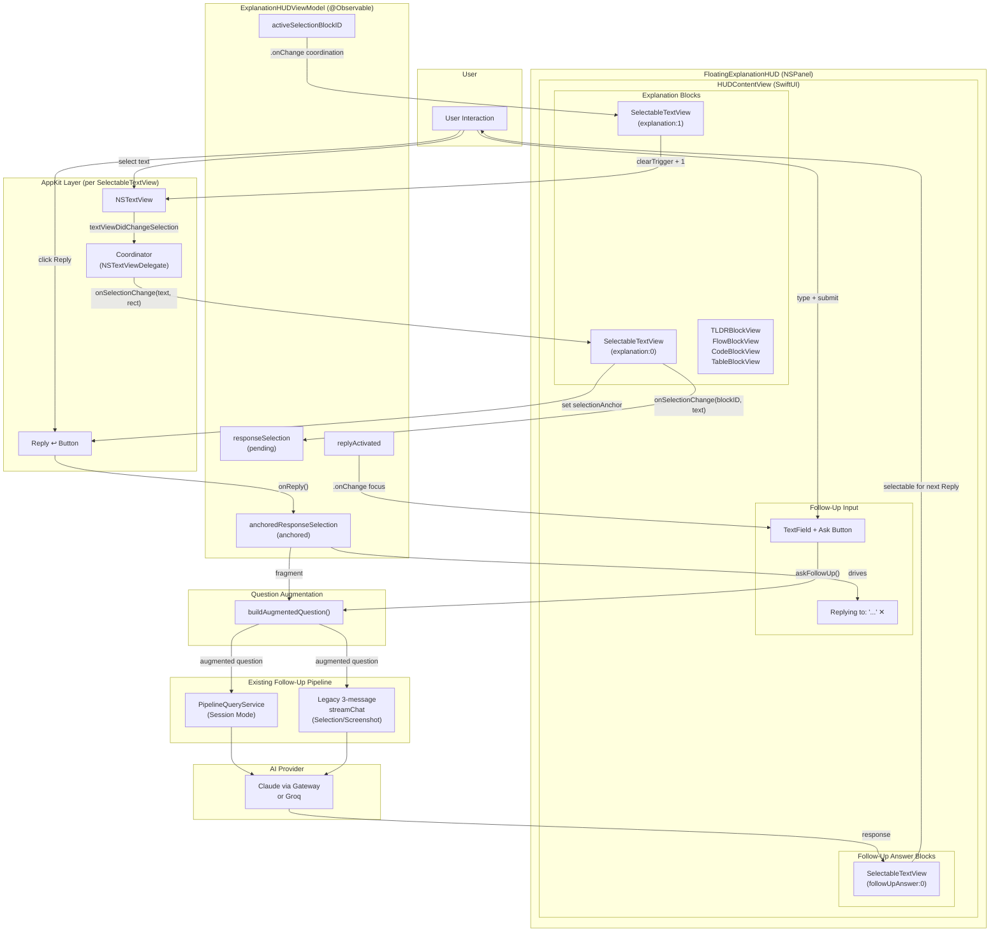

# Anchored Follow-Up / Reply ↩ — Feature Architecture

> **Status**: Implemented, manually verified, production-ready.
> **Date**: 2026-08-12
> **Scope**: Presentation layer extension of the existing Follow-Up system.

---

## 1. Executive Summary

**Anchored Follow-Up** (also called **Reply ↩**) allows users to select a specific fragment of Decode's AI-generated explanation or follow-up answer, explicitly commit that selection as contextual reference via a "Reply ↩" button, and ask a follow-up question that is automatically augmented with the selected fragment.

### Problem

When users ask follow-up questions about a long explanation, they must manually describe which part of the response they mean. This is inefficient and error-prone — the user types "the part about the guard statement" when they could simply point at it.

### Solution

Users select text directly in the response, click Reply, and ask their question. Decode injects the selected fragment as contextual reference into the follow-up request. The AI receives both the question and the exact excerpt the user is asking about.

### Key Design Decisions

- **Extension, not replacement.** Anchored Follow-Up reuses the existing Follow-Up pipeline (both the understanding pipeline path and the legacy 3-message conversation path). No new AI system, no new backend endpoint, no new persistence layer.
- **Explicit intent.** Selecting text is a candidate action. Clicking Reply is explicit user intent. This prevents accidental contextual follow-ups when users select text to read or copy.
- **Single selection.** At most one text block may be visually selected at a time, matching the familiar ChatGPT-style interaction model.
- **Transient state.** All selection and reply state is ephemeral UI state. Nothing is persisted to disk, database, or analytics beyond the normal follow-up request logging.

### Architecture Overview

```
User selects text
  → NSTextView (AppKit) tracks native selection
  → Coordinator reports to ViewModel (pending selection)
  → Reply button appears (SwiftUI overlay)

User clicks Reply
  → ViewModel commits pending → anchored selection
  → Native selection cleared
  → "Replying to..." indicator appears
  → Follow-Up input focused

User submits question
  → ViewModel augments question with anchored fragment
  → Existing Follow-Up pipeline executes
  → Response rendered in selectable blocks
  → Cycle can repeat
```

### Components Involved

| Layer | Component | Role |
|-------|-----------|------|
| Presentation | `SelectableTextView` | NSTextView wrapper with Reply button |
| Presentation | `FloatingExplanationHUD` | HUD panel hosting content views |
| Presentation | `ExplanationHUDViewModel` | State management for selection and reply |
| Presentation | `ExplanationTagParser` | Parses explanation text into content blocks |
| Infrastructure | `AILimits` | Selection character limit (1,500) |
| Application | `PipelineQueryService` | Pipeline follow-up execution |
| Infrastructure | AI Provider | Existing LLM communication |

---

## 2. Product / UX Intent

### The Fundamental Distinction

The feature is built on one critical UX principle:

> **Selecting text is not the same as replying to text.**

Selecting text is exploratory. Users select text to read it, to copy it, to consider it. This is a candidate action with no commitment.

Clicking Reply is deliberate. The user has decided: "I want to ask a question specifically about this fragment." This is explicit user intent.

This distinction prevents a class of UX errors where a user who merely highlighted text to read it more carefully would accidentally attach that selection to their next follow-up question.

### Interaction Model

The interaction is intentionally similar to ChatGPT's select-and-reply pattern:

1. Completed responses become selectable text.
2. Selecting text surfaces a contextual action (Reply).
3. The action commits the selection as reference context.
4. The user types a question that is understood in the context of the selected fragment.
5. Follow-up answers are themselves selectable, enabling iterative drill-down.

Decode does not replicate ChatGPT's internal architecture. The similarity is purely in the interaction model that users already understand.

---

## 3. Complete User Journey

### A. No Selection

The explanation is complete. All `.inlineRun` content blocks are rendered as `SelectableTextView` instances (NSTextView-backed). The follow-up input shows the default placeholder: "Ask a follow-up question...". No Reply button is visible.

### B. User Selects Text

The user clicks and drags to highlight text within a response block. The NSTextView's `textViewDidChangeSelection` delegate fires. The Coordinator extracts the selected text and its bounding rectangle, then calls the SwiftUI callback. The ViewModel records the pending selection.

### C. Reply Button Appears

A dark capsule button labeled "Reply ↩" appears near the selected text, positioned just below the selection (or above if insufficient vertical space). The button belongs to the block that contains the selection. Only one Reply button can exist at a time.

**Nothing else changes.** The follow-up input is not focused. The placeholder remains "Ask a follow-up question...". No "Replying to..." indicator appears.

### D. User Clicks Reply

The pending selection is copied to `anchoredResponseSelection`. The pending selection is cleared. The native NSTextView highlight is cleared via `clearTrigger`. The Reply button disappears.

### E. Replying-to Indicator Appears

A secondary indicator appears above the follow-up input: "Replying to: `[first 80 characters of selection]...`" with a dismiss (✕) button. This indicator is driven by `anchoredResponseSelection`, not by the pending selection.

### F. Follow-Up Input Receives Focus

`replyActivated` is set to `true`. The SwiftUI `.onChange(of: viewModel.replyActivated)` handler sets `isFollowUpFocused = true`, transferring keyboard focus to the TextField. The flag is immediately reset to `false` after consumption.

### G. User Types Question

The user types into the follow-up TextField. The placeholder now reads "Ask about this selection..." (driven by `anchoredResponseSelection != nil`). The user's visible question text is exactly what they type.

### H. Question Is Submitted

The user presses Enter or clicks "Ask". `askFollowUp()` is called. `buildAugmentedQuestion()` prepends the anchored fragment to the user's question:

```
Regarding this specific part of [your previous response / your follow-up answer]:
"[anchored fragment]"

[user's question]
```

The user never sees this augmented form. Their TextField shows only their question.

### I. Anchored Context Reaches Follow-Up Pipeline

The augmented question string is passed to the existing follow-up infrastructure. If pipeline state exists (Session Mode), the question goes through `PipelineQueryService.queryFollowUpBySnippet()` or `queryFollowUp()`. Otherwise, it goes through the legacy 3-message conversation path via `askFollowUpLegacy()`.

No special handling exists in either path for anchored context — the augmented question is treated as a normal follow-up question.

### J. Follow-Up Answer Is Rendered

The follow-up answer is parsed through `ExplanationTagParser.blocks()` and rendered. Every `.inlineRun` block becomes a `SelectableTextView` with `source: .followUpAnswer`. These blocks are immediately selectable.

On success, `clearResponseSelection()` is called, clearing all pending and anchored state.

### K. User Selects Text From Follow-Up Answer

The same selection mechanism applies. The `SelectableBlockID` uses `source: .followUpAnswer` to distinguish these blocks from the original explanation. Reply button appears.

### L. User Replies to the New Selection

The cycle repeats. The new anchored selection's `isFollowUp` property is `true`, which changes the augmented question wording from "your previous response" to "your follow-up answer".

### M. User Cancels Anchored Context

The user clicks the ✕ button on the "Replying to..." indicator. This calls `clearResponseSelection()`, which clears `responseSelection`, `anchoredResponseSelection`, `activeSelectionBlockID`, and `replyActivated`. The follow-up input returns to its default state.

### N. HUD Is Dismissed

`dismiss()` calls `clearResponseSelection()` as part of its full state reset. All selection state is cleared.

### O. New Explanation Begins

`showLoading()`, `showStream()`, `showError()`, and `prepareIntentCollection()` all call `clearResponseSelection()` during their state resets. Any previous selection state is cleared before new content appears.

---

## 4. UI Architecture

### Visual Structure

```
┌─────────────────────────────────────────┐
│  ✦ Explanation — [source app]    [mode] │  ← Header
├─────────────────────────────────────────┤
│                                         │
│  [Selectable explanation text blocks]   │  ← SelectableTextView instances
│                                         │     (.inlineRun blocks only)
│           ┌────────────┐                │
│           │ Reply ↩    │                │  ← Contextual capsule button
│           └────────────┘                │     (dark background, positioned
│                                         │      near selection)
│  [TL;DR cards, flow blocks, code blocks,│
│   tables — NOT selectable]              │  ← Other block types use
│                                         │     dedicated views
├─────────────────────────────────────────┤
│  Follow-up                              │  ← Section divider
│  [Follow-up answer blocks]              │  ← Also SelectableTextView
│                                         │     (source: .followUpAnswer)
├─────────────────────────────────────────┤
│  ↩ Replying to: "[preview]..."    ✕     │  ← Replying-to indicator
│                                         │     (only when anchored)
│  ┌─────────────────────────┐  ┌─────┐  │
│  │ Ask about this sel...   │  │ Ask │  │  ← Follow-Up input
│  └─────────────────────────┘  └─────┘  │     (placeholder changes
│                                         │      when anchored)
└─────────────────────────────────────────┘
```

### Visual State Changes

| Trigger | Reply Button | Replying-to | Placeholder | Focus |
|---------|-------------|-------------|-------------|-------|
| Text selected | Appears near selection | Hidden | "Ask a follow-up question..." | No change |
| Reply clicked | Disappears | Appears | "Ask about this selection..." | Input focused |
| ✕ on indicator | Hidden | Disappears | "Ask a follow-up question..." | No change |
| Follow-up succeeds | Hidden | Disappears | "Ask a follow-up question..." | No change |

### Reply Button Positioning

The Reply button is a SwiftUI `Button` overlaid on the `SelectableTextView` via `ZStack`. Its position is computed from the NSTextView selection geometry:

1. `NSLayoutManager.boundingRect(forGlyphRange:in:)` returns the selection rectangle in NSTextView-local coordinates.
2. The button is placed `4pt` below the selection, horizontally centered on the selection midpoint.
3. Horizontal clamping keeps the button within the view width.
4. If the button would exceed the view's bottom edge, it is placed `4pt` above the selection instead.

The button is positioned via `.offset(x:y:)` within the `ZStack`.

### Selectable Block Types

Only `.inlineRun` blocks (inline prose with optional tag formatting) are wrapped in `SelectableTextView`. Other block types are rendered with their own dedicated views:

| Block Type | View | Selectable? |
|-----------|------|-------------|
| `.inlineRun` | `SelectableTextView` | Yes |
| `.tldr` | `TLDRBlockView` | No |
| `.flow` | `FlowBlockView` | No |
| `.codeBlock` | `CodeBlockView` | No |
| `.table` | `TableBlockView` | No |

Explanation blocks use `SelectableTextView` only when `displayState == .complete`. During streaming, they use standard SwiftUI `Text` with `.textSelection(.enabled)`.

---

## 5. UI State Matrix

| # | State | `responseSelection` | `anchoredResponseSelection` | `activeSelectionBlockID` | Reply Button | Replying-to | Placeholder | Focus | Augmentation |
|---|-------|--------------------|-----------------------------|--------------------------|-------------|-------------|-------------|-------|-------------|
| 1 | Nothing selected | `nil` | `nil` | `nil` | Hidden | Hidden | "Ask a follow-up..." | No | None |
| 2 | Pending selection | Set | `nil` | Set | Visible | Hidden | "Ask a follow-up..." | No | None |
| 3 | Anchored reply | `nil` | Set | `nil` | Hidden | Visible | "Ask about this..." | Yes | Active |
| 4 | Anchored + new pending | Set | Set (old) | Set (new) | Visible (new) | Visible (old) | "Ask about this..." | No | Old anchor |
| 5 | New reply replaces old | `nil` | Set (new) | `nil` | Hidden | Visible (new) | "Ask about this..." | Yes | New anchor |
| 6 | Follow-up submitting | `nil` | Set | `nil` | Hidden | Visible | "Ask about this..." | No | Active |
| 7 | Follow-up success | `nil` | `nil` | `nil` | Hidden | Hidden | "Ask a follow-up..." | No | Cleared |
| 8 | Follow-up failure | `nil` | Set | `nil` | Hidden | Visible | "Ask about this..." | No | Active |
| 9 | Cancel (✕ on indicator) | `nil` | `nil` | `nil` | Hidden | Hidden | "Ask a follow-up..." | No | None |
| 10 | HUD dismissal | `nil` | `nil` | `nil` | Hidden | Hidden | — | — | Cleared |
| 11 | New explanation | `nil` | `nil` | `nil` | Hidden | Hidden | — | — | Cleared |

Notes:
- State 4 is the key interaction: a new pending selection coexists with an old anchored selection. Reply is visible for the new selection.
- State 8 (follow-up failure) preserves the anchored context so the user can retry.
- State 7 clears everything via `clearResponseSelection()` on both pipeline and legacy success paths.

---

## 6. Core State Model

Three conceptually distinct states govern the feature. Understanding their separation is essential.

### 6.1. Native Selection

**What**: The visual text highlight rendered by AppKit's `NSTextView`.

**Where**: Each `NSTextView` instance within each `SelectableTextView` / `SelectableTextViewRepresentable`.

**Nature**: Pure UI state. Managed by AppKit, not SwiftUI or the ViewModel. Multiple NSTextViews can independently hold native selections — the cross-block coordination mechanism (Section 9) enforces single selection.

**Cleared by**: `textView.setSelectedRange(NSRange(location: 0, length: 0))`, triggered via the `clearTrigger` binding.

### 6.2. Pending Selection (`responseSelection`)

**What**: The ViewModel's record of the currently selected response fragment. Represents a Reply candidate that the user has not yet committed to.

**Where**: `ExplanationHUDViewModel.responseSelection: ResponseSelection?`

**Type**: `ResponseSelection` — contains `blockID: SelectableBlockID` and `text: String` (truncated to `AILimits.maxResponseSelectionCharacters` = 1,500 characters).

**Set by**: `handleSelectionChange(blockID:text:)` when text is non-empty.

**Cleared by**: `handleSelectionChange` with nil/empty text from the active block, or `activateReply()` (consumed into anchored), or `clearResponseSelection()`.

**Controls**: Reply button visibility (via `selectionAnchor` on the `SelectableTextView`).

**Does NOT control**: Replying-to indicator, placeholder text, focus, or prompt augmentation.

### 6.3. Anchored Selection (`anchoredResponseSelection`)

**What**: The explicitly committed Reply context. Created only when the user clicks the Reply button.

**Where**: `ExplanationHUDViewModel.anchoredResponseSelection: ResponseSelection?`

**Type**: Same `ResponseSelection` struct as pending.

**Set by**: `activateReply()` only — copies from `responseSelection`.

**Cleared by**: `clearResponseSelection()` (called on follow-up success, cancel, dismiss, new explanation).

**Controls**: Replying-to indicator visibility, "Ask about this selection..." placeholder, Follow-Up prompt augmentation via `buildAugmentedQuestion()`.

### Mapping to Implementation

| Concept | Swift Property | Type | Set By | Cleared By |
|---------|---------------|------|--------|------------|
| Pending selection | `responseSelection` | `ResponseSelection?` | `handleSelectionChange` | `handleSelectionChange(nil)`, `activateReply`, `clearResponseSelection` |
| Active block | `activeSelectionBlockID` | `SelectableBlockID?` | `handleSelectionChange` | `activateReply`, `clearResponseSelection` |
| Anchored selection | `anchoredResponseSelection` | `ResponseSelection?` | `activateReply` | `clearResponseSelection` |
| Reply focus trigger | `replyActivated` | `Bool` | `activateReply` | `.onChange` consumer in view, `clearResponseSelection` |

---

## 7. State Transition Diagram



### Non-Reply Follow-Up Path



This diagram illustrates the critical invariant: pending selection alone never causes augmentation.

---

## 8. Native Text Selection Architecture

### Why NSTextView

SwiftUI's `.textSelection(.enabled)` modifier allows text selection but does not expose the selected text programmatically. There is no SwiftUI API to:

- Read what text the user has selected
- Read the selection's screen coordinates
- Programmatically clear the selection
- Receive callbacks when selection changes

All four capabilities are required for Anchored Follow-Up. `NSTextView` provides all of them through its delegate protocol and `NSLayoutManager`.

### Component Structure

```
SelectableTextView (SwiftUI View)
├── SelectableTextViewRepresentable (NSViewRepresentable)
│   ├── NSTextView (AppKit)
│   │   └── NSTextStorage (attributed text)
│   └── Coordinator (NSTextViewDelegate)
│       ├── textViewDidChangeSelection() — fires on selection change
│       ├── suppressNextDeselection — flag for programmatic clears
│       └── lastAttributedString — change detection
└── Reply ↩ Button (SwiftUI overlay, offset-positioned)
```

### Data Flow: Selection



### Attributed Text Handling

`ExplanationTagParser.attributedString(from:)` produces a SwiftUI `AttributedString` with formatting for custom tags (`<hl>`, `<critical>`, `<tip>`, etc.). This is bridged to `NSAttributedString` via `buildNSAttributedString(from:)`, which also applies a fallback `NSFont.systemFont(ofSize: 13)` to any runs lacking a font attribute.

Content change detection compares source `AttributedString` values on the Coordinator (`lastAttributedString`) rather than comparing bridged `NSAttributedString` objects. This avoids a bridging asymmetry where fallback font application creates non-equal `NSAttributedString` instances from equal `AttributedString` inputs, which would cause spurious `setAttributedString` calls on every `updateNSView` invocation.

### Block Identity

Each selectable block receives a `SelectableBlockID` combining:

- `source: SelectableBlockSource` — `.explanation` or `.followUpAnswer`
- `index: Int` — the block's position within its source (assigned sequentially by `ExplanationTagParser`)

This prevents ID collisions because `ExplanationTagParser` assigns IDs `0, 1, 2, ...` independently for each `blocks(from:)` call. Without source qualification, explanation block 0 and follow-up answer block 0 would be indistinguishable.

---

## 9. Cross-Block Selection Coordination

### The Problem

Decode renders multiple independent `NSTextView` instances — one per `.inlineRun` content block. AppKit does not enforce single selection across different `NSTextView` instances. If a user selects text in block A, then selects text in block B, both blocks retain their native highlights.

This creates confusing UX: two highlighted regions, two Reply buttons, ambiguous context.

### The Solution: SwiftUI `.onChange` Coordination

Each `SelectableTextView` receives `activeSelectionBlockID` from the parent `FloatingExplanationHUD` (via `viewModel.activeSelectionBlockID`). An `.onChange` handler detects when the active block changes:

```swift
.onChange(of: activeSelectionBlockID) { _, newActive in
    if let newActive, newActive != blockID, selectionAnchor != nil {
        selectionAnchor = nil      // Hide Reply button
        clearTrigger += 1          // Clear native NSTextView selection
    }
}
```

### Sequence: Cross-Block Clearing



### Why `updateNSView` Alone Was Insufficient

An earlier implementation attempted to clear cross-block selections directly in `updateNSView` by comparing `activeSelectionBlockID` against `blockID`. This approach had two problems:

1. **SwiftUI scheduling**: `updateNSView` is called during SwiftUI's view reconciliation pass. The timing of when each representable receives its update is not guaranteed to be immediate.
2. **Callback suppression side-effect**: The cross-block clear used `suppressNextDeselection = true` to prevent the deselection callback from firing. But this also prevented `selectionAnchor` from being cleared, leaving the Reply button visible on the old block even though its native selection was gone.

The `.onChange` approach operates at the SwiftUI level, directly setting `selectionAnchor = nil` (clearing the Reply button) and incrementing `clearTrigger` (which propagates to `updateNSView` via the binding, clearing the native selection).

---

## 10. Stale Deselection Protection

### The Race Condition

When block A is programmatically cleared because block B became active:

1. `clearTrigger` is incremented on A's `SelectableTextView`.
2. In the next `updateNSView`, A's representable calls `textView.setSelectedRange(NSRange(location: 0, length: 0))`.
3. AppKit fires `textViewDidChangeSelection` synchronously.
4. The Coordinator receives a zero-length selection notification.

If this callback were processed normally, it would call `onSelectionChange(nil, nil)`, which would call `viewModel.handleSelectionChange(blockID: A, text: nil)`. If `activeSelectionBlockID` were `A`, this would clear the pending selection — potentially clearing B's legitimate selection state.

### The Protection Mechanism

Two layers of protection prevent this:

**Layer 1: Suppression flag on the Coordinator.**
Before programmatic clearing, `suppressNextDeselection` is set to `true`. When `textViewDidChangeSelection` fires with a zero-length range and suppression is active, the callback is silently consumed and the flag is reset to `false`. The ViewModel never sees the deselection.

**Layer 2: Stale blockID comparison on the ViewModel.**
Even if the suppression flag is not set (e.g., the user manually deselects text in the old block), `handleSelectionChange` checks:

```swift
if activeSelectionBlockID == blockID {
    // Clear — this is from the currently active block
} else {
    // Ignore — stale deselection from a previously active block
}
```

Since `activeSelectionBlockID` is `B` and the callback's `blockID` is `A`, the deselection is ignored.

### Invariant

> A deselection callback from block X must only clear the pending selection if `activeSelectionBlockID == X`. All other deselections are stale and must be silently discarded.

---

## 11. Reply Button Architecture

### Visibility Rule

The Reply button is visible when `selectionAnchor != nil` — that is, when the block has a pending native selection with a computed button position.

```swift
if let anchor = selectionAnchor {
    // Reply button rendered
}
```

There is no guard on `anchoredResponseSelection`. An existing anchored reply context does not suppress the Reply button. This is the critical invariant for State 4 (Anchored A + Pending B):

> Reply visibility depends on pending selection, not on whether an anchored selection already exists.

### Ownership

The Reply button belongs to exactly one block: the block with the current `selectionAnchor`. Since the `.onChange` cross-block coordination clears `selectionAnchor` on all non-active blocks, only one Reply button can exist at a time.

### Position

Computed from `NSLayoutManager.boundingRect(forGlyphRange:in:)`:

- Default: centered below the selection, `4pt` gap.
- Horizontal: clamped to `[0, viewWidth - buttonWidth]`.
- Vertical fallback: if below would overflow, placed `4pt` above the selection.

### Appearance

Dark capsule (`Color(red: 0.20, green: 0.20, blue: 0.20)`) with white text "Reply ↩", `11pt` system font, `4px` drop shadow. Uses `.buttonStyle(.plain)` to avoid SwiftUI's default button chrome.

### Click Action

```swift
Button {
    onReply()             // → viewModel.activateReply()
    clearTrigger += 1     // Clear native NSTextView selection
    selectionAnchor = nil // Hide this Reply button
}
```

Three actions in sequence:
1. Commit the pending selection as anchored context.
2. Clear the native visual highlight.
3. Remove the Reply button from the UI.

---

## 12. Reply Activation

When the user clicks Reply, `activateReply()` executes:

```swift
func activateReply() {
    guard let pending = responseSelection else { return }
    anchoredResponseSelection = pending    // 1. Capture
    responseSelection = nil                // 2. Clear pending
    activeSelectionBlockID = nil           // 3. No block is "active" anymore
    followUpText = ""                      // 4. Clear any typed text
    replyActivated = true                  // 5. Signal focus transfer
}
```

### Step-by-Step

1. **Capture**: The pending `ResponseSelection` (with its `blockID` and truncated `text`) is copied to `anchoredResponseSelection`.
2. **Clear pending**: `responseSelection` becomes `nil`. There is no longer a pending selection candidate.
3. **Clear active block**: `activeSelectionBlockID` becomes `nil`. This ensures that the `.onChange` handler on the (now-clearing) block does not re-trigger.
4. **Clear input**: `followUpText` is reset to empty string.
5. **Signal focus**: `replyActivated` is set to `true`. The view's `.onChange(of: viewModel.replyActivated)` handler transfers focus to the TextField and resets the flag.

### Semantic State Survives Native Clearing

The Reply button's click handler also increments `clearTrigger`, which clears the native NSTextView selection. The Coordinator's `suppressNextDeselection` flag prevents the resulting zero-length callback from reaching the ViewModel. Thus:

- Native highlight: cleared
- `selectionAnchor`: cleared (by the button action, not the callback)
- `anchoredResponseSelection`: preserved (set by `activateReply()`)

The anchored context survives the native clearing because it exists at the ViewModel level, completely independent of the AppKit selection state.

---

## 13. Follow-Up Integration

Anchored Follow-Up does not create a separate conversation system. It augments the user's question before passing it to the existing Follow-Up infrastructure.

### Two Follow-Up Paths

Decode has two follow-up execution paths. Both receive the augmented question identically.

#### Pipeline Path (Session Mode)

When `FollowUpContext` contains pipeline state (`pipelineQueryService`, `pipelineConversationState`, `pipelineFilePath`):

1. Snippet-based: `PipelineQueryService.queryFollowUpBySnippet()` — used when line range is available.
2. Entity-based: `PipelineQueryService.queryFollowUp()` — used when entity name is available.

The augmented question is injected into `ConversationState` via `injectQuestion()`, which adds a `pendingQuestion` field to the `FollowUpReasoningEngine`'s state.

#### Legacy Path (Selection/Screenshot Mode)

When pipeline state is absent, a 3-message conversation is constructed:

```
Message 1 (user):      Original source content
Message 2 (assistant): Explanation text
Message 3 (user):      Augmented question (with anchored fragment)
```

This is streamed via `aiProvider.streamChat()` with the combined system prompt (original + follow-up rules).

### No Backend Changes

The augmented question is a plain text string. It requires no special backend handling, no new API endpoint, no new request field. The backend receives a normal follow-up request that happens to contain a quoted excerpt in its question text.

### Cleanup After Follow-Up

Both paths call `clearResponseSelection()` on success, clearing all pending and anchored state:

- Pipeline success: after `followUpAnswer` is set and `followUpText` is cleared.
- Legacy success: after the stream completes without cancellation.

Follow-up failure does NOT clear the anchored context, allowing the user to retry.

---

## 14. Prompt / Context Augmentation

### Where Augmentation Occurs

`ExplanationHUDViewModel.buildAugmentedQuestion(_:)` is a private method called by `askFollowUp()`. It is the single point where the anchored fragment is injected into the question.

### Augmentation Format

```
Regarding this specific part of [source]: "[selected text]"

[user's question]
```

Where `[source]` is either:
- `"your previous response"` — when the selection is from the original explanation (`isFollowUp == false`)
- `"your follow-up answer"` — when the selection is from a follow-up answer (`isFollowUp == true`)

### Guard Condition

```swift
guard let selection = anchoredResponseSelection else {
    return question  // No augmentation — return raw question
}
```

If no anchored selection exists, the question passes through unchanged. This is the mechanism by which normal follow-ups (without Reply) remain unaugmented.

### Selection Truncation

The selected text is truncated to `AILimits.maxResponseSelectionCharacters` (1,500 characters) at the point of capture in `handleSelectionChange`:

```swift
let truncated = String(text.prefix(AILimits.maxResponseSelectionCharacters))
```

This prevents excessively long selections from consuming disproportionate token budget in the follow-up request.

### Key Invariant

> Only `anchoredResponseSelection` is used for augmentation. A pending selection (`responseSelection`) alone never causes augmentation. If the user selects text, ignores Reply, and submits a normal follow-up, the question is sent without modification.

---

## 15. Focus Management

### When Focus Transfers

Focus transfers to the Follow-Up TextField in exactly one scenario: when `activateReply()` sets `replyActivated = true`.

The mechanism:

```swift
// In FloatingExplanationHUD's followUpSection:
.onChange(of: viewModel.replyActivated) { _, activated in
    if activated {
        isFollowUpFocused = true          // @FocusState → TextField
        viewModel.replyActivated = false  // Consume the signal
    }
}
```

`isFollowUpFocused` is a `@FocusState` variable bound to the TextField via `.focused($isFollowUpFocused)`.

### When Focus Does NOT Transfer

- Selecting text (pending selection only) — no focus change.
- A new pending selection while anchored context exists — no focus change.
- Deselection — no focus change.
- Programmatic cross-block clearing — no focus change.

### Non-Activating Panel Considerations

The HUD uses `KeyablePanel` (an `NSPanel` subclass with `canBecomeKey: true`) at `.floating` level with `.nonactivatingPanel` style mask. The panel can become key (required for button clicks and TextField input) without activating Decode's app or stealing focus from the user's source editor.

When Reply is clicked, the panel is already key (the user clicked a button inside it). The `@FocusState` transfer simply moves focus within the panel from the button to the TextField.

---

## 16. Lifecycle and Cleanup

All lifecycle paths that reset the HUD call `clearResponseSelection()`, which clears:

| Property | Cleared To |
|----------|-----------|
| `responseSelection` | `nil` |
| `anchoredResponseSelection` | `nil` |
| `activeSelectionBlockID` | `nil` |
| `replyActivated` | `false` |

### Lifecycle Paths

| Trigger | Method | Clears Selection? |
|---------|--------|-------------------|
| Follow-up success (pipeline) | `clearResponseSelection()` inline | Yes |
| Follow-up success (legacy) | `clearResponseSelection()` inline | Yes |
| Follow-up failure | — | **No** (allows retry) |
| Cancel (✕ on replying-to) | `clearResponseSelection()` | Yes |
| Dismiss HUD | `dismiss()` → `clearResponseSelection()` | Yes |
| New explanation loading | `showLoading()` → `clearResponseSelection()` | Yes |
| New stream | `showStream()` → `clearResponseSelection()` | Yes |
| Error state | `showError()` → `clearResponseSelection()` | Yes |
| Intent collection | `prepareIntentCollection()` → `clearResponseSelection()` | Yes |

### Native Selection Cleanup

Native NSTextView selections are cleared independently of ViewModel state:

- **Reply click**: `clearTrigger += 1` in the button action.
- **Cross-block**: `clearTrigger += 1` in the `.onChange` handler.
- **View destruction**: NSTextView is deallocated when the HUD is dismissed or content changes.

The `clearTrigger` mechanism uses an integer counter compared against `lastClearTrigger` on the Coordinator. This is idempotent: repeated `updateNSView` calls with the same trigger value do not re-clear.

---

## 17. Data Ownership

| Data | Owner | Layer | Scope |
|------|-------|-------|-------|
| Native text highlight | `NSTextView` | AppKit | Per-block, visual only |
| Selection anchor (button position) | `SelectableTextView.selectionAnchor` | SwiftUI `@State` | Per-block |
| Clear trigger | `SelectableTextView.clearTrigger` | SwiftUI `@State` / `@Binding` | Per-block |
| Suppress deselection flag | `Coordinator.suppressNextDeselection` | AppKit Coordinator | Per-block |
| Source AttributedString cache | `Coordinator.lastAttributedString` | AppKit Coordinator | Per-block |
| Pending selection | `ExplanationHUDViewModel.responseSelection` | ViewModel (`@Observable`) | Global (HUD-wide) |
| Active block ID | `ExplanationHUDViewModel.activeSelectionBlockID` | ViewModel (`@Observable`) | Global (HUD-wide) |
| Anchored selection | `ExplanationHUDViewModel.anchoredResponseSelection` | ViewModel (`@Observable`) | Global (HUD-wide) |
| Reply activated flag | `ExplanationHUDViewModel.replyActivated` | ViewModel (`@Observable`) | Global (HUD-wide) |
| Focus state | `HUDContentView.isFollowUpFocused` | SwiftUI `@FocusState` | View-local |

### Key Boundary

The AppKit layer (NSTextView, Coordinator) owns visual selection state. The ViewModel owns semantic selection state. The two are connected by callbacks (AppKit → ViewModel) and triggers (ViewModel → AppKit via `clearTrigger`). They are never conflated.

---

## 18. Persistence

**Nothing is persisted.**

All selection and reply state is transient UI state that exists only while the HUD is visible:

| System | Involved? | Reason |
|--------|-----------|--------|
| SQLite (GRDB) | No | Selection state is not workspace or session data |
| SessionState JSON | No | Selection state is not application session state |
| Virtual Session | No | Selection state is not investigation memory |
| Profile Intelligence | No | Selection state is not user profiling data |
| Analytics | No | No selection-specific events are logged (the follow-up request itself is logged normally) |
| Billing | No | The follow-up request is metered normally; selection adds no separate cost |
| Keychain | No | No credentials involved |
| UserDefaults | No | No preferences involved |

### Why Transient

Response selection is inherently ephemeral. It refers to a specific fragment of a specific AI response in a specific HUD session. It has no meaning outside that context. Persisting it would create stale references to responses that may no longer exist.

---

## 19. Security / Privacy

### Selected Text in AI Requests

The anchored response fragment is included in the augmented follow-up question, which is sent to the AI provider. This is the same AI provider that generated the original response. The fragment is a quoted excerpt of the AI's own output, not new user data.

### Isolation

- Anchored context is cleared on HUD dismiss, new explanation, and follow-up success. It cannot leak into unrelated follow-up sessions.
- The `clearResponseSelection()` calls in `showLoading()`, `showStream()`, `showError()`, and `prepareIntentCollection()` ensure that selection state from a previous explanation cannot contaminate a new one.

### No Clipboard Usage

The feature does not use the system clipboard for selection tracking. `NSTextView` selection is read programmatically via `selectedRange()` and `substring(with:)`. The clipboard remains under the user's control.

### No External Persistence

Selected response text is never written to disk, database, or external service. It exists only in the ViewModel's memory for the duration of the HUD session.

---

## 20. Performance

### Selection Tracking

`textViewDidChangeSelection` fires synchronously on every selection change (including during mouse drag). The callback extracts the selected text (`O(n)` where `n` is the selection length, bounded by the response block size) and computes one `boundingRect` call (`O(1)` from the layout manager's glyph cache).

### Cross-Block Coordination

The `.onChange` handler fires once per `activeSelectionBlockID` change. It performs two constant-time operations: setting `selectionAnchor` to `nil` and incrementing `clearTrigger`. The `clearTrigger` propagation to `updateNSView` involves one `setSelectedRange` call (`O(1)`).

### Attributed Text Rendering

`buildNSAttributedString(from:)` bridges SwiftUI `AttributedString` to `NSAttributedString` and enumerates font attributes. This runs once per content change (not per selection change). The source-value comparison on the Coordinator prevents redundant calls.

### Prompt Augmentation

`buildAugmentedQuestion` is a simple string concatenation. The augmented question adds at most 1,500 characters (the truncation limit) plus a fixed-length prefix (~70 characters).

### Network Impact

**Reply itself introduces zero additional network requests.** No AI call is made when the user selects text or clicks Reply. A network request occurs only when the user submits a follow-up question — the same request that would occur without anchored context, with a slightly longer question string.

### Maximum Selection Size

`AILimits.maxResponseSelectionCharacters = 1,500` characters. This is approximately 300-500 tokens, a modest addition to the follow-up prompt. The truncation is applied at capture time in `handleSelectionChange`, not at augmentation time.

---

## 21. Failure Modes and Edge Cases

| Scenario | Expected Behavior |
|----------|-------------------|
| User selects text but never clicks Reply | Pending selection exists. Normal follow-up (without Reply) sends unaugmented question. Selection clears on deselect or HUD lifecycle reset. |
| User selects A then B | `activeSelectionBlockID` changes to B. `.onChange` fires on A: clears A's highlight and Reply. Only B is selected. |
| User selects A → Reply → selects B | Anchored A exists. Pending B exists. Reply(B) is visible. Replying-to(A) is visible. No automatic focus. |
| User selects A → Reply → B → Reply | Anchored B replaces anchored A. Replying-to shows B. |
| User cancels anchored context | `clearResponseSelection()` clears everything. Normal Follow-Up UI restored. |
| User dismisses HUD | `dismiss()` calls `clearResponseSelection()`. All state cleared. |
| Follow-up fails | `isFollowUpLoading` becomes false. `followUpError` shows the error. Anchored context is preserved for retry. |
| Follow-up succeeds | `clearResponseSelection()` clears anchored context. Answer rendered in selectable blocks. |
| Selection exceeds 1,500 characters | Truncated to `AILimits.maxResponseSelectionCharacters` at capture time. No error shown. |
| Multiple response blocks exist | Each `.inlineRun` block is an independent `SelectableTextView`. Cross-block coordination ensures single selection. |
| Original response vs Follow-Up response | Distinguished by `SelectableBlockSource` (`.explanation` vs `.followUpAnswer`). Affects augmented question wording. |
| During streaming | Explanation blocks use standard `Text` (not `SelectableTextView`) during streaming. Selection is only available after `displayState == .complete`. Follow-up answer blocks are always `SelectableTextView` (they appear only when complete). |
| Empty selection | `handleSelectionChange` treats empty text as deselection. No pending selection created. |
| Stale native callbacks | Suppressed by `suppressNextDeselection` flag. Even without suppression, ViewModel's `activeSelectionBlockID` comparison rejects stale deselections. |
| View recreation (SwiftUI identity change) | `@State` variables (`selectionAnchor`, `clearTrigger`) are tied to SwiftUI view identity. If `ForEach` IDs change (e.g., explanation text changes), views are recreated with fresh state. |
| Non-activating panel focus | `KeyablePanel.canBecomeKey` returns `true`, allowing button clicks and TextField focus without activating the app. |

---

## 22. Architectural Invariants

These invariants must be preserved by future modifications. Each is verified in the current implementation.

1. **Selecting text does not activate Reply.** `handleSelectionChange` sets `responseSelection` (pending) only. It never sets `anchoredResponseSelection`, `replyActivated`, or transfers focus.

2. **Only clicking Reply creates anchored context.** `anchoredResponseSelection` is set exclusively by `activateReply()`.

3. **Only anchored context is used for augmentation.** `buildAugmentedQuestion` reads `anchoredResponseSelection`. If it is `nil`, the question passes through unchanged.

4. **Pending selection may coexist with anchored selection.** `handleSelectionChange` does not check or clear `anchoredResponseSelection`. The two states are independent.

5. **A new pending selection shows Reply even if anchored context exists.** The Reply button's visibility depends only on `selectionAnchor != nil`. There is no guard on anchored state.

6. **A new Reply replaces the previous anchored context.** `activateReply()` overwrites `anchoredResponseSelection` with the current `responseSelection`.

7. **Only one native response selection may be visually active at a time.** The `.onChange(of: activeSelectionBlockID)` handler clears `selectionAnchor` and `clearTrigger` on all non-active blocks.

8. **Stale deselection cannot clear the current block.** `handleSelectionChange` ignores deselection when `activeSelectionBlockID != blockID`.

9. **Native selection clearing does not clear semantic anchored context.** `clearTrigger` and `setSelectedRange` affect only the AppKit NSTextView. `anchoredResponseSelection` is at the ViewModel level.

10. **Normal Follow-Up behavior is unchanged when Reply is not used.** When `anchoredResponseSelection` is `nil`, `buildAugmentedQuestion` returns the raw question. The follow-up pipeline receives exactly what it would have received before this feature existed.

11. **Selection state is transient.** No selection or reply state is persisted to disk, database, or analytics beyond normal follow-up request logging.

12. **Existing Follow-Up infrastructure is reused.** No new AI system, backend endpoint, or conversation pipeline was created. The augmented question is a string that flows through existing paths.

---

## 23. Test Architecture

### Test Suite

`AnchoredFollowUpTests` — 27 tests, all passing. Located at `DecodeTests/Presentation/AnchoredFollowUpTests.swift`.

Tests are `@MainActor` and operate directly on `ExplanationHUDViewModel` instances, verifying state transitions without UI rendering.

### Test Groups

#### Pending Selection State (5 tests)

Verifies that `handleSelectionChange` correctly sets, updates, and clears `responseSelection` and `activeSelectionBlockID`.

| Test | Protects |
|------|----------|
| `testHandleSelectionChangeSetsPendingSelection` | Basic selection capture |
| `testHandleSelectionChangeStoresCorrectBlockID` | Block source/index preservation |
| `testSameBlockDeselectionClearsPendingSelection` | Active-block deselection |
| `testEmptyTextClearsPendingSelection` | Empty string treated as deselection |
| `testSelectionTruncatedToLimit` | 1,500-character truncation |

#### Selection Does NOT Activate Reply (2 tests)

Regression tests for the bug where selecting text immediately showed the replying-to indicator.

| Test | Protects |
|------|----------|
| `testSelectingTextDoesNotCreateAnchoredSelection` | Invariant 1: no anchored state from selection |
| `testSelectingTextDoesNotChangeFollowUpPlaceholder` | No placeholder change from selection |

#### Reply Activation (3 tests)

Verifies the pending-to-anchored transition.

| Test | Protects |
|------|----------|
| `testActivateReplyConvertsPendingToAnchored` | Pending consumed, anchored created |
| `testActivateReplyDoesNothingWithoutPendingSelection` | Guard on nil pending |
| `testAnchoredSelectionSurvivesNativeSelectionClear` | Invariant 9: anchored survives native clear |

#### Reply Visible With Existing Anchor (2 tests)

Regression tests for the bug where an existing anchored selection suppressed the Reply button.

| Test | Protects |
|------|----------|
| `testReplyVisibleWhenAnchoredSelectionExists` | Invariant 5: pending coexists with anchored |
| `testReplyOnBReplacesAnchoredA` | Invariant 6: new Reply replaces old |

#### Cross-Block Selection (3 tests)

Verifies single-selection enforcement and stale-deselection protection.

| Test | Protects |
|------|----------|
| `testSelectingBlockBMakesItActiveBlock` | Active block tracking |
| `testStaleDeselectionDoesNotClearNewerSelection` | Invariant 8: stale deselection ignored |
| `testProgrammaticClearOfOldBlockDoesNotAffectNewBlock` | Programmatic clear safety |

#### Augmentation (3 tests)

Verifies that only anchored selection drives prompt augmentation.

| Test | Protects |
|------|----------|
| `testOnlyAnchoredSelectionDrivesAugmentation` | Invariant 3: no augmentation without Reply |
| `testAnchoredSelectionCreatedByReply` | Augmentation context from Reply click |
| `testPendingSelectionCoexistsWithAnchoredWithoutSuppress` | Invariant 4: coexistence |

#### State Clearing (4 tests)

Verifies that lifecycle events properly clear all selection state.

| Test | Protects |
|------|----------|
| `testClearResponseSelectionResetsAllState` | Explicit clear |
| `testCancelClearsBothPendingAndAnchored` | Cancel with both states active |
| `testDismissClearsAllSelectionState` | HUD dismiss |
| `testSuccessfulFollowUpClearsAnchoredSelection` | Follow-up success |

#### Block Identity (3 tests)

Verifies `SelectableBlockID` equality semantics and `ResponseSelection.isFollowUp`.

| Test | Protects |
|------|----------|
| `testSelectableBlockIDEquality` | Hashable/Equatable correctness |
| `testExplanationAndFollowUpBlockIDsWithSameIndexAreDifferent` | Source-qualified identity |
| `testResponseSelectionIsFollowUp` | isFollowUp computed property |

#### Full Lifecycle (2 tests)

End-to-end state transition verification.

| Test | Protects |
|------|----------|
| `testFullLifecycleSelectReplyAskClear` | Complete happy path |
| `testFullLifecycleAnchorAThenSelectBThenReplyB` | Anchor replacement flow |

### What Tests Cannot Cover

The test suite operates at the ViewModel level. It cannot verify:

- Native NSTextView visual selection (AppKit rendering)
- Cross-block `.onChange` coordination (SwiftUI view lifecycle)
- Reply button positioning (NSLayoutManager geometry)
- Focus transfer (`@FocusState` behavior)
- Non-activating panel keyboard handling

These behaviors are verified by manual testing.

---

## 24. Implementation File Map

| File | Layer | Responsibility | Key Types |
|------|-------|---------------|-----------|
| `Decode/Presentation/Overlay/SelectableTextView.swift` | Presentation | NSTextView wrapper with Reply button, cross-block coordination | `SelectableTextView`, `SelectableTextViewRepresentable`, `Coordinator` |
| `Decode/Presentation/Overlay/ExplanationHUDViewModel.swift` | Presentation | State management for selection, reply, follow-up, improvement | `ExplanationHUDViewModel`, `SelectableBlockSource`, `SelectableBlockID`, `ResponseSelection`, `FollowUpContext` |
| `Decode/Presentation/Overlay/FloatingExplanationHUD.swift` | Presentation | NSPanel lifecycle, SwiftUI hosting, content rendering | `FloatingExplanationHUD`, `HUDContentView`, `KeyablePanel` |
| `Decode/Presentation/Overlay/ExplanationTagParser.swift` | Presentation | Parses explanation text into typed content blocks | `ExplanationTagParser`, `ContentBlock`, `TaggedSegment` |
| `Decode/Infrastructure/AI/AILimits.swift` | Infrastructure | Central response-budget and input-guardrail policy | `AILimits` (enum with static constants) |
| `Decode/App/PipelineQueryService.swift` | Application | Pipeline follow-up query execution | `PipelineQueryService`, `PipelineQueryResult` |
| `Decode/Domain/Models/ExplanationExecutionContext.swift` | Domain | Records which capabilities contributed to an explanation | `ExplanationExecutionContext` |
| `DecodeTests/Presentation/AnchoredFollowUpTests.swift` | Tests | 27 tests for selection state, reply activation, lifecycle | `AnchoredFollowUpTests` |

---

## 25. Architectural Decisions

### Why NSTextView

SwiftUI's `.textSelection(.enabled)` does not expose the selected text, selection coordinates, or selection change events programmatically. `NSTextView` provides all of these through its delegate protocol and `NSLayoutManager`. The wrapper adds ~140 lines but enables the entire feature.

### Why Explicit Reply Activation

Implicit augmentation (automatically using any highlighted text as context) would create surprising behavior. Users frequently select text to read it, copy it, or reference it visually. Requiring an explicit Reply click matches the ChatGPT interaction model that users already understand and prevents accidental context injection.

### Why Pending and Anchored Are Separate

If selection and anchored context were the same property, two problems would arise:

1. Selecting new text B would overwrite anchored context A, silently replacing the user's committed reply context.
2. Deselecting text would clear the anchored context, even though the user explicitly committed to it.

The separation ensures that pending selection is ephemeral (cleared on deselect) while anchored context is durable (cleared only by explicit user action or lifecycle reset).

### Why Single Native Selection

Multiple simultaneous selections create ambiguity: which one does Reply reference? Which one would the user expect to be used for augmentation? The single-selection rule eliminates this ambiguity. The implementation cost is modest (`.onChange` handler + `clearTrigger`).

### Why Existing Follow-Up Infrastructure Is Reused

The anchored fragment is prepended to the question as a text prefix. This requires no changes to the follow-up pipeline, the reasoning engines, the backend gateway, or the AI provider. The augmented question is indistinguishable from a manually-typed question that quotes the relevant text. This is the minimum viable integration.

### Why No Backend Changes

The backend receives a follow-up question. Whether that question contains a quoted excerpt is irrelevant to the gateway, authentication, token logging, or model routing. The entire feature is client-side.

### Why No Persistence

Selection state references a specific fragment of a specific response in a specific HUD session. It has no meaning outside that context. Persisting it would create stale references and add complexity for zero user value.

---

## 26. What This Feature Does Not Do

- **Does not create a separate conversation system.** It augments the existing Follow-Up question text.
- **Does not create a new backend pipeline.** No new API endpoint, no new request format.
- **Does not persist response selections.** All state is transient.
- **Does not automatically use highlighted text as context.** Only explicitly committed (Reply-clicked) selections are used.
- **Does not change ordinary Follow-Up behavior.** When Reply is not used, Follow-Up works exactly as before.
- **Does not require clipboard-based selection.** Selection is tracked via NSTextView's delegate, not the system pasteboard.
- **Does not add analytics events specific to selection.** The follow-up request is logged normally with its compound mode.
- **Does not make non-prose blocks selectable.** Only `.inlineRun` content blocks (prose text) are wrapped in `SelectableTextView`. Code blocks, tables, TL;DR cards, and flow diagrams use their own dedicated views and are not selectable for Reply.
- **Does not support selection across blocks.** Each `NSTextView` handles selection independently. A user cannot select text that spans two prose blocks.

---

## 27. Future Extensibility

These are reasonable future extensions. None are planned or prioritized.

- **Selection from code blocks.** Wrapping `CodeBlockView` in a selectable container would allow users to Reply to specific code fragments. Requires adapting the `SelectableTextView` pattern for monospaced code rendering.
- **Richer selection metadata.** The `ResponseSelection` struct could carry block type, position within the explanation, or surrounding context to give the AI more grounding information.
- **Visual anchoring.** Instead of the text "Replying to: ..." indicator, the original selection could be highlighted in place with a persistent visual marker (background color, side bar) until the follow-up is submitted.
- **Multi-selection.** Allowing the user to select multiple fragments before submitting a single question. Would require changing the single-selection invariant and the augmentation format.
- **Selection analytics.** Tracking which parts of explanations users Reply to could reveal which explanation sections are most confusing or valuable.

---

## 28. Sequence Diagrams

### Sequence 1 — Select Text



### Sequence 2 — Click Reply



### Sequence 3 — Submit Anchored Follow-Up



### Sequence 4 — Cross-Block Selection



---

## 29. Complete Architecture Diagram



---

## 30. CTO Review Summary

### Architecture Status

The Anchored Follow-Up / Reply ↩ feature is **implemented and production-ready**. It extends the existing Follow-Up system with zero backend changes, zero persistence additions, and zero new AI pipelines.

### Production Readiness

- Builds successfully under Swift 6.0 with `SWIFT_STRICT_CONCURRENCY = complete`.
- All selection state is properly isolated to the HUD session.
- Lifecycle cleanup is comprehensive: every entry point that resets the HUD clears selection state.
- No known regressions to existing functionality.

### Test Status

**27 tests, 27 passing, 0 failures.** Tests cover pending selection, reply activation, anchored state, cross-block coordination, stale deselection protection, lifecycle cleanup, and full end-to-end flows.

### Manual Verification

The developer has manually verified the complete interaction flow:
- Text selection shows Reply button without activating reply mode.
- Reply click commits the selection, shows the replying-to indicator, and focuses the input.
- Cross-block selection clears the previous block's highlight.
- New selections show Reply even when an old anchored context exists.
- A new Reply replaces the previous anchored context.
- Submitted follow-ups include the anchored fragment as contextual reference.
- Follow-up answers are themselves selectable for iterative drill-down.

### Known Limitations

1. Only `.inlineRun` prose blocks are selectable. Code blocks, tables, TL;DR cards, and flow diagrams are not.
2. Selection cannot span multiple prose blocks (each `NSTextView` is independent).
3. Selection is limited to 1,500 characters (`AILimits.maxResponseSelectionCharacters`).
4. During streaming (before `displayState == .complete`), explanation blocks use standard SwiftUI `Text` and are not selectable for Reply.

### Critical Invariants

1. Selecting text ≠ activating Reply.
2. Only `anchoredResponseSelection` drives augmentation.
3. Pending and anchored selections are independent.
4. Only one native selection exists at a time.
5. Stale deselection cannot corrupt current state.
6. All selection state is transient.

### Relevant Files

| File | Lines |
|------|-------|
| `Decode/Presentation/Overlay/SelectableTextView.swift` | 267 |
| `Decode/Presentation/Overlay/ExplanationHUDViewModel.swift` | 1,139 |
| `Decode/Presentation/Overlay/FloatingExplanationHUD.swift` | 1,015 |
| `Decode/Infrastructure/AI/AILimits.swift` | 67 |
| `DecodeTests/Presentation/AnchoredFollowUpTests.swift` | ~280 |
