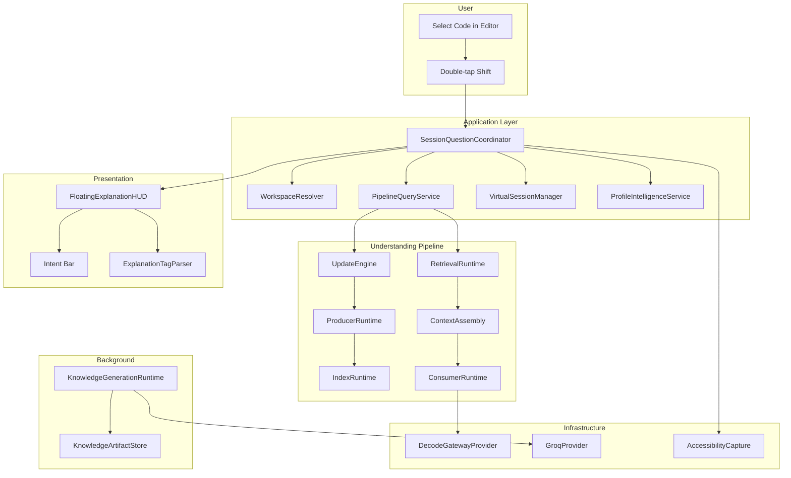
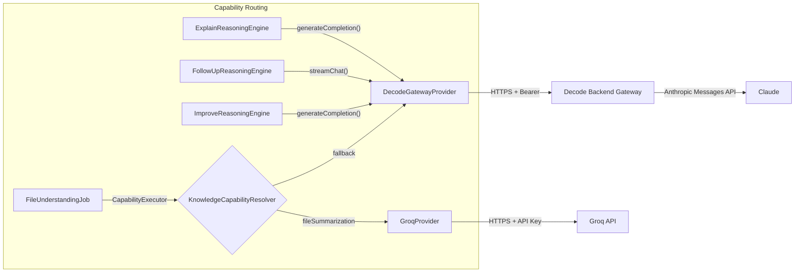
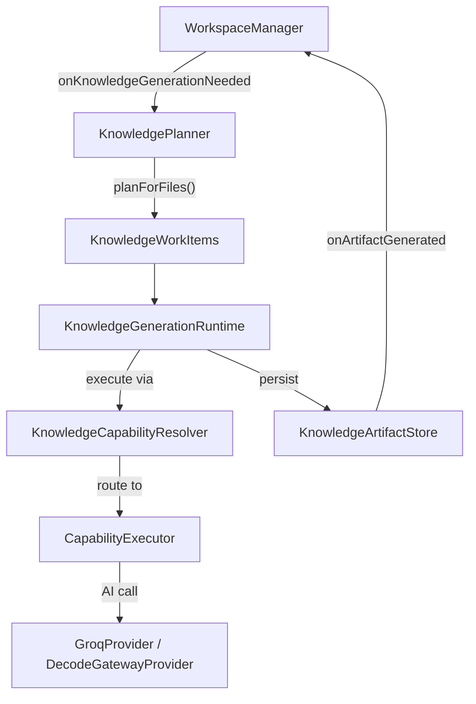
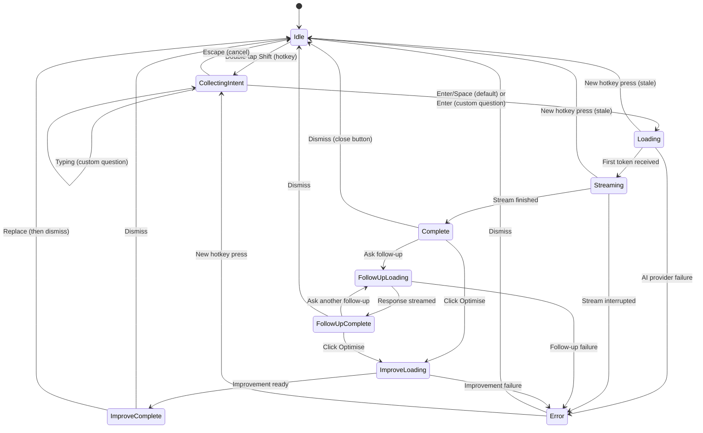

# Decode Session Mode — Complete Architecture Specification

**Version:** 1.0
**Date:** 2026-08-11
**Status:** Current as of `main` branch, commit `6a672d4`
**Audience:** Technical co-founder / CTO

---

## 1. Executive Summary

Session Mode is Decode's most intelligent code understanding capability. Unlike Selection Mode (which sends raw selected text to an LLM) or Screenshot Mode (which OCRs screen content), Session Mode operates on **structured knowledge** — deterministic facts extracted from source code via AST parsing, organized into a tiered intermediate representation (the DIR), and assembled into purpose-calibrated context before any AI reasoning occurs.

The result: Session Mode explanations are grounded in provable structural relationships, not LLM hallucination. Every claim the system produces is traceable to specific source material through a formal grounding chain.

**Key numbers:**
- 8 pipeline modules (DIRCore, ProducerRuntime, IndexRuntime, RetrievalRuntime, ContextAssembly, ConsumerRuntime, UpdateEngine, StorageEngine)
- 5 index families (Entity, Graph, Scope, Predicate, Content)
- 5-stage evidence retrieval pipeline
- 10-phase context assembly pipeline
- 6-phase consumer invocation lifecycle with grounding verification
- 20+ supported source languages
- Proactive background knowledge generation via KGR
- Cross-mode investigation memory via Virtual Session

---

## 2. Product Purpose

### What Problem Does Session Mode Solve?

Traditional code understanding tools do one of two things:

1. **Static analysis** — precise but shallow (linters, type checkers)
2. **"Send code to LLM"** — deep but ungrounded (Copilot Chat, ChatGPT)

Session Mode occupies a third position: **structured intelligence with AI reasoning**. It extracts deterministic, provable facts from source code (entities, relationships, imports, structure), organizes them into a formal knowledge representation, then uses AI only for the reasoning step — explaining what those facts mean for the developer.

### What Does the User Experience?

1. User opens a file or directory in Decode (⌃⇧O for file, ⌃⇧P for directory)
2. User selects code in their editor
3. User double-taps Shift
4. An Intent Bar appears — user can press Enter for a default explanation or type a custom question
5. Decode retrieves structured knowledge about the selected code from its internal representation
6. AI reasons over that knowledge and streams an explanation
7. User can ask follow-up questions, request code improvements, or save notes

The entire flow takes 2–5 seconds for the explanation to begin streaming.

---

## 3. Architectural Scope

This document covers Session Mode exclusively. Selection Mode (double-tap Control) and Screenshot Mode (double-tap Option) share some UI infrastructure (the Explanation HUD) but use fundamentally different execution paths — they send raw text/OCR directly to the AI without structured knowledge retrieval.

Session Mode is the only mode that uses:
- The Understanding Pipeline (8 modules)
- The DIR (Decode Intermediate Representation)
- Evidence retrieval and context assembly
- Reasoning engines with grounding verification
- Knowledge Generation Runtime (proactive semantic enrichment)
- Workspace-first architecture with project indexing

---

## 4. Current Status

### Production-Ready / Frozen

| Component | Status |
|-----------|--------|
| Understanding Pipeline (all 8 modules) | Frozen. No modifications without RFC. |
| Workspace Mode (all 8 milestones W0–W7) | Frozen. Bug fixes only. |
| Session Mode (all 18 specification-defined capabilities) | Frozen. Bug fixes only. |
| Virtual Session | Frozen. Bug fixes only. |
| Multi-Provider AI Platform | Frozen. Bug fixes only. |
| DAS-000 through DAS-012 | Frozen canonical architecture. |
| DDS-000 through DDS-009 | Frozen canonical design specifications. |
| Dashboard V2 & Analytics V2 API | Feature-complete. Frozen. |

### Implemented but Evolving

| Component | Status |
|-----------|--------|
| Project Intelligence (M8–M11) | Complete. M12 (Validation) not started. |
| Profile Intelligence | Implemented. Observation recording and profile derivation operational. |
| Knowledge Generation Runtime Phase 1 | Operational. FileUnderstandingJob production-ready. |

### Known Limitations

- No billing/ICU system implemented (designed, not built)
- No server-side request cancellation
- No persistent NavigationState (resets on restart)
- Swift conformance ambiguity (cannot distinguish superclass from protocol in inheritance clause)
- 4 pre-existing test failures unrelated to Session Mode
- Content Index updates are deferred (potential staleness)

### Future Work

- Billing Engine (designed, not implemented)
- Project Intelligence M12 (Validation)
- Module/system-scope KGR jobs
- Persistent NavigationState

---

## 5. Relationship to Decode Platform Architecture

Session Mode is a **consumer** of the Decode Intelligence Platform. The platform's canonical asset is the DIR (Decode Intermediate Representation) — a structured, tiered, incrementally maintained representation of software.

```
┌─────────────────────────────────────────────────────┐
│                   Decode Platform                    │
│                                                      │
│  Source Code                                         │
│      ↓                                               │
│  Producers (SwiftSyntax, TreeSitter)                │
│      ↓                                               │
│  DIR (Atomic Units with Grounding Chains)           │
│      ↓                                               │
│  Passes (ModuleBoundary, CrossFileResolution)       │
│      ↓                                               │
│  Indexes (Entity, Graph, Scope, Predicate, Content) │
│      ↓                                               │
│  Retrieval (5-stage evidence pipeline)              │
│      ↓                                               │
│  Context Assembly (strategy-based selection)        │
│      ↓                                               │
│  Consumers (Reasoning Engines)                      │
│      ↓                                               │
│  Understanding (grounded, verified output)          │
│                                                      │
│  Incremental Update operates across the pipeline    │
│  Storage Engine provides persistence & GC           │
└─────────────────────────────────────────────────────┘
```

Session Mode sits at the **consumer layer**. It does not modify the platform architecture — it queries it. The three reasoning engines (Explain, Follow-Up, Improve) are registered consumers that receive context frames and produce grounded understandings.

---

## 6. Core Architectural Principles

These principles are enforced by the frozen DAS/DDS specifications:

1. **Deterministic first.** Everything objectively knowable from the AST is computed deterministically (T0). Never ask an LLM to infer what can be determined from parsing.

2. **Semantic understanding augments, never replaces.** Deterministic facts are permanent. Semantic enrichment (purpose, behavior, safety, design) is an optional layer. Deterministic purpose is always the fallback.

3. **Structured facts, not raw source.** Entity signatures and relationships (~200–500 tokens) are sent to the LLM, not raw source code (~2,000–10,000 tokens). 90–95% token reduction.

4. **Grounded claims.** Every claim in the output is traceable to specific DIR units via grounding chains. Ungrounded claims are removed. Confidence is capped by the tier of grounding evidence.

5. **Proactive knowledge generation.** Semantic understanding is computed in the background when files are opened, not when the user asks a question. The first question is fast because knowledge already exists.

6. **AI is a reasoning mechanism, not the architecture.** AI participates at exactly two points: (a) background knowledge generation via KGR, (b) user-facing reasoning via reasoning engines. Everything else is deterministic.

---

## 7. High-Level Architecture



---

## 7B. Session Mode User Experience — Complete UI Walkthrough

This section describes exactly what a user sees and does when using Session Mode, from first launch through asking questions. It covers every UI surface, interaction, and visual state.

### 7B.1 Application Entry Point

**Main Window** (`ContentView.swift`): Decode's main window has a 170px sidebar with navigation (Home, Notes, Profile) and a settings gear. The Home page shows:
- AI connection status
- Hotkey hints: `Ctrl+Ctrl` (explain selection), `Option+Option` (screenshot), `Shift+Shift` (session question), `Ctrl+Shift+O` (open file), `Ctrl+Shift+P` (open folder)

On launch, if Session State (`session-state.json`) exists from a prior session, previously-open workspaces are restored automatically.

### 7B.2 Adding Files and Folders

There are three ways to open source code in Session Mode:

#### Method 1: Keyboard Shortcuts
- **⌃⇧O** (Ctrl+Shift+O) → Opens a macOS file picker to select a single source file
- **⌃⇧P** (Ctrl+Shift+P) → Opens a macOS folder picker to select an entire project directory

#### Method 2: FloatingLauncher (Left-Edge Panel)

A small semi-circle (22px) peeks from the left edge of the screen. When the user hovers near it:

```
Collapsed (default):          Expanded (on hover):
                              
  ╭──╮                        ╭──────────╮
  │  │  ← 22px peek           │  ⊕ File  │
  │  │                        │  📁 Dir  │
  ╰──╯                        │  🔍 View │
                              ╰──────────╯
```

- **Main circle** morphs from 42px (opacity 0.22) → 52px (opacity 1.0) with spring animation
- **Action buttons** emerge from center outward with scale 0.35 → 1.0
- **Add File** → opens file selection dialog (same as ⌃⇧O)
- **Add Folder** → opens directory selection dialog (same as ⌃⇧P)
- **Center button** → opens the Knowledge Inspector (SessionView)
- **Auto-collapse** after 350ms without mouse hover

The launcher is an `NSPanel` with `.nonactivatingPanel` + `.floating` — it never steals focus from the user's editor.

#### Method 3: Knowledge Inspector

The SessionView (opened via launcher center button or programmatically) also has controls to add workspaces.

### 7B.3 What Happens When a File Is Opened

When the user opens a single file (e.g., `WorkspaceResolver.swift`):

1. `WorkspaceManager` creates a `.file` workspace
2. File is parsed immediately by `SwiftSyntaxParser` (Swift) or `TreeSitterParser` (other languages)
3. Entities, imports, relationships, structure extracted
4. `FileIdentityClassifier` determines role (e.g., "service") and layer (e.g., "Application")
5. `FilePurposeDeriver` generates a one-sentence purpose
6. `FileIntelligence` object created with all deterministic facts
7. Workspace record persisted to SQLite database
8. Session state updated (`session-state.json`) — workspace added to `openWorkspaceIDs`
9. `FileWatcherService` starts monitoring the file's parent directory
10. KGR triggered: `FileUnderstandingJob` enqueued for background semantic enrichment
11. Workspace pill appears in the **Session Dock** (right edge)

### 7B.4 What Happens When a Folder Is Opened

When the user opens a directory (e.g., a project root):

1. `WorkspaceManager` creates a `.directory` workspace
2. `IndexingCoordinator` scans for supported files:
   - Supported: `.swift`, `.py`, `.js`, `.ts`, `.jsx`, `.tsx`, `.java`, `.c`, `.cpp`, `.h`, `.cs`, `.html`, `.css`, and more
   - Excluded directories: `.git`, `node_modules`, `Pods`, `build`, `__pycache__`, `.vscode`, etc.
3. Files are batched (20 per batch) and fed through the understanding pipeline
4. **Indexing progress is visible** in the Session Dock pill as a progress indicator:
   - `scanning` → `indexing (15/120)` → `complete (120 files)`
5. Parsed entities stored per-file in `parsedEntitiesByFile`
6. `DirectoryWatcherService` starts FSEvents-based monitoring (500ms debounce)
7. KGR generates semantic enrichment for each file in the background (max 2 concurrent AI jobs)
8. Workspace pill appears in Session Dock with folder icon and file count

### 7B.5 Session Dock (Right-Edge Workspace List)

**Location:** `FloatingSessionDock.swift` — an `NSPanel` pinned to the right screen edge

```
Collapsed:       Expanded (on hover):
                 
     ╭╮          ╭──────────────────────────╮
     ││          │ WorkspaceResolver.swift   │  ← file workspace
     ││          │ 📁 MyProject (120 files) │  ← directory workspace (active)
     ╰╯          │ SessionState.swift        │
                 ╰──────────────────────────╯
```

**Behavior:**
- **Collapsed:** 14×44px handle peeking from right edge
- **Expanded:** Up to 200×500px, slides out on hover near right edge
- **Auto-collapse** after 350ms without mouse
- **Workspace pills:** Capsule shapes with ultraThin material backdrop
  - File workspaces: file icon + filename
  - Directory workspaces: folder icon + name + file count + indexing progress
  - Active workspace: highlighted (visually distinct)
- **Click a pill** → activates that workspace (sets `activeWorkspaceId`)
- **Context menu** (right-click a pill):
  - **Pin** → pins workspace for unconditional resolution override
  - **Unpin** → removes pin
  - **Close** → closes workspace (removes from memory, stops watchers; database record preserved)
- **Magnification on hover** — hovered pill scales slightly larger

The dock is `.nonactivatingPanel` + `.floating` — never steals focus.

### 7B.6 Closing and Removing Workspaces

- **Close:** Right-click workspace pill → "Close" (or programmatic close)
  - Workspace removed from memory
  - File/directory watchers stopped
  - Session state updated (`openWorkspaceIDs` shrinks)
  - Database record is NOT deleted (permanent workspace history)
  - If active workspace is closed, the next workspace becomes active
- **Reopening:** Previous workspaces can be restored from the Knowledge Inspector

### 7B.7 Knowledge Inspector (SessionView)

**Location:** `SessionView.swift` — full SwiftUI window, typically opened from the launcher

**Layout:** 3-4 column split view:

```
┌─────────────┬──────────────────┬──────────────────────────────┬────────────────┐
│ Workspaces  │ Project Explorer │ Knowledge Content            │ Entity Detail  │
│             │ (dir only)       │                              │                │
│ • Resolver  │ ▸ Application/   │ ┌─ What Decode Sees ───────┐│ Name: resolve  │
│ ■ MyProject │   ▸ Coordinators/│ │ Language: Swift           ││ Kind: function │
│ • Session   │     Workspace... │ │ Lines: 387               ││ Lines: 42-87   │
│             │   ▸ Models/      │ │ Entities: 12             ││ Signature:     │
│             │   ▸ KnowledgeGen/│ │ Imports: Foundation, GRDB ││   func resolve │
│             │                  │ │ Relationships: 24         ││   (snippet:... │
│             │                  │ └────────────────────────────┘│               │
│             │                  │ ┌─ What Decode Understands ─┐│ Relationships: │
│             │                  │ │ Purpose: Manages multi-   ││ • calls score  │
│             │                  │ │   workspace scoring...    ││ • calls normal │
│             │                  │ │ Behavior: Evaluates all   ││               │
│             │                  │ │   workspaces using...     ││               │
│             │                  │ │ Safety: Thread-safe via   ││               │
│             │                  │ │   @MainActor isolation    ││               │
│             │                  │ │ Design: Strategy pattern  ││               │
│             │                  │ │   with pluggable scoring  ││               │
│             │                  │ └────────────────────────────┘│               │
└─────────────┴──────────────────┴──────────────────────────────┴────────────────┘
```

**Column 1 — Workspace List:**
- All open workspaces listed
- Click to select/activate
- Active workspace highlighted

**Column 2 — Project Explorer (directory workspaces only):**
- Hierarchical file tree grouped by subdirectory
- Disclosure triangles to expand/collapse directories
- File icons based on extension
- Active file highlighted in orange
- Click file → updates Column 3 with that file's knowledge

**Column 3 — Knowledge Content (scrollable):**

Expandable/collapsible sections:

| Section | Content |
|---------|---------|
| **What Decode Sees** | |
| File Overview | Language, LOC, file hash, build date |
| Structure | Formatted hierarchical outline of file layout |
| Entities | List of classes, structs, functions, etc. with parent/child hierarchy |
| Imports | Grouped by module, with imported symbols |
| Relationships | Entry points, internal/external calls, conformances, inheritances, ownership |
| **What Decode Understands** | |
| Identity | Role (view/coordinator/model), layer (presentation/application/domain), detected patterns |
| Purpose | Deterministic purpose statement + semantic enrichment (if generated) |
| Behavior | Semantic: control flow, state transitions, side effects |
| Safety | Semantic: error handling, concurrency model, resource lifecycle |
| Design | Semantic: architectural patterns, trade-offs, coupling |
| **How Decode Reasons** | |
| Question Context | Last question's context tier, health, prompt size, cache hit, layers used |
| **Timeline** | File opened, parsed, enriched (timestamps) |

Each section has an expand/collapse toggle with smooth animation.

**Column 4 — Entity Detail:**
- Metadata for selected entity (name, kind, line range, signature)
- Source relationships for that entity
- Click an entity in Column 3 → Column 4 updates

### 7B.8 Asking a Question (The Core Session Mode Flow)

Once a workspace is open and the user has code selected in their editor:

**Step 1: User selects code** in their editor (Xcode, VS Code, any app)

**Step 2: User double-taps Shift** (within 250ms, with 400ms typing cooldown)

**Step 3: Intent Bar appears** — compact HUD (500×90px) centered on screen:

```
╭──────────────────────────────────────────────────────╮
│  Help me understand this code…                       │
╰──────────────────────────────────────────────────────╯
```

- **Enter or Space** → default explanation (no vision, no custom question)
- **Start typing** → text field activates, user types custom question:
  ```
  ╭──────────────────────────────────────────────────────╮
  │  How does the scoring algorithm work?            ⏎  │
  ╰──────────────────────────────────────────────────────╯
  ```
- **Escape** → cancel, HUD disappears
- Keyboard works **cross-app** — user doesn't need to click the HUD first

**Step 4: Loading state** — HUD expands (500×200px), shows spinner:

```
╭──────────────────────────────────────────────────────╮
│  ⟳ Thinking…                                        │
╰──────────────────────────────────────────────────────╯
```

**Step 5: Explanation streams** — tokens appear as they arrive:

```
╭──────────────────────────────────────────────────────╮
│ Session · General · Virtual Session                   │
│──────────────────────────────────────────────────────│
│                                                       │
│ The scoring mechanism in WorkspaceResolver uses a     │
│ multi-tier approach to match the user's selected      │
│ code snippet to the correct workspace…                │
│                                                       │
│ <hl>Entity containment</hl> is the strongest signal   │
│ (100 points) — if the selected code contains an       │
│ entity that exists in the workspace's parsed data…    │
│                                                       │
│ <tip>The recency bonus (+10) means recently-used      │
│ workspaces get a slight edge in ambiguous cases.</tip> │
│                                                       │
╰──────────────────────────────────────────────────────╯
```

- **Capability badges** at top: "Session · General · Virtual Session" (from `ExplanationExecutionContext`)
- **Custom tag rendering**: `<hl>` bold orange, `<tip>` green background, `<critical>` red, etc.
- **Text is selectable** throughout
- **Close button (✕)** cancels the explanation

**Step 6: Explanation complete** — actions appear:

```
╭──────────────────────────────────────────────────────╮
│ Session · General · Virtual Session                   │
│──────────────────────────────────────────────────────│
│                                                       │
│ [Full explanation text…]                              │
│                                                       │
│──────────────────────────────────────────────────────│
│ ┌────────────────────────────────────┐  ┌───────┐    │
│ │ Ask a follow-up question…         │  │  Ask  │    │
│ └────────────────────────────────────┘  └───────┘    │
│                                                       │
│  [Optimise ▾]   [Save Note]   [Helpful] [Not Helpful]│
╰──────────────────────────────────────────────────────╯
```

### 7B.9 Post-Explanation Actions

#### Follow-Up Question
1. User types in the follow-up text field
2. Clicks "Ask" or presses Enter
3. Response streams below the original explanation
4. User can ask multiple follow-ups (conversation state preserved)
5. Each follow-up uses the pipeline with `ConversationState` round-trip

#### Optimise (Code Improvement)
1. User clicks "Optimise" → dropdown menu appears:
   - Balanced
   - Readability
   - Performance
   - Maintainability
2. User selects a goal
3. Improvement section appears:
   ```
   ╭─ Optimise ────────────────────────────────────────╮
   │ 💡 Extracted the scoring constants into named      │
   │    values for clarity and moved the bonus logic    │
   │    into a separate method.                         │
   │                                                    │
   │ ┌─ Original Code ──────────────────────────────┐  │
   │ │ func scoreWorkspace(_ ws: ManagedWorkspace)   │  │
   │ │     score += 100 // entity containment        │  │
   │ └──────────────────────────────────────────────┘  │
   │                                                    │
   │ ┌─ Improved Code (green accent) ───────────────┐  │
   │ │ private enum ScoringWeight {                  │  │
   │ │     static let entityContainment = 100        │  │
   │ │ }                                             │  │
   │ └──────────────────────────────────────────────┘  │
   │                                                    │
   │ ⚠️ Make sure original code selection is active     │
   │                                                    │
   │  [Copy]   [Replace]   [Cancel]                    │
   ╰──────────────────────────────────────────────────╯
   ```
4. **Copy** → copies improved code to clipboard (shows "Copied!" confirmation)
5. **Replace** → pastes improved code into editor via ⌘V simulation (shows "Replaced. Press ⌘Z to undo.")
6. **Cancel** → hides improvement section

#### Save Note
- Saves explanation + original code as a Markdown file in `~/Library/Application Support/Decode/Notes/`
- Title auto-generated from code (function/class name)
- Shows confirmation: "Saved: WorkspaceResolver.resolve"

#### Feedback
- "Was this helpful?" appears every 5 explanations
- Helpful / Not Helpful buttons
- Sent as analytics event to backend

### 7B.10 Virtual Session Memory Inspector

Accessible via a popover (from settings or programmatically):

```
╭─ Memory Inspector ─────────────────────────────╮
│                                                  │
│ Statistics                                       │
│   Investigations: 2                              │
│   Insights: 8                                    │
│   Memory size: 742 / 1000 chars                  │
│                                                  │
│ Working Memory                                   │
│   "Investigating workspace resolution scoring    │
│    and multi-file entity containment. Scoring    │
│    uses entity containment (100), normalized     │
│    match (80), and file content (60) with        │
│    recency and active bonuses."                  │
│                                                  │
│ Investigations                                   │
│   1. Workspace Resolution (5 insights)           │
│      Understanding: Multi-tier scoring with      │
│      entity containment as primary signal...     │
│   2. KGR Pipeline (3 insights)                   │
│      Understanding: Proactive knowledge          │
│      generation using FileUnderstandingJob...    │
│                                                  │
│ Known Files: WorkspaceResolver.swift, ...        │
│ Known Entities: resolve, scoreWorkspace, ...     │
│                                                  │
│  [Clear Session]                                 │
╰──────────────────────────────────────────────────╯
```

### 7B.11 Complete User Journey — Start to Finish

```
┌─────────────────────────────────────────────────────┐
│ 1. LAUNCH                                            │
│    App opens → previous workspaces restored           │
│    Launcher appears on left edge (semi-circle peek)  │
│    Session Dock appears on right edge (if workspaces)│
└────────────────────┬────────────────────────────────┘
                     ▼
┌─────────────────────────────────────────────────────┐
│ 2. OPEN PROJECT                                      │
│    Hover launcher → expand → click "Add Folder"      │
│    OR press ⌃⇧P                                     │
│    → Select project directory                         │
│    → Workspace pill appears in Session Dock           │
│    → Indexing begins: scanning → indexing → complete  │
│    → KGR generates semantic enrichment in background │
└────────────────────┬────────────────────────────────┘
                     ▼
┌─────────────────────────────────────────────────────┐
│ 3. EXPLORE (optional)                                │
│    Open Knowledge Inspector (launcher center button) │
│    → Browse file tree in Project Explorer             │
│    → Click file → see entities, relationships         │
│    → See "What Decode Sees" + "What Decode Understands│
│    → Inspect identity, purpose, behavior, safety      │
└────────────────────┬────────────────────────────────┘
                     ▼
┌─────────────────────────────────────────────────────┐
│ 4. ASK A QUESTION                                    │
│    Select code in editor (Xcode, VS Code, etc.)      │
│    Double-tap Shift                                   │
│    Intent Bar appears → type question or press Enter  │
│    → Loading → Streaming → Complete                   │
│    → Explanation with custom tags rendered             │
└────────────────────┬────────────────────────────────┘
                     ▼
┌─────────────────────────────────────────────────────┐
│ 5. INTERACT                                          │
│    Ask follow-up questions (pipeline preserves context│
│    Request code improvement (Optimise button)         │
│    Save as note for later reference                   │
│    Give feedback (helpful/not helpful)                │
│    → Working Memory evolves with each interaction    │
│    → Profile Intelligence learns user patterns       │
└────────────────────┬────────────────────────────────┘
                     ▼
┌─────────────────────────────────────────────────────┐
│ 6. CONTINUE                                          │
│    Select different code → double-tap Shift again     │
│    → Previous explanation dismissed                   │
│    → New explanation with fresh context               │
│    → Working Memory carries investigation context     │
│    Switch workspaces via Session Dock click            │
│    Close workspaces via right-click → Close            │
│    Pin workspace for forced resolution                │
└─────────────────────────────────────────────────────┘
```

### 7B.12 Keyboard Shortcuts Summary

| Shortcut | Action | Context |
|----------|--------|---------|
| ⌃⇧O (Ctrl+Shift+O) | Open single file | Anywhere |
| ⌃⇧P (Ctrl+Shift+P) | Open project directory | Anywhere |
| Double-tap Shift | Ask Session Mode question | With code selected in any editor |
| Double-tap Control | Explain selection (Selection Mode) | With code selected |
| Double-tap Option | Screenshot explain (Screenshot Mode) | Anytime |
| Enter / Space | Submit default explanation | Intent Bar active |
| Escape | Cancel / dismiss | Intent Bar or HUD active |
| Enter | Submit follow-up question | Follow-up text field active |

### 7B.13 Window and Panel Architecture

All Session Mode UI surfaces are designed to **never steal focus** from the user's code editor:

| Surface | Type | Activating? | Level | Purpose |
|---------|------|-------------|-------|---------|
| FloatingLauncher | `NSPanel` | No (`.nonactivatingPanel`) | `.floating` | Left-edge file/folder opener |
| FloatingSessionDock | `NSPanel` | No (`.nonactivatingPanel`) | `.floating` | Right-edge workspace list |
| FloatingExplanationHUD | `NSPanel` (`KeyablePanel`) | Selectively key | `.floating` | Explanation display + interaction |
| SessionView | SwiftUI window | Yes (full window) | Normal | Knowledge Inspector |
| ContentView | SwiftUI window | Yes (main window) | Normal | App settings/home |

The `KeyablePanel` subclass is notable: it overrides `canBecomeKey` to allow keyboard input (for the Intent Bar and follow-up fields) while maintaining `.nonactivatingPanel` behavior. This means the user can type into the HUD without their editor losing focus at the system level.

---

## 8. End-to-End Request Lifecycle

### Complete Sequence: User Question → Explanation

```
 1. User selects code in their editor (e.g., Xcode, VS Code)
    │
 2. User double-taps Shift
    │  HotkeyService detects modifier-only double-tap within 250ms window
    │  Yields HotkeyEvent(.askSessionQuestion, sourceAppPID, sourceAppName)
    │
 3. SessionQuestionCoordinator receives event
    │  Increments requestGeneration counter
    │  Cancels any activeRequestTask
    │  Spawns new Task for this request
    │
 4. Validation checks
    │  ├─ AI provider configured? (aiProvider() != nil)
    │  ├─ At least one workspace open? (workspaceProvider().count > 0)
    │  └─ Accessibility permission granted? (selectionCapture.hasAccessibilityPermission())
    │  Any failure → toast notification → return
    │
 5. Text capture via AccessibilityCapture
    │  ├─ Strategy 1: AX focused element → kAXSelectedTextAttribute
    │  ├─ Strategy 2: AX text markers (Safari/WebKit)
    │  ├─ Strategy 3: AX tree walk (BFS, depth 8, max 200 nodes)
    │  └─ Strategy 4: Clipboard fallback (⌘C simulation for Electron apps)
    │  Returns: SelectionCaptureResult(text, sourceApp, characterRange)
    │  Stale check: verify requestGeneration unchanged
    │
 6. Workspace resolution via WorkspaceResolver
    │  ├─ Pinned workspace? → unconditional override (confidence 100)
    │  ├─ Single workspace? → trivial match (confidence 100)
    │  ├─ Multiple workspaces? → scoring:
    │  │   ├─ Entity containment: 100 pts
    │  │   ├─ Normalized entity match: 80 pts
    │  │   ├─ File content match: 60 pts
    │  │   ├─ Recency bonus: +10 (decrements by 5 per rank)
    │  │   └─ Active workspace bonus: +5
    │  └─ Low confidence / ambiguous → fallback to activeWorkspaceId
    │  For .directory workspaces: resolves specific file within directory
    │  Returns: WorkspaceResolution(workspace, method, confidence, resolvedFilePath)
    │
 7. Snippet line range derivation
    │  ├─ Find exact occurrence of snippet text in file
    │  ├─ Multiple occurrences + AX offset → pick closest
    │  └─ Fallback: full file range
    │  Returns: (startLine, endLine)
    │
 8. Intent collection via HUD
    │  HUD appears at compact size (500×90px)
    │  Intent Bar shows: "Help me understand this code…"
    │  ├─ Enter/Space → default explanation (empty string)
    │  ├─ Printable character → editing mode (custom question)
    │  │   └─ onEditingStarted callback fires (one-shot)
    │  └─ Escape → cancel (returns nil)
    │  Stale check after intent returned
    │
 9. ExplanationExecutionContext created
    │  mode: "session"
    │  explanationProfile: "general" or "dsa" (from UserDefaults)
    │  virtualSession: true/false
    │  profileIntelligence: true/false
    │  semanticContext: true/false
    │
10. Quota check
    │  AIUsageTracker.tryConsumeRequest()
    │  100 requests per 5-hour rolling window
    │  Failure → toast with next available time → return
    │
11. Context loading
    │  ├─ Semantic enrichment from FileIntelligence (pre-generated by KGR)
    │  ├─ Profile context from ProfileIntelligenceService.currentProfile()
    │  └─ Virtual Session working memory (if enabled)
    │
12. Pipeline execution via PipelineQueryService.queryBySnippet()
    │
    │  12a. UpdateEngine.processChanges(file)
    │  │    Ensures file is parsed through write pipeline
    │  │    Frontend execution → T0 atomic units
    │  │    Pass execution → T1 units (ModuleBoundary, CrossFileResolution)
    │  │    Epoch advance → changes visible to queries
    │  │
    │  12b. RetrievalRuntime.retrieve(RetrievalRequest)
    │  │    Anchor resolution: snippet line range → overlapping entities
    │  │    Direct evidence (distance 0): all units for anchor entities
    │  │    Relational evidence (distance 1+): BFS traversal of calls/conformsTo/inherits
    │  │    Scope evidence (distance 2+): file-level and module-level properties
    │  │    Canonical ordering + deduplication
    │  │    Returns: EvidenceSet with AnnotatedUnits
    │  │
    │  12c. ContextAssembly.assemble(AssemblyRequest)
    │  │    Strategy resolution by purpose ("explain")
    │  │    10-phase selection pipeline
    │  │    Budget allocation across strata
    │  │    Coherence enforcement
    │  │    Returns: ContextFrame with FilledStrata
    │  │
    │  12d. ConsumerRuntime.invoke(ConsumerRequest)
    │       Engine resolution → ExplainReasoningEngine
    │       Knowledge extraction from context frame units
    │       Module/system observation extraction (M6/M11)
    │       System prompt construction (framework-aware, profile-aware)
    │       User prompt construction (snippet + entities + relationships + semantic context)
    │       AI call via DecodeGatewayProvider.generateCompletion()
    │       Grounding verification (claims ← frame units)
    │       Confidence capping (T0→95%, T1→85%, T2→65%)
    │       Returns: Understanding(content, claims, metadata, conversationState)
    │
13. Virtual Session recording
    │  VirtualSessionManager.recordInsight()
    │  ├─ Extract understanding text (deterministic: TLDR → first paragraph → first sentence)
    │  ├─ Investigation boundary detection (structural affinity scoring)
    │  ├─ Working memory evolution (topic-aware, bounded 1000 chars)
    │  └─ Persistence to ~/Library/Application Support/Decode/virtual-session.json
    │
14. HUD streaming
    │  Understanding.content wrapped in single-yield AsyncThrowingStream
    │  HUD transitions: loading → streaming → complete
    │  ExplanationTagParser renders custom tags (<hl>, <critical>, <tip>, etc.)
    │  FollowUpContext captured for potential follow-up questions
    │
15. Profile Intelligence recording
    │  ProfileIntelligenceService.recordObservation()
    │  Async, fire-and-forget, never blocks
    │
16. Analytics
    │  Request logged server-side via gateway (ai_requests + request_logs dual-write)
    │  mode: "session", request_type: "explain"
    │  Captures: latency_ms, tokens, provider, model, language, explanation_profile
    │
17. User interactions available:
        ├─ Follow-up question → FollowUpReasoningEngine via pipeline
        ├─ Improve code → ImproveReasoningEngine via pipeline
        ├─ Save note → NoteService (Markdown file + SQLite index)
        ├─ Copy explanation → system clipboard
        ├─ Feedback → analytics event
        └─ Dismiss → panel hidden
```

---

## 9. Workspace Architecture

### Workspace-First Design

The application is organized around **Workspaces**, not sessions. A workspace represents a persistent relationship between Decode and a source file or directory.

#### Workspace Model (Domain)

```swift
// Decode/Domain/Models/Workspace.swift
struct Workspace: Codable, FetchableRecord, PersistableRecord {
    let id: UUID
    let kind: WorkspaceKind          // .file or .directory
    let createdAt: Date
    var updatedAt: Date
    var bookmarkData: Data           // Security-scoped bookmark for filesystem access
    var rootPath: String             // Absolute canonical path
    var rootFileName: String         // Display name
    var summaryText: String          // AI-generated workspace description
    var isCorrupted: Bool
}
```

#### ManagedWorkspace (Application — Runtime State)

```swift
// Decode/Application/WorkspaceManager.swift
final class ManagedWorkspace: Identifiable {
    let id: UUID
    let workspace: Workspace
    
    // Parsed entities
    var parsedEntities: [ParsedEntity]
    var parsedEntitiesByFile: [String: [ParsedEntity]]      // .directory only
    
    // File intelligence (deterministic facts)
    var fileIntelligence: FileIntelligence?
    var fileIntelligenceByFile: [String: FileIntelligence]   // .directory only
    
    // Runtime state
    var lastRefreshedAt: Date?
    var isFileAccessible: Bool
    var lastQuestionContext: QuestionContext?
    
    // Services
    var indexingCoordinator: IndexingCoordinator?            // .directory only
    var fileWatcher: FileWatcherService
    var directoryWatcher: DirectoryWatcherService?           // .directory only
    var watcherTask: Task<Void, Never>?
    var directoryWatcherTask: Task<Void, Never>?
}
```

### Persistence Model: Database vs. Session State

This separation is architecturally intentional and frozen:

| Concept | Storage | What It Stores | Lifecycle |
|---------|---------|----------------|-----------|
| Workspace history | GRDB/SQLite (`workspaces` table) | Every workspace ever created. Records never deleted on close. | Permanent |
| Application session state | JSON file (`session-state.json`) | Which workspaces are open, which is active, which is pinned | Transient (survives restart) |

**Why the separation:** Workspace records in the database are permanent history. Closing a workspace does not delete its record. The JSON session state tracks which workspaces from that history are currently open in this application session. This prevents conflation of "workspace exists" with "workspace is active."

```swift
// Decode/Application/SessionState.swift
struct SessionState: Codable, Equatable, Sendable {
    let openWorkspaceIDs: [UUID]
    let activeWorkspaceID: UUID?
    let pinnedWorkspaceID: UUID?
}
```

**Persistence location:** `~/Library/Application Support/Decode/session-state.json`
**Write frequency:** Every open/close/activate/pin mutation (crash-resilient incremental saves)
**First launch behavior:** No file → clean slate (zero workspaces restored)

### WorkspaceManager

`WorkspaceManager` (`@Observable @MainActor`) is the central runtime manager for workspace lifecycle:

**Path:** `Decode/Application/WorkspaceManager.swift`

**Key operations:**
- `createFileWorkspace(url:)` — Create `.file` workspace, parse, start file watcher
- `createDirectoryWorkspace(url:)` — Create `.directory` workspace, start indexing + directory watcher
- `activateWorkspace(id:)` — Set as active, save session state
- `pinWorkspace(id:)` / `unpinWorkspace()` — Pin/unpin for resolution override
- `closeWorkspace(id:)` — Remove from memory, stop watchers, save session state (does NOT delete from DB)
- `restoreWorkspaces()` — On launch, load from DB based on `session-state.json`

**Callbacks wired by AppDependencies:**
- `onFileChanged(filePath, kind)` → Forward to UpdateEngine for incremental pipeline reprocessing
- `onKnowledgeGenerationNeeded(workspaceId, filePaths, fileHashes, fileIntelligences)` → Trigger KGR
- `loadExistingEnrichment(filePath, fileHash)` → Load cached SemanticEnrichment from KnowledgeArtifactStore

### Directory Workspace Lifecycle

```
User opens directory (⌃⇧P or launcher)
    ↓
WorkspaceManager.createDirectoryWorkspace()
    ↓
IndexingCoordinator scans manifest
    ├─ Supported extensions: swift, py, js, ts, jsx, tsx, java, c, cpp, h, hpp, cs, html, css, etc.
    ├─ Excluded directories: .git, node_modules, Pods, build, __pycache__, etc.
    └─ Batches files (20/batch) through understanding pipeline
    ↓
Indexing state observable: idle → scanning → indexing(n/total) → complete(fileCount)
    ↓
onKnowledgeGenerationNeeded fires
    ↓
KGR plans and enqueues FileUnderstandingJobs
    ↓
Background semantic enrichment generation (2 concurrent AI jobs max)
    ↓
onArtifactGenerated hydrates workspace FileIntelligence
    ↓
DirectoryWatcherService monitors for changes
    ├─ FSEvents on root directory FD
    ├─ 500ms debounce
    ├─ Mod-date snapshot comparison
    └─ Changed files → re-parse + re-index + invalidate KGR artifacts
```

### File Workspace Lifecycle

```
User opens file (⌃⇧O or launcher)
    ↓
WorkspaceManager.createFileWorkspace()
    ├─ Parse with SwiftSyntaxParser or TreeSitterParser
    ├─ Extract entities, imports, relationships
    ├─ Classify file identity and purpose
    ├─ Build FileIntelligence
    └─ Start FileWatcherService on parent directory
    ↓
onKnowledgeGenerationNeeded fires for single file
    ↓
KGR generates semantic enrichment
    ↓
FileWatcherService monitors for changes
    └─ Changed → re-parse + re-index + invalidate KGR artifact
```

---

## 10. Project/File Intelligence

### What Decode Knows About Code

File Intelligence is organized in layers, from cheapest/fastest (deterministic) to most expensive (AI-generated):

#### Layer 1: Deterministic Facts (T0 — Always Available)

Extracted in a single AST parse pass. Never requires AI. Never cached (recomputed on file change).

| Fact | Example |
|------|---------|
| Entities | Classes, structs, enums, protocols, functions, methods, properties |
| Signatures | `func resolve(snippet:workspaces:) -> WorkspaceResolution` |
| Line ranges | `startLine: 42, endLine: 87` |
| Parent relationships | `method resolve` owned by `class WorkspaceResolver` |
| Imports | `import Foundation`, `import GRDB` |
| Relationships | `.calls`, `.conformsTo`, `.inherits`, `.owns` |
| Structure outline | Hierarchical text representation of file layout |

**Parsers:**
- `SwiftSyntaxParser` — Swift files via SwiftSyntax library (full AST fidelity)
- `TreeSitterParser` — Python, JS, TS, JSX, TSX, HTML, CSS, Java, C#, C, C++ via tree-sitter grammars

Both produce `DetailedParseResult` with entities, imports, and relationships.

#### Layer 2: File Identity and Purpose (Deterministic)

Computed deterministically from entity composition, file name patterns, and path-based layer detection:

- **FileIdentityClassifier** (`Decode/Application/FileIdentityClassifier.swift`): Classifies file role (view, coordinator, model, service, test, etc.), architectural layer (presentation, application, domain, infrastructure), and detected patterns (Observable state, DI, delegate, singleton, async/await).

- **FilePurposeDeriver** (`Decode/Application/FilePurposeDeriver.swift`): Generates one-sentence purpose statement. Analyzes method names for behavioral files, entity composition for models, protocol contracts, test targets.

#### Layer 3: Semantic Enrichment (AI-Generated — Proactive via KGR)

Four semantic understanding layers, all generated in a single LLM call via `FileUnderstandingJob`:

| Layer | Content |
|-------|---------|
| Purpose | Why the file exists (1–2 sentences) |
| Behavior | Runtime operation, control flow, state transitions (2–3 sentences) |
| Safety | Error handling, concurrency model, resource lifecycle (2–3 sentences) |
| Design | Architectural responsibility, patterns, trade-offs (2–3 sentences) |

**Key design decision:** The LLM receives structured entity signatures and relationships (~200–500 tokens), not raw source code (~2,000–10,000 tokens). This is a 90–95% token reduction.

**Caching:** By `(jobIdentifier, filePath, contentHash)` in `KnowledgeArtifactStore`. Same file hash = no re-execution. Persisted to `~/Library/Application Support/Decode/knowledge/artifacts.json`.

#### Layer 4: Module Intelligence (T1 — Deterministic Composition)

Computed by `ModuleBoundaryPass` (directory-based module boundary detection):
- Groups files by containing directory into module entities
- Computes: entity counts, type distribution, language distribution, external imports
- Produces T1 units with module-level properties

#### Layer 5: Cross-File Resolution (T1 — Deterministic)

Computed by `CrossFileResolutionPass`:
- Resolves symbolic relationship targets (e.g., "Sendable") to qualified cross-file entities
- Unique match → high confidence; 2–3 candidates → low confidence; 4+ → skipped

---

## 11. DIR and Structured Knowledge

### The Atomic Unit

The DIR stores knowledge as **atomic units** — immutable, self-describing records with 10 mandatory fields:

```
1. id: UnitIdentifier          — Globally unique, assigned at admission
2. subject: UnitSubject        — Entity or entity pair being described
3. predicate: PredicateIdentifier — Property name (e.g., "calls", "kind", "imports")
4. value: TypedValue           — Asserted value
5. tier: Tier                  — T0 (deterministic), T1 (composition), T2 (semantic)
6. provenance: ProvenanceRecord — Producer identity, method, timestamp
7. confidence: Confidence      — 0–100, bounded by tier
8. grounding: GroundingChain   — Evidence chain to source material
9. version: VersionStamp       — Content-addressed version of source
10. status: UnitStatus         — Active, Invalidated, Superseded, GarbageCollected
```

### Grounding Chains

Every unit traces its origin:

- `direct(SourcePosition)` — Extracted from specific file, line range, file version
- `derived([UnitIdentifier])` — Derived from other units (composition passes)
- `inferred(inputUnits, method)` — Semantic inference (T2 units)

### Tier System

| Tier | Confidence Ceiling | Source | Example |
|------|-------------------|--------|---------|
| T0 | 95% | Deterministic AST parsing | "Class `WorkspaceResolver` has method `resolve`" |
| T1 | 85% | Deterministic composition passes | "Module `Application` contains 15 files" |
| T2 | 65% | Semantic inference (AI) | "This file manages workspace lifecycle" |

### Supersession

When a file changes, its T0 units are superseded by new units from re-parsing. Superseded units are eventually garbage collected by StorageEngine.

---

## 12. Retrieval Architecture

### Five-Stage Evidence Pipeline

**Path:** `Decode/Understanding/RetrievalRuntime/`

When Session Mode asks "explain this code," the retrieval runtime gathers relevant knowledge:

**Stage 1: Anchor Resolution (Deterministic)**
- Snippet reference (file + line range) → scan active units grounded to that file → find entities whose source range overlaps the snippet
- Fallback: file-level scope entity if no overlapping entities found

**Stage 2: Direct Evidence (Distance 0)**
- For each anchor entity, query Entity Index for all units where subject = anchor
- Filter by tier and confidence

**Stage 3: Relational Evidence (Distance 1+)**
- BFS traversal from anchors following relationship predicates:
  - `.explain` intent: calls (forward, depth 1), conformsTo (forward, depth 1), inherits (forward, depth 1)
- For each neighbor: include edge unit + neighbor's properties
- Track visited entities to prevent revisits

**Stage 4: Scope Evidence (Distance 2+)**
- File-level scope properties
- Module-level properties (if scope ≥ .module)
- System-level properties (if scope ≥ .system)

**Stage 5: Canonical Ordering**
- Sort by: Stage → Distance → Unit ID
- Deduplication: each unit at shortest distance only
- Budget enforcement: allocate by intent (explain: 50% direct, 30% relational, 20% scope)

**Output:** `EvidenceSet` — annotated units with distance, provenance, and metadata about completeness/truncation.

---

## 13. Context Assembly

### Strategy-Based Selection

**Path:** `Decode/Understanding/ContextAssembly/`

Context assembly transforms an evidence set into a **context frame** — a purpose-calibrated, budget-conscious selection of knowledge units organized into strata.

**10-Phase Pipeline:**

1. Precondition validation (budget > 0, evidence structural validity)
2. Strategy resolution by purpose ("explain", "followup", "improve")
3. Budget computation (per-stratum allocation by fraction)
4. Candidate identification (filter evidence by stratum criteria)
5. Candidate ordering per fill policy (distanceFirst, tierFirst, confidenceFirst, entityCompleteness)
6. Budget-conscious selection with coherence constraints
7. Coherence enforcement (if trigger matches, pull in required units)
8. Tier preference application
9. Elision (when truncation necessary — stratumFirst, distanceFirst, confidenceFirst, or proportional)
10. Context frame construction

**Output:** `ContextFrame` with purpose, strategy version, filled strata, budget summary, and metadata.

**Key design property:** Context strategies are versioned. The same strategy version + same evidence = same context frame. This enables reproducibility and debugging.

---

## 14. Reasoning Architecture

### What Happens Before the LLM

Before any AI call, the pipeline has:
1. Parsed the source code deterministically (entities, relationships, imports)
2. Identified the target entities from the user's snippet
3. Retrieved relevant evidence from 5 index families
4. Selected and organized evidence into a purpose-calibrated context frame
5. Verified all evidence traces back to source material via grounding chains

The reasoning engine receives this structured knowledge, not raw source code.

### What the LLM Does

The LLM's job is **reasoning**, not **analysis**. It explains what the deterministic facts mean for the developer. It cannot invent entities that don't exist in the context frame, and its claims are verified against the grounding evidence post-hoc.

### What the LLM Does NOT Do

- Does not parse source code
- Does not identify entities or relationships
- Does not determine file structure or imports
- Does not classify file identity or purpose (deterministic)
- Does not build indexes or retrieve evidence
- Does not decide what knowledge is relevant (context assembly does)

---

## 15. AI Provider Architecture

### Multi-Provider Design



### Provider Architecture

| Component | Path | Role |
|-----------|------|------|
| `AIProviderProtocol` | `Decode/Domain/Protocols/AIProviderProtocol.swift` | Domain-layer contract for AI providers |
| `AIConfiguration` | `Decode/Infrastructure/AI/AIConfiguration.swift` | Single source of truth for env vars |
| `AIProviderRegistry` | `Decode/Infrastructure/AI/AIProviderRegistry.swift` | Lightweight registry indexed by identifier |
| `DecodeGatewayProvider` | `Decode/Infrastructure/AI/DecodeGatewayProvider.swift` | Premium reasoning via Decode backend → Claude |
| `GroqProvider` | `Decode/Infrastructure/AI/GroqProvider.swift` | Fast inference for background knowledge |
| `OpenAICompatibleProvider` | `Decode/Infrastructure/AI/OpenAICompatibleProvider.swift` | Generic OpenAI-compatible handler |
| `AnthropicProvider` | `Decode/Infrastructure/AI/AnthropicProvider.swift` | Direct Anthropic API (alternative to gateway) |

### Current Provider Assignments

| Operation | Provider | Model | Reason |
|-----------|----------|-------|--------|
| Session Explain | DecodeGatewayProvider → Claude | claude-haiku-4-5-20251001 | Premium reasoning quality |
| Session Follow-up | DecodeGatewayProvider → Claude | claude-haiku-4-5-20251001 | Conversation continuity |
| Session Improve | DecodeGatewayProvider → Claude | claude-haiku-4-5-20251001 | Code quality judgment |
| File Understanding (KGR) | GroqProvider → Groq | llama-3.3-70b-versatile | Fast, cost-effective background work |
| KGR fallback | DecodeGatewayProvider → Claude | claude-haiku-4-5-20251001 | When Groq unavailable |

### Why Reasoning Engines Never Reference Providers

Reasoning engines receive an `@Sendable () async -> (any AIProviderProtocol)?` closure. They call `generateCompletion()` or `streamChat()` without knowing which provider is behind the closure. This enables:
- Provider swapping without engine changes
- Testing with mock providers
- Future provider routing changes (e.g., switching to a different model for explanations)

### Environment Configuration

```
ANTHROPIC_API_KEY     → Claude via gateway
ANTHROPIC_MODEL       → Default: claude-haiku-4-5-20251001
GROQ_API_KEY          → Groq for KGR (optional — fallback to Claude)
GROQ_MODEL            → Default: llama-3.3-70b-versatile
GROQ_VISION_MODEL     → Default: qwen/qwen3.6-27b
```

---

## 16. Knowledge Generation Runtime

### Architecture



**Path:** `Decode/Application/KnowledgeGeneration/`

### Components

| Component | Responsibility |
|-----------|---------------|
| `KnowledgePolicy` | Decides whether knowledge generation is allowed (enabled? AI available? tier ceiling?) |
| `KnowledgePlanner` | Evaluates registered jobs against files, checks cache, produces prioritized work items |
| `KnowledgeGenerationRuntime` | Executes work items with concurrency control (max 2 AI jobs), deduplication |
| `KnowledgeArtifactStore` | Persistent cache keyed by (jobIdentifier, filePath, contentHash) |
| `KnowledgeCapabilityResolver` | Maps capabilities to tiers and executor closures |
| `FileUnderstandingJob` | Production job: generates semantic enrichment (purpose, behavior, safety, design) |

### Why Proactive?

Knowledge is generated when files are opened/indexed, not when the user asks a question. This means:
- The first question on a file is fast (knowledge already exists)
- Background generation uses cheaper providers (Groq) when available
- Users never wait for enrichment unless it's their very first interaction with an un-indexed file

### Invalidation

Cache keys include `contentHash`. When a file changes:
1. New content hash ≠ old hash
2. Cache lookup returns nil (key mismatch)
3. Planner schedules new job
4. Old artifact naturally expires (key no longer queried)

### FileUnderstandingJob

**Path:** `Decode/Application/KnowledgeGeneration/FileUnderstandingJob.swift`

The first production KGR job. It:
1. Takes `FileIntelligence` (deterministic facts) as input
2. Reuses `SemanticEnrichmentService`'s prompt construction (structured facts → LLM prompt)
3. Calls AI via `.fileSummarization` capability executor
4. Parses XML-tagged response into `SemanticEnrichment` (purpose, behavior, safety, design)
5. Encodes as JSON Data for artifact store persistence

**Capability:** `.fileSummarization` (tier: `.summarization`)
**Priority:** Default (processed in order of workspace indexing)
**Retry:** None in Phase 1
**Concurrency:** Up to 2 concurrent AI-tier jobs globally

---

## 17. Virtual Session

### Architecture

**Path:** `Decode/Application/VirtualSessionManager.swift` (~1,400 lines)

Virtual Session provides **cross-mode investigation memory** — it remembers what the user has been exploring and injects relevant context into future explanations.

**Critical distinction:**
- **Workspace/project knowledge** = structural facts about code (entities, relationships, imports)
- **Virtual Session working memory** = what the user has been investigating (topics, insights, understanding)
- **Investigation history** = historical record of past explorations (not injected into prompts)

### Working Memory

- **Purpose:** Short-term, continuously evolving summary of the user's current investigation topic
- **Injection:** Unconditionally injected into every prompt when non-empty (prepended to user message)
- **Budget:** 1,000 characters maximum
- **Topic switching:** Resets when the user switches to a structurally or semantically different topic
- **Compression:** Async LLM compression when > 1,000 chars; deterministic eviction fallback on failure
- **Format:** `"INVESTIGATION CONTEXT (from earlier in this session):\n<content>\nBuild on this understanding..."`

### Investigations

- **Purpose:** Living knowledge documents that track what the user has learned
- **NOT injected into prompts** (unlike Working Memory)
- **Sentence-level evolution:** New insights replace less information-dense existing sentences
- **Importance scoring:** `(meaningful words × 0.5) + (reinforcement × 2.0) + (recency + 1.0)`
- **Viewable via:** Memory Inspector popover

### Investigation Boundary Detection

**Layer 1 (Structural — Session Mode):**
- File path match, entity name overlap, related entity overlap, module + layer match
- High affinity → continue current investigation

**Layer 2 (Semantic — Selection/Screenshot Mode):**
- Extract topic keywords from understanding (excluding stop words)
- Zero overlap with ≥2 new evidence words → topic switch

### Persistence

- **Location:** `~/Library/Application Support/Decode/virtual-session.json`
- **Write frequency:** After every mutation (insight recording, compression, eviction)
- **Atomic writes:** Prevents corruption on crash
- **Expiration:** 2-hour inactivity timeout

### Limits

| Limit | Value |
|-------|-------|
| Max insights | 20 |
| Max investigations | 5 |
| Max total insight characters | 3,000 |
| Working memory budget | 1,000 chars |
| Inactivity expiration | 2 hours |

---

## 18. Explanation Execution Context

**Path:** `Decode/Domain/Models/ExplanationExecutionContext.swift`

A runtime record of which capabilities contributed to an explanation:

```swift
@MainActor final class ExplanationExecutionContext: Sendable {
    let mode: String                    // "session", "selection", "screenshot"
    let explanationProfile: String?     // "general", "dsa"
    var virtualSession: Bool            // Set by coordinator if VS enabled
    var profileIntelligence: Bool       // Set if profile loaded
    var semanticContext: Bool           // Set if semantic enrichment available
}
```

**Rendered in HUD header** as capability badges: "Session · General · Virtual Session"

**Design:** Each subsystem marks its contribution at the exact point of injection. The HUD renders `displayText` — no prompt string inspection needed.

---

## 19. Explain

### Session Explain Flow

```
SessionQuestionCoordinator
    → PipelineQueryService.queryBySnippet()
        → UpdateEngine.processChanges()         [ensure file parsed]
        → RetrievalRuntime.retrieve()            [gather evidence]
        → ContextAssembly.assemble()             [build context frame]
        → ConsumerRuntime.invoke()               [ExplainReasoningEngine]
            → Extract knowledge from context frame
            → Build system prompt (framework-aware, profile-aware)
            → Build user prompt (snippet + entities + relationships + observations)
            → AI call: generateCompletion(mode: "session")
            → Grounding verification + confidence capping
            → Return Understanding
    → HUD.showStream()                           [render to user]
    → VirtualSessionManager.recordInsight()      [update working memory]
    → ProfileIntelligenceService.recordObservation()
```

### ExplainReasoningEngine Prompt Construction

**System prompt components (ordered):**
1. Base instruction: "You are an expert code explainer. Receive structured knowledge extracted by deterministic analysis."
2. Framework language hint (imperative flow, lifecycle, contract, ownership, etc.)
3. Detail level guidance (minimal/standard/detailed)
4. Module observation instruction (if M6 observations present)
5. System observation instruction (if M11 observations present)
6. Profile Intelligence block (if available)

**User prompt components (ordered):**
1. Selected code snippet (user's entry point)
2. System observations (broadest architectural framing)
3. Module observations (module-level context)
4. Filtered entities (non-module, non-system — actual code entities with their facts)
5. Relationships (calls, conformsTo, inherits between entities)
6. Semantic context from KGR (purpose, behavior, safety, design)

### Analytics

- **Mode:** `session`
- **Request type:** `explain`
- **Logged:** latency_ms, prompt/completion tokens, provider, model, language, explanation_profile
- **Dual-write:** `ai_requests` (v2) + `request_logs` (legacy)

---

## 20. Follow-Up

### Session Follow-Up vs. Selection Follow-Up

| Aspect | Session Follow-Up | Selection Follow-Up |
|--------|-------------------|---------------------|
| Knowledge source | DIR pipeline (context frame + conversation state) | Raw selected text |
| Reasoning engine | FollowUpReasoningEngine | Direct AI call (3-message conversation) |
| Context reuse | Full structured knowledge from prior explanation | Original prompt + explanation text |
| Analytics mode | `session_followup` | `selection_followup` |

### Session Follow-Up Flow

```
User types question in HUD follow-up field
    → ExplanationHUDViewModel.askFollowUp()
    → Quota check: AIUsageTracker.tryConsumeRequest()
    → PipelineQueryService.queryFollowUpBySnippet()
        → Inject question into ConversationState
        → RetrievalRuntime.retrieve() [same file/snippet]
        → ContextAssembly.assemble() [purpose: "followup"]
        → ConsumerRuntime.invoke() [FollowUpReasoningEngine]
            → Decode prior ConversationState (context summary + prior response)
            → Build 3-message conversation:
              [user: context summary, assistant: prior response, user: follow-up question]
            → AI call: streamChat(mode: "session_followup")
            → Update ConversationState with new response
            → Return Understanding
    → Stream response to followUpAnswer in HUD
```

### ConversationState

```swift
// Opaque, serializable context carrying conversation history
struct ConversationState: Sendable {
    let data: Data              // Serialized FollowUpState
    let engineIdentifier: String
    let engineVersion: String
    static let maxSizeBytes = 256 * 1024  // 256 KB limit
}

// Internal to FollowUpReasoningEngine
struct FollowUpState: Codable {
    let contextSummary: String  // Structured knowledge summary
    let priorResponse: String   // Previous explanation text
    var pendingQuestion: String? // User's follow-up question
}
```

### Follow-Up System Prompt

```
Length: 3–6 sentences (longer only if explicitly asked)
Rules: Answer only the question asked. No unsolicited suggestions.
Formatting: <hl> for important terms, <critical> for bugs, inline backticks for code.
No section headers, no regeneration of prior explanation.
```

### Fallback Path

If `pipelineQueryService` or `conversationState` is unavailable, falls back to legacy 3-message conversation:
1. Original user message (captured code snippet)
2. Assistant's explanation
3. User's follow-up question

Sent via `aiProvider.streamChat()` with combined system prompt.

---

## 21. Improve

### Session Improve Flow

```
User clicks "Optimise" and selects goal (Balanced, Readability, Performance, etc.)
    → ExplanationHUDViewModel.requestImprovement()
    → Pipeline path (preferred):
        → PipelineQueryService.queryBySnippet(purpose: "improve")
        → ImproveReasoningEngine
            → Extract knowledge from context frame
            → Build system prompt from ImprovementService.systemPrompt + goal
            → AI call: generateCompletion(mode: "session_improve")
            → Parse XML response: <improvement_summary> + <improved_code>
            → Return Understanding
    → Parse response via ImprovementService.parseResponse()
    → Display: ImprovementSectionView
        ├─ Summary (lightbulb icon + explanation of changes)
        ├─ Original code (monospaced, bordered)
        ├─ Improved code (monospaced, green accent)
        └─ Actions: Copy | Replace | Cancel
```

### Improvement Quality Threshold

Changes only count as improvements if they meaningfully improve readability, maintainability, safety, performance, API design, naming, simplicity, or structure. The following do NOT count:
- Comment-only changes
- Formatting/whitespace changes
- Variable renaming to synonyms
- Type annotations the compiler infers

### No-Improvement Path

When AI determines no improvement is needed, the response contains only `<improvement_summary>` (no `<improved_code>`). This is a **successful outcome**, not a failure. The engine marks completeness as `.complete`.

### Replace Action

Via `TextReplacementService`:
1. Activate source editor by PID
2. Backup current clipboard
3. Write improved code to clipboard
4. Resign key from Decode windows
5. Simulate ⌘V via CGEvent
6. Wait 300ms for editor to process
7. Restore clipboard

**Known limitation:** HUD panel may capture key window after Replace click, causing paste to target the panel instead of the editor.

### Context Reuse

Session Improve reuses the existing pipeline infrastructure — it queries the same file/snippet through the same retrieval/assembly pipeline but with purpose "improve" instead of "explain". The ImproveReasoningEngine receives the same structured knowledge (entities, relationships, semantic context) and uses it to identify improvement opportunities.

---

## 22. Intent Bar

### Architecture

The Intent Bar is part of `FloatingExplanationHUD`, not a separate component. It appears when the HUD enters `.collectingIntent` state.

**Path:** `Decode/Presentation/Overlay/FloatingExplanationHUD.swift`

### Presentation

- HUD appears at compact size (500×90px)
- Floating capsule with hint text: "Help me understand this code…"
- Panel made key with `panel.makeKey()` for keyboard focus
- Dual event monitors installed (local + global) for cross-app keyboard handling

### Interaction Model

```
Intent Bar Appears
    │
    ├─ Enter or Space → Default explanation
    │   intentContinuation resumes with ""
    │   No vision triggered
    │
    ├─ Printable character → Editing mode
    │   isEditingIntent = true
    │   onEditingStarted callback fires (one-shot, then nilled)
    │   Text field active, user types custom question
    │   Enter → submit custom question
    │   Escape → cancel
    │
    └─ Escape → Cancel
        intentContinuation resumes with nil
        Panel hidden
```

### `collectIntent()` API

```swift
func collectIntent(
    sourceApp: String?,
    mode: String,
    explanationProfile: String?,
    onEditingStarted: (@MainActor () -> Void)?
) async -> String?
```

Returns:
- `nil` — user cancelled
- `""` (empty string) — default explanation
- `"some question"` — custom question

Uses `CheckedContinuation<String?, Never>` for async/await suspension.

### Relationship to Vision (Selection Mode Only)

In Selection Mode, `onEditingStarted` triggers background vision capture. This is irrelevant to Session Mode, which does not use visual context.

---

## 23. Explanation HUD

### Architecture

**Path:** `Decode/Presentation/Overlay/FloatingExplanationHUD.swift` (AppKit + SwiftUI hybrid)

**Window:** `KeyablePanel` subclass of `NSPanel` with:
- `.nonactivatingPanel` style — never steals focus from source editor
- `.floating` level — stays above other windows
- Transparent titlebar with repositioned traffic lights
- `canBecomeKey` overridden to allow keyboard input while non-activating

**Positioning:** Centers horizontally on screen, slightly above vertical center (10% above midY). Multi-monitor aware — positions on screen where mouse is located.

### Before Explanation

1. **Intent collection state** (`.collectingIntent`):
   - Compact panel (500×90px)
   - Intent Bar capsule visible
   - Keyboard focus via `panel.makeKey()`
   - Event monitors active

2. **Loading state** (`.loading`):
   - Panel expands to default size (500×200px)
   - Spinner + "Thinking…" text
   - No content yet

### During Explanation

3. **Streaming state** (`.streaming`):
   - Tokens accumulate in `explanationText`
   - Content rendered incrementally via `ExplanationTagParser`
   - ScrollView with text selection enabled
   - Panel resizes dynamically
   - Cancellable via close button

### After Explanation

4. **Complete state** (`.complete`):
   - Full explanation rendered
   - Custom tags styled: `<hl>` (bold orange), `<critical>` (red bg), `<tip>` (green bg), `<note>` (blue bg), `<analogy>` (italic purple), `<tldr>` (summary card), `<flow>` (workflow diagram)
   - Code blocks in monospaced font with horizontal scroll
   - Tables with bordered cells
   - Text selection enabled throughout

**Available actions after completion:**
- Follow-up question (text field + "Ask" button)
- Optimise (menu with goal selection)
- Save Note
- Feedback (Helpful / Not Helpful — shown every 5 explanations)
- Close (✕ button)

### Content Rendering

`ExplanationTagParser` (`Decode/Presentation/Overlay/ExplanationTagParser.swift`) processes the AI response through a multi-stage pipeline:

1. **Sanitization:** Strip markdown headings → bold, unwrap unknown tags, collapse blank lines
2. **Block detection:** Extract fenced code blocks, markdown tables, structural diagrams
3. **Tag parsing:** Linear scan for 7 custom tags, nested tags resolved outermost-first
4. **Blocking:** Group consecutive inline segments into `.inlineRun` blocks
5. **Styling:** Convert to `AttributedString` with tag-specific colors/fonts

**Content block types:**
- `.inlineRun` — Text with inline tags
- `.tldr` — Summary card (blue-tinted background)
- `.flow` — Workflow/hierarchy diagram (monospaced)
- `.codeBlock` — Syntax-highlighted code with language label
- `.table` — Bordered table with headers

### Error State

5. **Error state** (`.error`):
   - Error message displayed in HUD
   - If partial content was received before error, it remains visible
   - Error appended as note below partial content

### Dismissal

- Close button (✕) triggers full dismiss
- Panel hidden via `orderOut(nil)`
- Event monitors cleaned up
- Active streams/tasks cancelled
- State reset to `.idle`

---

## 24. Text Selection and Reply Flow

### Current Implementation

Text selection inside explanations is enabled via SwiftUI's `.textSelection(.enabled)` modifier on text content blocks. Users can select text for clipboard copy operations.

**Follow-up interaction model:**

The HUD provides a dedicated follow-up text field that appears after the explanation is complete (`.complete` state). The user types their follow-up question in this field and clicks "Ask" or presses Enter.

**Flow:**

```
Explanation Complete
    → Follow-up section visible
    → User types question in text field
    → User clicks "Ask" or presses Enter
    → ExplanationHUDViewModel.askFollowUp()
    → Quota check
    → Pipeline follow-up (preferred) or legacy 3-message fallback
    → Response streams into followUpAnswer
    → Displayed below original explanation
```

The follow-up question can reference any part of the explanation — the entire prior explanation is carried in `ConversationState` for pipeline follow-ups, or as the second message in the 3-message conversation for legacy follow-ups.

---

## 25. UI State Machine



### State Detail

| State | Entry Condition | Visible UI | Available Actions | Application State |
|-------|----------------|------------|-------------------|-------------------|
| Idle | App launch, dismiss, new request cancels old | Nothing (HUD hidden) | Open workspace, trigger hotkey | No active request |
| CollectingIntent | Double-tap Shift with valid workspace | Compact HUD with Intent Bar | Type question, Enter, Space, Escape | `intentContinuation` suspended |
| Loading | Intent submitted | Expanded HUD with spinner + "Thinking…" | Close (cancel) | Pipeline executing |
| Streaming | First token received | Tokens accumulating in scrollable view | Close (cancel), read partial content | `activeStreamTask` running |
| Complete | Stream finished | Full explanation with action buttons | Follow-up, Optimise, Note, Feedback, Close | `followUpContext` captured |
| FollowUpLoading | Ask follow-up clicked | Follow-up spinner below explanation | Close | Follow-up pipeline executing |
| FollowUpComplete | Follow-up response finished | Answer below explanation | Ask another, Optimise, Close | Updated `conversationState` |
| ImproveLoading | Optimise clicked with goal | Improvement spinner | Close | Improvement AI call running |
| ImproveComplete | Improvement response parsed | Summary + original/improved code + Copy/Replace/Cancel | Copy, Replace, Cancel, Close | `improvedCode` available |
| Error | Any failure | Error message (+ partial content if any) | Close | Error logged |

---

## 26. Profile Intelligence Integration

**Path:** `Decode/Application/ProfileIntelligenceService.swift`

### What Profile Intelligence Does

Profile Intelligence observes how the user interacts with Decode and builds a lightweight profile that provides advisory context to AI reasoning.

### Profile Structure

```swift
struct UserProfile {
    let technology: TechnologyProfile      // Languages used, primary tech stack
    let learning: LearningProfile          // Confusion patterns, question topics
    let coding: CodingProfile              // Common patterns, coding style
    let interaction: InteractionProfile    // Mode preferences (session vs. selection)
    let preference: PreferenceProfile      // Length/depth preferences
    let project: ProjectProfile            // Project-specific insights
    let totalObservationCount: Int
    let lastObservationDate: Date?
    let derivedAt: Date
    let profileVersion: String
}
```

### How It Works

1. **Recording:** After each explanation, follow-up, improvement, note, or feedback event, the coordinator calls `profileIntelligenceService.recordObservation()`. Async, fire-and-forget, never blocks.

2. **Derivation:** On `currentProfile()` access, derives profile from accumulated observations. Lazy — only recomputes on cache invalidation.

3. **Injection:** Profile context is passed as `profileContext` string in `OutputSpecification` to reasoning engines. Engines include it in the system prompt as advisory framing.

4. **Sync:** `ProfileSyncService` sends profile snapshot to backend (JSONB on `users` table) for admin inspection. Fire-and-forget, never blocks UI.

### Privacy Boundaries

- Profile is **advisory** — it does NOT override the user's request
- Profile is derived from interaction patterns, not source code content
- Backend stores a read-only snapshot for admin visibility only
- No cross-user profile sharing

### When Included / Omitted

- **Included:** When `profileIntelligenceService.currentProfile()` returns non-nil and `totalObservationCount` > 0
- **Omitted:** First-time users (no observations yet), profile derivation failure, empty profile

---

## 27. Billing / ICU

### Current State: NOT IMPLEMENTED

The billing architecture has been **designed** but is **not implemented** in the current codebase.

### What Exists

- **Client-side quota:** `AIUsageTracker` enforces 100 requests per 5-hour rolling window (stored in UserDefaults, survives restart)
- **Server-side cost estimation:** `estimate_cost()` in `backend/app/pricing.py` computes estimated USD cost per request based on model pricing and token counts
- **Cost tracking:** `estimated_cost_usd` stored per `ai_requests` row for dashboard analytics

### What Does NOT Exist

- No billing engine
- No credits/ICU system
- No user quotas beyond client-side rate limiting
- No subscription/plan management
- No billing cycles or invoices

### Billing Architecture Design (Reference Only — Not Implemented)

The designed billing model uses **atomic metering**: each LLM call is independently billed. Formula: `credits = max(1, ceil((input_tokens × input_rate + output_tokens × output_rate) / 1M))`. 1 credit = $0.001. Weekly billing periods (Monday reset). Three tiers: Free (750 credits), Medium (1500), Higher (2500). Server-authoritative, client-decorative.

---

## 28. Analytics

### Three Analytics Layers

| Layer | Purpose | Storage | Owner |
|-------|---------|---------|-------|
| Request analytics | Track every AI call: mode, type, tokens, latency, cost | `ai_requests` + `request_logs` (dual-write) | Backend |
| Product analytics | Track user actions: improve, note, feedback | `analytics_events` table | Backend |
| Profile analytics | Observe user patterns for personalization | In-memory + backend JSONB | Client + Backend |

### Request Analytics Fields

```
origin_mode: "session" | "selection" | "screenshot"
request_type: "explain" | "improve" | "followup" | "enrichment" | "vision"
explanation_profile: "none" | "dsa"
language: "swift" | "python" | "javascript" | ...
ai_provider: "anthropic" | "groq" | ...
ai_model: "claude-haiku-4-5-20251001" | "llama-3.3-70b-versatile" | ...
success: bool
error_type: str | null
latency_ms: int
prompt_tokens, completion_tokens, total_tokens: int
prompt_character_count: int
estimated_cost_usd: float
```

### Compound Modes

Follow-up and improve analytics use compound mode values:
- `session_followup`, `selection_followup`, `screenshot_followup`
- `session_improve`, `selection_improve`

Mode and explanation_profile are **orthogonal** — never encoded into a single string.

### Product Analytics Events

| Event Type | When | Metadata |
|------------|------|----------|
| `improve_copy` | User copies improved code | mode, language, goal |
| `improve_replace` | User replaces code in editor | mode, language, goal |
| `improve_dismiss` | User dismisses improvement | mode |
| `improve_no_change` | AI determines no improvement needed | mode |
| `feedback` | User rates explanation | feature, liked, mode, language, goal |

### Client-Side Analytics

`AnalyticsEventService` (`Decode/Infrastructure/AI/AnalyticsEventService.swift`):
- Fire-and-forget pattern (spawns detached Task at `.utility` priority)
- Endpoint: `POST /api/gateway/analytics/event` (204 No Content)
- Failures silently logged (DEBUG only)
- Never blocks UI

### Admin Dashboards

- **Legacy:** `GET /admin` — Basic analytics, token stats, user management
- **Dashboard V2:** `GET /admin/v2` — 8-page operational intelligence dashboard with 10 API endpoints, comprehensive token analytics, 6 chart types, drill-down drawers, global search

---

## 29. Persistence and Storage

| Component | Purpose | Source of Truth? | Persistent? | Format | Owner | Used By |
|-----------|---------|-----------------|-------------|--------|-------|---------|
| DIR (AtomicUnits) | Structured code knowledge | Yes (write pipeline) | Yes (snapshot) | JSON snapshot | StorageEngine | Retrieval, Context Assembly, Consumer |
| Indexes (5 families) | Query optimization | No (derived from DIR) | No (rebuilt on startup) | In-memory | IndexRuntime | Retrieval |
| Workspace records | Workspace history | Yes | Yes | SQLite (GRDB) | WorkspaceManager | Session restore, analytics |
| Session state | Open/active/pinned workspaces | Yes (application state) | Yes | JSON file | WorkspaceManager | App lifecycle |
| Knowledge artifacts | Cached semantic enrichment | No (can be regenerated) | Yes | JSON file | KnowledgeArtifactStore | Reasoning engines |
| Virtual Session | Investigation memory | Yes (session memory) | Yes | JSON file | VirtualSessionManager | Prompt augmentation |
| Working Memory | Current investigation context | No (derived from insights) | Yes (part of VS JSON) | String | VirtualSessionManager | Prompt injection |
| Profile snapshot | User interaction patterns | No (derived from observations) | Yes (backend JSONB) | JSONB | ProfileIntelligenceService | System prompt context |
| Notes | Saved explanations | Yes | Yes | Markdown files + SQLite index | NoteService | User reference |
| Request logs | AI call analytics | Yes | Yes | PostgreSQL (backend) | Backend gateway | Dashboard |
| Analytics events | User action tracking | Yes | Yes | PostgreSQL (backend) | Backend analytics | Dashboard |
| Conversation state | Follow-up context | No (transient) | No | In-memory Data | FollowUpReasoningEngine | Follow-up chaining |
| Auth token | User authentication | Yes | Yes | macOS Keychain | KeychainService | All API calls |
| Quota timestamps | Rate limiting | Yes (client-side) | Yes | UserDefaults | AIUsageTracker | Request gating |

### Storage Locations

| Data | Location |
|------|----------|
| SQLite database | `~/Library/Application Support/Decode/decode.sqlite3` |
| Session state | `~/Library/Application Support/Decode/session-state.json` |
| Knowledge artifacts | `~/Library/Application Support/Decode/knowledge/artifacts.json` |
| Virtual Session | `~/Library/Application Support/Decode/virtual-session.json` |
| Notes | `~/Library/Application Support/Decode/Notes/*.md` |
| DIR snapshot | `snapshotDirectory/snapshot.json` |
| Auth token | macOS Keychain (service: `com.decode.app`) |

---

## 30. Concurrency and Async Architecture

### Swift Concurrency Model

All application-layer services are `@MainActor`-isolated. The understanding pipeline uses actor-based concurrency (off main thread).

| Operation | Thread | Blocks UI? | Cancellable? | Retried? | Survives Restart? |
|-----------|--------|-----------|-------------|----------|-------------------|
| Hotkey detection | Main (NSEvent monitors) | No | N/A | N/A | N/A |
| Text capture (AX) | Main | Brief (~50ms) | No | No | No |
| Workspace resolution | Main | No (<1ms) | No | No | No |
| Intent collection | Main (suspended) | No (async suspension) | Yes (Escape) | No | No |
| Pipeline execution | Background (actors) | No | Yes (generation counter) | No | No |
| Frontend parsing | Background (ProducerActor) | No | No | No | No |
| Index construction | Background (IndexActor) | No | No | No | No |
| Evidence retrieval | Background (stateless) | No | No | No | No |
| Context assembly | Background (stateless) | No | No | No | No |
| AI reasoning | Background (via closure) | No | Yes (Task cancellation) | No | No |
| KGR jobs | Background (detached) | No | Yes (workspace cancel) | Configurable | Yes (artifacts persist) |
| Directory indexing | Background (batched) | No | Yes (workspace close) | No | Partially (completed batches persist) |
| File watching | Background (DispatchQueue) | No | Yes (stop watcher) | N/A | No (restarted on restore) |
| VS compression | Background (Task) | No | No | Falls back to deterministic | No |
| Profile sync | Background (detached, .utility) | No | No | No | No |
| Analytics send | Background (detached, .utility) | No | No | No | No |
| HUD streaming | Main (Task on @MainActor VM) | No (incremental) | Yes (new request) | No | No |

### Generation Counter Pattern

SessionQuestionCoordinator uses a `requestGeneration: UInt64` counter to handle request staleness:

1. Each hotkey press increments the counter
2. After every long-running operation (capture, intent, pipeline), check: `guard generation == requestGeneration else { return }`
3. If stale, the current request silently terminates
4. The newer request proceeds without interference

This eliminates race conditions when users rapidly trigger new explanations.

### Actor Isolation in Pipeline

| Actor | Owns | Thread |
|-------|------|--------|
| UpdateActor | Unit store, epoch counter, change set queue | Background |
| ProducerActor | Producer registry, pass DAG, execution state | Background |
| IndexActor | 5 index families, availability tracking | Background |
| ConsumerActor | Active/fallback engines, demand dedup | Background |
| StorageActor | Grounding map, content hashes, snapshot state | Background |

**Stateless services (thread-safe via NSLock):**
- RetrievalService
- ContextAssemblyService

---

## 31. Error Handling and Failure Modes

### Failure Categories

| Failure | Impact | User Experience | Recovery |
|---------|--------|----------------|----------|
| No AI provider configured | Blocks explanation | Toast: "AI provider not configured" | User configures API keys |
| No workspace open | Blocks explanation | Toast: "Open a file first" | User opens file/directory |
| No accessibility permission | Blocks text capture | Toast + system prompt | User grants permission |
| Empty/whitespace selection | Blocks explanation | Toast: "No code selected" | User selects code |
| Quota exhausted | Blocks explanation | Toast with next available time | User waits |
| Workspace resolution failure | Degrades | Falls back to active workspace | Automatic |
| Snippet line range failure | Degrades | Falls back to full file range | Automatic |
| Pipeline processChanges failure | Degrades | May get stale/missing evidence | Automatic retry on next question |
| No evidence found | Blocks explanation | `PipelineQueryResult.noEvidence` → error in HUD | User selects different code |
| Context assembly rejection | Blocks explanation | `PipelineQueryResult.assemblyRejected` → error in HUD | Rare edge case |
| AI provider timeout (120s) | Blocks explanation | Error in HUD | User retries |
| AI streaming interruption | Partial result | Partial content shown + error note | User retries |
| Grounding verification failure (all claims ungrounded) | Blocks explanation | Consumer failure → error in HUD | Rare edge case |
| KGR job failure | Degrades | No semantic enrichment available (deterministic purpose used instead) | Automatic — no user impact |
| Virtual Session compression failure | Degrades | Falls back to deterministic eviction | Automatic |
| Profile derivation failure | Degrades | Explanation without profile context | Automatic |
| Profile sync failure | Silent | No user impact | Silently logged |
| Analytics send failure | Silent | No user impact | Silently logged |
| Note save failure | Visible | Error shown in HUD | User retries |
| Text replacement failure | Visible | Error message in improvement section | User copies manually |

### Graceful Degradation Hierarchy

```
Full pipeline + semantic enrichment + profile + virtual session
    ↓ (KGR failure)
Full pipeline + deterministic purpose + profile + virtual session
    ↓ (Profile failure)
Full pipeline + deterministic purpose + virtual session
    ↓ (Virtual Session failure)
Full pipeline + deterministic purpose only
    ↓ (Pipeline failure — hypothetical)
Legacy fallback (direct AI call with raw code)
```

The legacy fallback path exists but is rarely triggered. The pipeline is designed to degrade gracefully at each layer rather than fail completely.

---

## 32. Security and Privacy

### Authentication Flow

```
Admin generates invite code → User enters code in app →
Server validates + creates access token (256-bit random hex) →
Token hash (SHA-256) stored server-side in users table →
Raw token stored in macOS Keychain (service: com.decode.app) →
All API calls use Bearer auth with raw token
```

### Data Flow Boundaries

| Data | Stays Local | Sent to Decode Backend | Sent to AI Provider |
|------|-------------|----------------------|---------------------|
| Source code (raw) | ✓ (parsed locally) | Never (structured facts only) | Only in Selection/Screenshot Mode |
| Structured facts | ✓ | Via gateway (for AI reasoning) | As part of prompt |
| Entity signatures | ✓ | Via gateway | As part of prompt |
| Relationships | ✓ | Via gateway | As part of prompt |
| Semantic enrichment | ✓ (cached locally) | Via gateway (for KGR if using gateway) | Generated by AI |
| User profile | ✓ (derived locally) | Snapshot sync (JSONB) | As system prompt context |
| Explanations | ✓ (rendered in HUD) | Never stored server-side | Generated by AI |
| Notes | ✓ (Markdown on disk) | Never | Never |
| Analytics | ✓ (metadata only) | Mode, latency, tokens, provider | Never |
| Auth token | ✓ (Keychain) | Hash stored | Never |

### Key Security Properties

1. **Source code never stored on backend.** The backend is a gateway — it proxies AI requests and logs metadata, but does not store source code.

2. **Session Mode sends structured facts, not raw source.** Reasoning engines receive entity signatures and relationships (~200–500 tokens), not raw source files (~2,000–10,000 tokens).

3. **Tokens stored in macOS Keychain.** Not in UserDefaults, not in files.

4. **Admin access requires separate `ADMIN_TOKEN`** — user tokens cannot access admin endpoints.

5. **No persistent explanation storage on server.** AI responses pass through the gateway but are not stored.

### Backend Configuration

```
DEBUG: http://localhost:8000
RELEASE: https://decode-production-9eba.up.railway.app
Override: UserDefaults key "decodeBackendBaseURL"
```

---

## 33. Performance Architecture

### Strategy: Minimize User Wait Time

| Technique | How | Impact |
|-----------|-----|--------|
| Proactive knowledge generation | KGR generates enrichment when files open, not when user asks | First question fast |
| Deterministic-first computation | AST parsing is instantaneous vs. AI calls | Sub-second for structural facts |
| Structured facts over raw source | 90–95% token reduction | Faster AI response, lower cost |
| Incremental indexing | Only changed files re-processed | Sub-second for file changes |
| File-hash invalidation | Same content hash → skip re-generation | Avoid redundant AI calls |
| Content-addressed caching | KGR artifacts cached by (job, file, hash) | Zero-cost cache hits |
| Background concurrent AI jobs | Max 2 concurrent KGR jobs | Parallel enrichment without overload |
| Debounced file watching | 500ms debounce on file system events | Prevent cascade of re-indexes |
| Generation counter | New request cancels stale request | No wasted AI calls |
| Non-activating panels | `.nonactivatingPanel` style | No focus theft from editor |

### Latency Budget (Typical Session Mode Explanation)

```
Text capture:        ~50ms   (Accessibility API)
Workspace resolution: <1ms   (in-memory scoring)
Snippet line range:   <5ms   (string search in file)
Intent collection:    variable (user typing)
Pipeline execution:   ~100ms (retrieval + assembly + context preparation)
AI reasoning:         2–4s   (network + LLM inference)
Streaming:            0ms    (first token after AI starts)
Total:                ~2.5–4.5s
```

AI reasoning dominates the latency budget. Everything before it is sub-200ms.

---

## 34. Observability and Diagnostics

### Available Diagnostic Tools

| Tool | Access | Shows |
|------|--------|-------|
| Knowledge Inspector (SessionView) | In-app window | Parsed entities, relationships, file intelligence, semantic enrichment, question context |
| Memory Inspector (VirtualSessionInspectorView) | In-app popover | Working memory, investigations, statistics |
| Dashboard V2 (`/admin/v2`) | Web browser (admin) | 8-page analytics: executive, product, AI platform, users, workspaces, quality, cost, settings |
| Pipeline diagnostics | DEBUG builds only | `/tmp/decode_grounding_diag.log` — traces processChanges, active units, anchors, evidence |
| `print()` statements | DEBUG builds only | Gated by `#if DEBUG` |
| Request logs | Backend PostgreSQL | Every AI call with full metadata |

### Debugging a Broken Session Mode Explanation

**User reports:** "Session Mode explanation is wrong."

**Diagnostic flow:**

```
1. UI Layer
   │  Check: Which mode was used? (session/selection/screenshot)
   │  Check: What does the HUD show? (error? partial? complete?)
   │  Check: ExplanationExecutionContext badges (Vision? Virtual Session? Profile?)
   │
2. Request Layer
   │  Check: Dashboard V2 → Users → find user → recent requests
   │  Check: Was request successful? Latency? Token count?
   │  Check: Provider and model used
   │
3. Target Layer
   │  Check: Knowledge Inspector → What file/entity was resolved?
   │  Check: Was workspace resolution correct? (active vs. auto-resolved)
   │  Check: Snippet line range — did it match the selection?
   │
4. Workspace Layer
   │  Check: Knowledge Inspector → What entities/relationships are known?
   │  Check: Is semantic enrichment present? (KGR may not have run yet)
   │  Check: File intelligence completeness
   │
5. Pipeline Layer (DEBUG builds)
   │  Check: /tmp/decode_grounding_diag.log
   │  Check: processChanges result — how many files processed, epochs
   │  Check: Active units in DIR — count, tiers, grounding
   │  Check: Anchors found for snippet — did entities overlap the selection?
   │
6. Retrieval Layer
   │  Check: Evidence set — how many units? Which stages? Truncated?
   │  Check: Budget allocation — was evidence cut short?
   │  Check: Fallback families — did any index use DIR scan?
   │
7. Context Assembly
   │  Check: Context frame — strata, budget used, degradation level
   │  Check: Strategy version — which strategy was applied?
   │
8. Reasoning Layer
   │  Check: Understanding metadata — engineId, version, degradation
   │  Check: Grounding coverage — what % of frame units referenced?
   │  Check: Ungrounded claims removed — high count suggests prompt issues
   │  Check: Confidence adjustments — excessive capping suggests weak evidence
   │
9. AI Provider
   │  Check: Provider response — was it coherent? Truncated? Error?
   │  Check: Token usage — prompt tokens vs. completion tokens
   │  Check: Model — correct model for this operation?
   │
10. Rendering
    │  Check: ExplanationTagParser — did custom tags parse correctly?
    │  Check: Content blocks — code blocks, tables, diagrams rendered?
    │  Check: AttributedString styling — correct colors/fonts?
```

---

## 35. Testing and Verification

### Automated Testing

| Test Suite | Coverage Area | Status |
|------------|--------------|--------|
| `WorkspaceManagerTests` | Workspace creation, persistence, state restoration | Passing |
| `WorkspaceResolverTests` | Workspace resolution scoring | Passing |
| `WorkspaceResolverMultiFileTests` | Multi-file directory resolution | Passing |
| `IndexingCoordinatorTests` | Batch indexing lifecycle | Passing |
| `DirectoryWatcherServiceTests` | File change detection | Passing |
| `NavigationStateTests` | Active file/entity tracking | Passing |
| `SessionStateTests` | Session state persistence | Passing |
| `SessionViewModelDirectoryTests` | Directory workspace view model | Passing |
| `SessionResolverTests` | Legacy session resolution | Passing |
| `ExplanationTagParserTests` | Custom tag parsing | 1 pre-existing failure |
| `ExplainReasoningEngineTests` | Explain engine prompts/claims | Passing |
| `ImproveReasoningEngineTests` | Improve engine prompts/claims | Passing |
| `FollowUpReasoningEngineTests` | Follow-up engine conversation state | Passing |
| `SelectionModeCoordinatorTests` | Selection capture → AI → HUD flow | Passing |
| `SwiftSyntaxFrontendTests` | Swift AST extraction | 1 pre-existing failure |
| `TreeSitterFrontendTests` | Multi-language parsing | Passing |
| `ModuleBoundaryPassTests` | Module detection | Passing |
| `CrossFileResolutionPassTests` | Cross-file symbol resolution | Passing |
| `ModuleEmergentPropertiesTests` | Module-level property derivation | Passing |
| `ModuleContextStrategyTests` | Module context strategy | Passing |
| `ModuleObservationTests` | Module observation extraction | Passing |
| `ModuleIntelligenceValidationTests` | End-to-end module intelligence | Passing |
| `VirtualSessionManagerTests` | VS lifecycle, memory, investigations | Passing |
| `SessionModeKGRHydrationTests` | KGR artifact hydration | Passing |
| `ProjectExplorerTreeTests` | File tree construction | Passing |

### Pre-Existing Test Failures (4)

1. `streamChatFormatsMessages` (AINetworkClientTests) — `emptyResponse` error
2. `showStreamHandlesError` (ExplanationHUDViewModelTests) — display state mismatch
3. `emptyTagSkipped` (ExplanationTagParserTests) — segment parsing difference
4. `SwiftSyntaxFrontend: Contains output uses file: prefix` — entity qualified name format

All predate Session Mode implementation and are unrelated.

### Manual Verification

- Build verification: `xcodebuild -project Decode.xcodeproj -scheme Decode -configuration Debug build`
- Strict concurrency: `SWIFT_STRICT_CONCURRENCY = complete` in build settings
- UI verification: requires running the app and interacting with Session Mode manually
- Production hardening: tested with real workspaces and real AI providers

---

## 36. Architectural Decisions and Tradeoffs

### 1. Workspace-First Architecture

**Decision:** Replace session-oriented architecture with workspace-first design.
**Problem:** Sessions conflated "a file being analyzed" with "an interaction session." Opening the same file twice created duplicate sessions. Directories couldn't be represented.
**Alternatives:** Fix session deduplication. Add directory support to sessions.
**Why chosen:** Workspaces are the natural unit of user intent. A workspace represents a persistent relationship with source material, independent of interaction sessions.
**Tradeoff:** More complex state management (database + JSON session state separation). Worth it for clean directory workspace support.

### 2. DIR as Canonical Knowledge Representation

**Decision:** Build a formal, tiered, incrementally maintained intermediate representation.
**Problem:** "Send code to LLM" approaches cannot ground their claims, scale to large codebases, or reuse knowledge across questions.
**Alternatives:** Vector embeddings. RAG over raw source. Traditional code indexing.
**Why chosen:** The DIR provides formal grounding chains, tier-based confidence, and incremental maintenance. It's the foundation for all current and future intelligence capabilities.
**Tradeoff:** Significant upfront engineering investment (8 pipeline modules). But all future capabilities are consumers of this investment.

### 3. Deterministic-First Computation

**Decision:** Extract all objectively knowable facts from AST before involving AI.
**Problem:** LLMs are expensive, slow, and unreliable for facts that can be computed deterministically.
**Why chosen:** Deterministic facts are permanent, fast, free, and provably correct. They provide the foundation that AI reasoning can build upon.
**Tradeoff:** More complex parsing infrastructure. But eliminates entire classes of hallucination.

### 4. Proactive Knowledge Generation

**Decision:** Generate semantic enrichment when files are opened, not when users ask questions.
**Problem:** Lazy enrichment (compute on first question) makes the first question slow and unpredictable.
**Alternatives:** Keep lazy enrichment. Pre-compute only for frequently accessed files.
**Why chosen:** Background generation is invisible to the user. First question is fast. Cheaper providers (Groq) can be used for background work.
**Tradeoff:** Generates knowledge that may never be queried. Acceptable at alpha scale.

### 5. Multi-Provider AI Architecture

**Decision:** Separate background knowledge generation (Groq) from premium reasoning (Claude via gateway).
**Problem:** Using expensive models for background enrichment is wasteful. Using cheap models for user-facing reasoning degrades quality.
**Why chosen:** Each use case has different quality/cost/latency requirements. Capability-based routing matches providers to requirements.
**Tradeoff:** More complex configuration. But significant cost savings on background work.

### 6. Virtual Session as Separate Memory

**Decision:** Virtual Session is independent of workspace/project knowledge.
**Problem:** Users explore code across files and modes. Without memory, each question starts from zero context.
**Alternatives:** Embed memory in workspace state. Build conversation history per workspace.
**Why chosen:** Investigation memory is orthogonal to code knowledge. A user might explore the same file but different topics. Or explore different files on the same topic.
**Tradeoff:** Two independent context injection points (working memory + structured knowledge). But captures a dimension of understanding that code knowledge cannot.

### 7. Generation Counter (Not Mutex)

**Decision:** Use a generation counter for request staleness, not a mutex/lock.
**Problem:** When users rapidly trigger new explanations, old requests must be cancelled.
**Why chosen:** Generation counters are lock-free, race-free, and simple. After every async operation, check if the generation is still current. If not, return early.
**Tradeoff:** Requires discipline — every await point must check staleness. But eliminates deadlock risk.

### 8. ConversationState as Opaque Data

**Decision:** ConversationState is opaque bytes with engine metadata.
**Problem:** Follow-up questions need prior context, but the pipeline should not understand conversation semantics.
**Why chosen:** Only reasoning engines create and consume conversation state. The pipeline transports it without interpreting it. This maintains clean separation of concerns.
**Tradeoff:** Cannot inspect conversation state for debugging without engine-specific decoders. Bounded at 256 KB to prevent unbounded growth.

---

## 37. Historical / Superseded Architecture

### Retired Components

These components existed in earlier versions and have been superseded:

| Old Component | Replaced By | Status |
|---------------|-------------|--------|
| `SessionManager` | `WorkspaceManager` | Code may still exist for compatibility |
| `Session` model | `Workspace` model | Workspace is the canonical abstraction |
| `SessionResolver` | `WorkspaceResolver` | Workspace-first resolution |
| `ContextBuilderService` (tier-based) | Pipeline-based retrieval + context assembly | Fully replaced |
| Context tiers (T1–T3 legacy) | DIR tiers (T0, T1, T2) with formal semantics | Formally specified |
| Reactive semantic enrichment | Proactive KGR | `SemanticEnrichmentService.enrich()` still exists as fallback |
| Direct AI calls for Session Mode | Pipeline-first with legacy fallback | Pipeline is primary path |

### Important Evolution

**Sessions → Workspaces:**
The original architecture used "sessions" as the primary abstraction. A session was created each time a user opened a file. This caused deduplication problems (same file → multiple sessions) and couldn't represent directories. The workspace-first migration separated persistent workspace records (database) from transient session state (JSON file), enabling clean directory support and proper lifecycle management.

**Tier-Based Context → Pipeline Context:**
The original context builder used simple tier-based heuristics (T1: basic, T2: with imports, T3: with relationships). The pipeline replaces this with formal evidence retrieval (5 stages), strategy-based context assembly (10 phases), and grounding verification. The improvement is not just in code quality but in architectural guarantees — reproducibility, budget-consciousness, and traceable evidence.

**Lazy Enrichment → Proactive KGR:**
Originally, semantic enrichment was computed lazily on the first user question per file. This made the first question unpredictably slow. KGR generates enrichment proactively when files are opened, using cheaper providers (Groq) for background work.

---

## 38. Known Limitations

1. **No billing system.** Designed but not implemented. Users have a client-side 100 request / 5-hour quota only.
2. **No server-side request cancellation.** Client cancels `URLSession` task but server-side LLM call runs to completion.
3. **No persistent `NavigationState`.** Active file/entity within directory workspaces resets on app restart.
4. **Swift conformance ambiguity.** SwiftSyntax lacks type resolution — cannot distinguish superclass from protocol in inheritance clause. All recorded as `.conformsTo`.
5. **Content Index staleness.** Content Index updates are deferred — potential for brief staleness windows.
6. **Replace ⌘V targeting.** HUD panel may capture key window after Replace click, causing paste to target the panel instead of the editor.
7. **No `os.Logger` in release builds.** Only server-side observability for production debugging.
8. **Directory watcher monitors root FD only.** Relies on FSEvents propagation for deeply nested changes.
9. **SQL grammar excluded from tree-sitter.** Upstream SPM package issue.
10. **4 pre-existing test failures.** Unrelated to Session Mode.
11. **Sandbox disabled.** Re-enabling requires security-scoped bookmark implementation.

---

## 39. Future Evolution

### Near-Term (Designed or Foundations Built)

| Feature | Status |
|---------|--------|
| Billing Engine (ICU/credits) | Designed, not implemented |
| Project Intelligence M12 (Validation) | Not started |
| Persistent NavigationState | Foundation exists in SessionState |
| Module/system-scope KGR jobs | Planner supports `.module` and `.system` scope; no jobs registered |

### Natural Extension Points

| Capability | How It Would Work |
|------------|-------------------|
| New reasoning engine | Register with ConsumerRuntime (DDS-009:PC-2). Receives context frames, produces grounded understandings. |
| New language support | Register new tree-sitter grammar as frontend with ProducerRuntime. |
| New index family | Add to IndexRuntime. Retrieval and assembly use it automatically. |
| New composition pass | Register with ProducerRuntime. DAG auto-wires dependencies. |
| New KGR job | Implement `KnowledgeJobDescriptor`, register with planner and runtime. |
| New AI provider | Implement `AIProviderProtocol`, register with `AIProviderRegistry`. |

### Explicitly Out of Scope

| Feature | Reason |
|---------|--------|
| AI quality ratings | No user feedback mechanism at scale yet |
| User-configurable hotkeys | Current hotkeys work for alpha |
| SSE streaming for Session Mode | Current single-chunk approach works; marginal improvement |
| Time-windowed analytics | Not useful until daily volume exceeds ~50 |

---

## 40. Component / File Map

### Application Layer

| Component | Responsibility | File Path |
|-----------|---------------|-----------|
| `SessionQuestionCoordinator` | Session Mode orchestrator | `Decode/Application/SessionQuestionCoordinator.swift` |
| `SelectionModeCoordinator` | Selection Mode orchestrator | `Decode/Application/SelectionModeCoordinator.swift` |
| `ScreenshotModeCoordinator` | Screenshot Mode orchestrator | `Decode/Application/ScreenshotModeCoordinator.swift` |
| `WorkspaceManager` | Workspace CRUD, lifecycle, callbacks | `Decode/Application/WorkspaceManager.swift` |
| `WorkspaceResolver` | Multi-workspace scoring resolution | `Decode/Application/WorkspaceResolver.swift` |
| `IndexingCoordinator` | Batch directory indexing | `Decode/Application/IndexingCoordinator.swift` |
| `NavigationState` | Active file/entity in directory workspace | `Decode/Application/NavigationState.swift` |
| `SessionState` | Transient open/active/pinned state | `Decode/Application/SessionState.swift` |
| `VirtualSessionManager` | Cross-mode investigation memory | `Decode/Application/VirtualSessionManager.swift` |
| `ProfileIntelligenceService` | User pattern observation & profile derivation | `Decode/Application/ProfileIntelligenceService.swift` |
| `ImprovementService` | Code improvement prompts & parsing | `Decode/Application/ImprovementService.swift` |
| `ExplanationFramework` | V7 explanation prompt & framework detection | `Decode/Application/ExplanationFramework.swift` |
| `SemanticEnrichmentService` | LLM-based file understanding (fallback) | `Decode/Application/SemanticEnrichmentService.swift` |
| `FileIdentityClassifier` | Deterministic file role classification | `Decode/Application/FileIdentityClassifier.swift` |
| `FilePurposeDeriver` | Deterministic purpose statement | `Decode/Application/FilePurposeDeriver.swift` |
| `AIUsageTracker` | Client-side quota enforcement | `Decode/Application/AIUsageTracker.swift` |
| `NoteService` | Explanation note persistence | `Decode/Application/NoteService.swift` |
| `FeedbackManager` | Feedback scheduling & submission | `Decode/Application/FeedbackManager.swift` |

### Knowledge Generation

| Component | Responsibility | File Path |
|-----------|---------------|-----------|
| `KnowledgeGenerationRuntime` | Job execution with concurrency control | `Decode/Application/KnowledgeGeneration/KnowledgeGenerationRuntime.swift` |
| `KnowledgePolicy` | Allow/defer/prohibit decisions | `Decode/Application/KnowledgeGeneration/KnowledgePolicy.swift` |
| `KnowledgePlanner` | Job evaluation, cache check, work item creation | `Decode/Application/KnowledgeGeneration/KnowledgePlanner.swift` |
| `KnowledgeArtifactStore` | Persistent artifact cache | `Decode/Application/KnowledgeGeneration/KnowledgeArtifactStore.swift` |
| `KnowledgeCapability` | Capability enum & resolver | `Decode/Application/KnowledgeGeneration/KnowledgeCapability.swift` |
| `KnowledgeJob` | Job protocol & types | `Decode/Application/KnowledgeGeneration/KnowledgeJob.swift` |
| `FileUnderstandingJob` | Semantic enrichment generation | `Decode/Application/KnowledgeGeneration/FileUnderstandingJob.swift` |

### Reasoning Engines

| Component | Responsibility | File Path |
|-----------|---------------|-----------|
| `ExplainReasoningEngine` | Explain over context frames | `Decode/Application/ExplainReasoningEngine.swift` |
| `FollowUpReasoningEngine` | Follow-up with ConversationState | `Decode/Application/FollowUpReasoningEngine.swift` |
| `ImproveReasoningEngine` | Code improvement reasoning | `Decode/Application/ImproveReasoningEngine.swift` |
| `ReasoningEngineSupport` | Knowledge extraction, claims, observations | `Decode/Application/ReasoningEngineSupport.swift` |

### Understanding Pipeline

| Module | Responsibility | Directory |
|--------|---------------|-----------|
| `DIRCore` | Foundation types, protocols | `Decode/Understanding/DIRCore/` |
| `ProducerRuntime` | Parse → DIR (frontends, passes, DAG) | `Decode/Understanding/ProducerRuntime/` |
| `IndexRuntime` | 5 index families | `Decode/Understanding/IndexRuntime/` |
| `RetrievalRuntime` | 5-stage evidence pipeline | `Decode/Understanding/RetrievalRuntime/` |
| `ContextAssembly` | Strategy-based context frames | `Decode/Understanding/ContextAssembly/` |
| `ConsumerRuntime` | Engine invocation, grounding verification | `Decode/Understanding/ConsumerRuntime/` |
| `UpdateEngine` | Central coordination, epochs | `Decode/Understanding/UpdateEngine/` |
| `StorageEngine` | Snapshots, GC, grounding map | `Decode/Understanding/StorageEngine/` |

### Frontends & Passes

| Component | Responsibility | File Path |
|-----------|---------------|-----------|
| `SwiftSyntaxFrontend` | Swift AST → DIR (T0) | `Decode/App/SwiftSyntaxFrontend.swift` |
| `TreeSitterFrontend` | Multi-language AST → DIR (T0) | `Decode/App/TreeSitterFrontend.swift` |
| `ModuleBoundaryPass` | Directory-based module detection (T1) | `Decode/App/ModuleBoundaryPass.swift` |
| `CrossFileResolutionPass` | Cross-file symbol resolution (T1) | `Decode/App/CrossFileResolutionPass.swift` |

### Composition Root & Bridge

| Component | Responsibility | File Path |
|-----------|---------------|-----------|
| `UnderstandingSystem` | Pipeline composition root | `Decode/App/UnderstandingSystem.swift` |
| `PipelineQueryService` | App-layer ↔ pipeline bridge | `Decode/App/PipelineQueryService.swift` |
| `AppDependencies` | Root DI container | `Decode/App/AppDependencies.swift` |

### Infrastructure

| Component | Responsibility | File Path |
|-----------|---------------|-----------|
| `HotkeyService` | Double-tap detection, chord shortcuts | `Decode/Infrastructure/Hotkey/HotkeyService.swift` |
| `AccessibilityCapture` | Text selection from other apps | `Decode/Infrastructure/Capture/AccessibilityCapture.swift` |
| `TextReplacementService` | Code replacement via clipboard + ⌘V | `Decode/Infrastructure/Capture/TextReplacementService.swift` |
| `ScreenCaptureService` | Screen region capture | `Decode/Infrastructure/Capture/ScreenCaptureService.swift` |
| `WindowSelector` | Content window selection | `Decode/Infrastructure/Capture/WindowSelector.swift` |
| `DecodeGatewayProvider` | Claude via backend gateway | `Decode/Infrastructure/AI/DecodeGatewayProvider.swift` |
| `GroqProvider` | Groq for background KGR | `Decode/Infrastructure/AI/GroqProvider.swift` |
| `AIConfiguration` | Provider env var loading | `Decode/Infrastructure/AI/AIConfiguration.swift` |
| `AIProviderRegistry` | Provider registry | `Decode/Infrastructure/AI/AIProviderRegistry.swift` |
| `ProfileSyncService` | Profile upload to backend | `Decode/Infrastructure/AI/ProfileSyncService.swift` |
| `AnalyticsEventService` | Fire-and-forget analytics | `Decode/Infrastructure/AI/AnalyticsEventService.swift` |
| `DatabaseService` | GRDB/SQLite operations | `Decode/Infrastructure/Database/DatabaseService.swift` |
| `KeychainService` | Secure token storage | `Decode/Infrastructure/Keychain/KeychainService.swift` |
| `DirectoryWatcherService` | FSEvents directory monitoring | `Decode/Infrastructure/FileSystem/DirectoryWatcherService.swift` |
| `FileWatcherService` | Single file monitoring | `Decode/Infrastructure/FileSystem/FileWatcherService.swift` |
| `SwiftSyntaxParser` | Swift AST parsing | `Decode/Infrastructure/AST/SwiftSyntaxParser.swift` |
| `TreeSitterParser` | Multi-language parsing | `Decode/Infrastructure/AST/TreeSitterParser.swift` |

### Presentation

| Component | Responsibility | File Path |
|-----------|---------------|-----------|
| `FloatingExplanationHUD` | Main explanation panel (AppKit + SwiftUI) | `Decode/Presentation/Overlay/FloatingExplanationHUD.swift` |
| `ExplanationHUDViewModel` | HUD state machine | `Decode/Presentation/Overlay/ExplanationHUDViewModel.swift` |
| `ExplanationTagParser` | Custom tag rendering | `Decode/Presentation/Overlay/ExplanationTagParser.swift` |
| `ImprovementSectionView` | Code improvement display | `Decode/Presentation/Overlay/ImprovementSectionView.swift` |
| `FloatingLauncher` | Left-edge launcher panel | `Decode/Presentation/Overlay/FloatingLauncher.swift` |
| `FloatingSessionDock` | Right-edge workspace list | `Decode/Presentation/Session/FloatingSessionDock.swift` |
| `SessionView` | Knowledge inspector window | `Decode/Presentation/Session/SessionView.swift` |
| `SessionViewModel` | Session view state | `Decode/Presentation/Session/SessionViewModel.swift` |
| `ProjectExplorerView` | File tree sidebar | `Decode/Presentation/Session/ProjectExplorerView.swift` |
| `VirtualSessionInspectorView` | Memory inspector popover | `Decode/Presentation/Settings/VirtualSessionInspectorView.swift` |
| `ContentView` | Main app window | `Decode/App/ContentView.swift` |

### Backend

| Component | Responsibility | File Path |
|-----------|---------------|-----------|
| Gateway service | AI provider routing + streaming | `backend/app/gateway_service.py` |
| Gateway router | API endpoints for AI calls | `backend/app/routers/gateway.py` |
| Auth | Token-based authentication | `backend/app/auth.py` |
| Analytics V2 | 10 analytics endpoints | `backend/app/routers/analytics_v2.py` |
| Pricing | Cost estimation per request | `backend/app/pricing.py` |
| Config | Environment configuration | `backend/app/config.py` |

---

## 41. Complete End-to-End Sequence

This diagram represents every data transformation in a Session Mode explanation:

```
┌──────────────────────────────────────────────────────────────────┐
│ USER                                                             │
│                                                                  │
│  1. Selects code in editor (e.g., a Swift function in Xcode)    │
│  2. Double-taps Shift key                                        │
└───────────────────────────┬──────────────────────────────────────┘
                            │
                            ▼
┌──────────────────────────────────────────────────────────────────┐
│ HOTKEY SERVICE                                                    │
│                                                                  │
│  NSEvent flagsChanged monitor detects modifier-only double-tap   │
│  within 250ms window (with 400ms typing cooldown)                │
│                                                                  │
│  Yields: HotkeyEvent {                                           │
│    action: .askSessionQuestion                                   │
│    sourceAppPID: 1234                                             │
│    sourceAppName: "Xcode"                                        │
│  }                                                               │
└───────────────────────────┬──────────────────────────────────────┘
                            │
                            ▼
┌──────────────────────────────────────────────────────────────────┐
│ SESSION QUESTION COORDINATOR                                     │
│                                                                  │
│  3. Increment requestGeneration (stale request detection)        │
│  4. Cancel any activeRequestTask                                 │
│  5. Validate: AI provider? Workspaces? Accessibility?            │
│                                                                  │
│  6. Capture selected text via AccessibilityCapture               │
│     Input: sourceAppPID                                          │
│     Output: SelectionCaptureResult {                             │
│       text: "func resolve(snippet:...) -> WorkspaceResolution"   │
│       sourceApp: "Xcode"                                         │
│       characterRange: NSRange(location: 1200, length: 450)       │
│     }                                                            │
│     Truncated to 15,000 chars if needed                          │
│                                                                  │
│  7. Resolve workspace via WorkspaceResolver                      │
│     Input: snippet text, all workspaces, pinned/active IDs       │
│     Output: WorkspaceResolution {                                │
│       workspace: ManagedWorkspace (id: abc-123)                  │
│       method: .autoResolved                                      │
│       confidence: 100                                            │
│       resolvedFilePath: "/path/to/WorkspaceResolver.swift"       │
│     }                                                            │
│                                                                  │
│  8. Derive snippet line range                                    │
│     Input: snippet text, file path, AX character range           │
│     Output: (startLine: 42, endLine: 87)                         │
│                                                                  │
│  9. Collect intent via HUD                                       │
│     HUD appears (compact, 500×90px)                              │
│     User types: "How does the scoring work?"                     │
│     Returns: "How does the scoring work?"                        │
│                                                                  │
│  10. Build ExplanationExecutionContext {                          │
│        mode: "session"                                           │
│        explanationProfile: "general"                             │
│        virtualSession: true                                      │
│        profileIntelligence: true                                 │
│        semanticContext: true                                     │
│      }                                                           │
│                                                                  │
│  11. Quota check: AIUsageTracker.tryConsumeRequest() → true      │
│                                                                  │
│  12. Load context:                                               │
│      semanticEnrichment: "Manages multi-workspace scoring..."    │
│      profileContext: "User works primarily with Swift..."        │
│      workingMemory: "Investigating workspace resolution..."      │
└───────────────────────────┬──────────────────────────────────────┘
                            │
                            ▼
┌──────────────────────────────────────────────────────────────────┐
│ PIPELINE QUERY SERVICE                                           │
│                                                                  │
│  queryBySnippet(                                                 │
│    filePath: "/path/to/WorkspaceResolver.swift",                 │
│    startLine: 42, endLine: 87,                                   │
│    purpose: "explain",                                           │
│    questionHint: "How does the scoring work?",                   │
│    profileContext: "User works primarily with Swift...",          │
│    snippetText: "func resolve(snippet:...) ...",                 │
│    semanticContext: "Manages multi-workspace scoring..."         │
│  )                                                               │
└───────────────────────────┬──────────────────────────────────────┘
                            │
                            ▼
┌──────────────────────────────────────────────────────────────────┐
│ UPDATE ENGINE                                                     │
│                                                                  │
│  processChanges([FileChangeEvent(path, .modified)])              │
│  → Frontend parses file (SwiftSyntaxFrontend)                    │
│  → Extracts T0 units: entities, relationships, imports           │
│  → Composition passes: ModuleBoundary (T1), CrossFileRes (T1)   │
│  → Admits units to DIR via WriteTransaction                      │
│  → Advances epoch                                                │
│  → Updates indexes                                               │
└───────────────────────────┬──────────────────────────────────────┘
                            │
                            ▼
┌──────────────────────────────────────────────────────────────────┐
│ RETRIEVAL RUNTIME                                                │
│                                                                  │
│  RetrievalRequest {                                              │
│    subject: .snippet(file, startLine: 42, endLine: 87)           │
│    intent: .explain                                              │
│    scope: .local                                                 │
│    budget: 200 units                                             │
│  }                                                               │
│                                                                  │
│  Stage 1 (Anchors): Scan grounded units → find entities          │
│    overlapping lines 42-87 → [resolve(), scoreWorkspace()]       │
│                                                                  │
│  Stage 2 (Direct): Entity Index → all units for anchors          │
│    kind, signature, startLine, endLine, imports, etc.            │
│                                                                  │
│  Stage 3 (Relational): BFS depth 1 on calls/conformsTo/inherits │
│    resolve() calls → scoreWorkspace(), normalizeScore()          │
│    WorkspaceResolver conformsTo → (nothing found)                │
│                                                                  │
│  Stage 4 (Scope): File-level and module-level properties         │
│    File: language=swift, lineCount=387                           │
│    Module: entityCount=5, importCount=3                          │
│                                                                  │
│  Stage 5 (Ordering): Sort by stage → distance → unit ID          │
│    Deduplicate, annotate with EvidenceProvenance                 │
│                                                                  │
│  Output: EvidenceSet {                                           │
│    anchors: [resolve, scoreWorkspace]                            │
│    evidence: [142 AnnotatedUnits]                                │
│    metadata: { stages: 4 complete, budget: 142/200 used }        │
│  }                                                               │
└───────────────────────────┬──────────────────────────────────────┘
                            │
                            ▼
┌──────────────────────────────────────────────────────────────────┐
│ CONTEXT ASSEMBLY                                                  │
│                                                                  │
│  Strategy: "explain" v1.0                                        │
│  Budget: 200 units                                               │
│                                                                  │
│  Phase 1-2: Validate + resolve strategy                          │
│  Phase 3: Allocate budget (50% direct, 30% relational, 20% scope)│
│  Phase 4-7: Select candidates per stratum, enforce coherence     │
│  Phase 8-9: Metadata + frame construction                        │
│                                                                  │
│  Output: ContextFrame {                                          │
│    purpose: "explain"                                            │
│    strategyVersion: "1.0"                                        │
│    strata: [                                                     │
│      FilledStratum("Direct", 85 units),                          │
│      FilledStratum("Relational", 40 units),                      │
│      FilledStratum("Scope", 17 units)                            │
│    ]                                                             │
│    budgetUsed: 142                                               │
│    degradationLevel: .none                                       │
│  }                                                               │
└───────────────────────────┬──────────────────────────────────────┘
                            │
                            ▼
┌──────────────────────────────────────────────────────────────────┐
│ CONSUMER RUNTIME (ExplainReasoningEngine)                        │
│                                                                  │
│  Phase 1: Validate context frame + output specification          │
│  Phase 2: Resolve engine → ExplainReasoningEngine v1.0.0         │
│                                                                  │
│  Phase 3: Reasoning                                              │
│    Extract knowledge from 142 context units:                     │
│      entityFacts: { resolve: [(kind, function), (signature,...)],│
│                     scoreWorkspace: [(kind, function), ...] }    │
│      relationships: [(resolve, calls, scoreWorkspace, unit42)]   │
│    Extract module observations (M6): role, cohesion, visibility  │
│    Extract system observations (M11): architecture, dependencies │
│                                                                  │
│    Build system prompt:                                          │
│      "You are an expert code explainer..."                       │
│      + framework hint (Swift → imperative flow)                  │
│      + detail level (standard)                                   │
│      + module observation instruction                            │
│      + system observation instruction                            │
│      + profile context ("User works primarily with Swift...")     │
│                                                                  │
│    Build user prompt:                                            │
│      "How does the scoring work?"                                │
│      + snippet text                                              │
│      + system observations                                       │
│      + module observations                                       │
│      + entity facts (resolve: kind=function, signature=...)      │
│      + relationships (resolve calls scoreWorkspace)              │
│      + semantic context ("Manages multi-workspace scoring...")    │
│                                                                  │
│    AI call: DecodeGatewayProvider.generateCompletion(             │
│      userContent: [assembled prompt],                            │
│      systemPrompt: [system prompt],                              │
│      mode: "session"                                             │
│    )                                                             │
│    → HTTPS to Decode Backend → Anthropic Messages API → Claude   │
│    → Response: "The scoring mechanism in WorkspaceResolver..."   │
│                                                                  │
│  Phase 4: Grounding verification                                 │
│    Collect all unit IDs from context frame (142 units)            │
│    For each claim: filter grounding refs to frame units           │
│    Remove claims with zero grounding references                  │
│                                                                  │
│  Phase 5: Confidence capping                                     │
│    T0 grounded claims → max 95% confidence                       │
│    T1 grounded claims → max 85% confidence                       │
│                                                                  │
│  Phase 6: Understanding production                               │
│    Output: Understanding {                                       │
│      content: "The scoring mechanism in WorkspaceResolver..."    │
│      claims: [12 verified, grounded claims]                      │
│      metadata: { purpose: explain, coverage: 0.78,               │
│                  groundingCoverage: 0.85, tierDist: {T0:10,T1:2} │
│                  completeness: .complete }                       │
│      conversationState: ConversationState(data: ...,             │
│        engineId: "com.decode.explain", version: "1.0.0")         │
│    }                                                             │
└───────────────────────────┬──────────────────────────────────────┘
                            │
                            ▼
┌──────────────────────────────────────────────────────────────────┐
│ POST-PIPELINE (back in SessionQuestionCoordinator)               │
│                                                                  │
│  13. Virtual Session recording                                   │
│      VirtualSessionManager.recordInsight()                       │
│        → Extract understanding (TLDR or first paragraph)         │
│        → Investigation boundary detection                        │
│        → Evolve working memory (topic-aware)                     │
│        → Persist to virtual-session.json                         │
│                                                                  │
│  14. HUD streaming                                               │
│      hud.showStream(AsyncStream wrapping Understanding.content)  │
│        → Loading → Streaming → Complete                          │
│        → ExplanationTagParser renders custom tags                │
│        → FollowUpContext captured with ConversationState          │
│                                                                  │
│  15. Profile Intelligence                                        │
│      ProfileIntelligenceService.recordObservation()              │
│        → Async, fire-and-forget                                  │
│        → Cache invalidation → lazy re-derivation                 │
│                                                                  │
│  16. Analytics (server-side)                                     │
│      Logged via gateway: mode=session, type=explain              │
│      latency_ms, tokens, provider, model, language, profile      │
│      Dual-write: ai_requests + request_logs                      │
└──────────────────────────────────────────────────────────────────┘
```

---

## 42. CTO Takeaways

### What is the core architectural idea?

Decode builds a **formal knowledge representation** (the DIR) from source code via deterministic AST parsing, then uses AI only for the final reasoning step. The DIR is the platform — all capabilities (Explain, Follow-Up, Improve, and future capabilities) are consumers of the same structured knowledge.

### What makes Decode different from a simple "send code to LLM" product?

Three things:
1. **Grounded claims.** Every AI-generated claim is traceable to specific source material via formal grounding chains. Ungrounded claims are removed.
2. **Structured knowledge over raw source.** The AI receives entity signatures and relationships (~200–500 tokens), not raw files (~2,000–10,000 tokens). 90–95% token reduction.
3. **Deterministic-first computation.** Everything objectively knowable from the AST is computed deterministically. AI handles reasoning over those facts, not fact extraction.

### Where does the real intelligence live?

In three places:
1. **The DIR** — the structured knowledge representation (deterministic, permanent, incrementally maintained)
2. **The pipeline** — retrieval, context assembly, and grounding verification (deterministic, strategy-based, reproducible)
3. **Semantic enrichment** — proactively generated understanding of file purpose, behavior, safety, and design (AI-augmented, cached, optional)

### What does the LLM actually do?

The LLM has exactly two roles:
1. **Background:** Generate semantic enrichment (purpose, behavior, safety, design) from structured facts (via KGR/FileUnderstandingJob)
2. **User-facing:** Reason over structured knowledge to produce explanations, follow-up answers, and code improvements (via reasoning engines)

The LLM does NOT parse code, extract entities, identify relationships, build indexes, retrieve evidence, or assemble context.

### What is deterministic?

- AST parsing (entities, relationships, imports, structure)
- File identity classification (role, layer, patterns)
- File purpose derivation (behavioral analysis from method names)
- Module boundary detection (directory-based grouping)
- Cross-file symbol resolution
- Workspace resolution scoring
- Evidence retrieval (5-stage pipeline from indexes)
- Context assembly (strategy-based selection)
- Grounding verification (claim → unit traceability)
- Confidence capping (tier-based ceiling)

### What is persisted?

- Workspace records (SQLite), Session state (JSON), DIR snapshots (JSON), Knowledge artifacts (JSON), Virtual Session (JSON), Notes (Markdown + SQLite), Auth tokens (Keychain), Analytics (PostgreSQL backend)

### What is derived?

- Indexes (from DIR), Profile (from observations), Working memory (from insights), Context frames (from evidence), Understanding claims (from AI + grounding)

### What is cached?

- Semantic enrichment by file content hash (KnowledgeArtifactStore), Profile by observation count (in-memory), DIR indexes (rebuilt on startup from snapshot)

### What are the most important architectural boundaries?

1. **Domain ← Application ← Infrastructure ← Presentation** (strict layering)
2. **Pipeline modules: no cross-imports** (dependency graph is frozen)
3. **Reasoning engines: stateless, no DIR/index access** (receive context frames only)
4. **Workspace records (permanent) vs. session state (transient)** (never conflated)
5. **Background knowledge (Groq) vs. premium reasoning (Claude)** (capability-based routing)

### What parts are frozen?

DAS-000–012, DDS-000–009, all 8 pipeline modules, UnderstandingSystem, reasoning engines, workspace mode, session mode (18 capabilities), virtual session, multi-provider platform, dashboard V2.

### What parts can evolve?

Profile Intelligence, KGR jobs (new job types), new language frontends, new composition passes, new reasoning engines, billing system, new AI providers.

### What are the biggest current risks?

1. **No billing system.** Cost containment is client-side quota only. Server has no spending controls.
2. **No server-side cancellation.** Abandoned requests still consume server-side AI tokens.
3. **Single-point-of-failure backend.** Railway-hosted, no redundancy.
4. **Sandbox disabled.** Security-scoped bookmarks not fully implemented.

### What would be dangerous to redesign casually?

- The DIR schema (10-field atomic unit). Everything depends on it.
- The pipeline module dependency graph. It's frozen for a reason.
- The workspace/session state separation. Conflating them caused the original session bugs.
- The grounding verification pipeline. It's what makes Decode's claims trustworthy.
- The tier system. Confidence capping depends on it.

### What is the natural future evolution?

1. **More consumers.** New reasoning engines for new capabilities (refactoring, review, etc.) — all consuming the same DIR.
2. **More producers.** New language grammars, new frontends — all producing T0 units.
3. **More passes.** New composition/inference passes — all extending the DIR.
4. **More KGR jobs.** Module-level and system-level knowledge generation.
5. **Billing.** Server-authoritative, atomic metering (designed, awaiting implementation).
6. **Living Project Intelligence.** System-wide architectural understanding that evolves with the codebase.

The platform's value compounds: every new consumer benefits from the entire existing knowledge base, and every new producer enriches all existing consumers. This is the core leverage of the DIR-first architecture.
